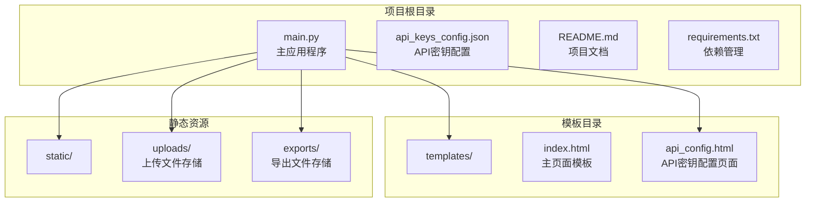
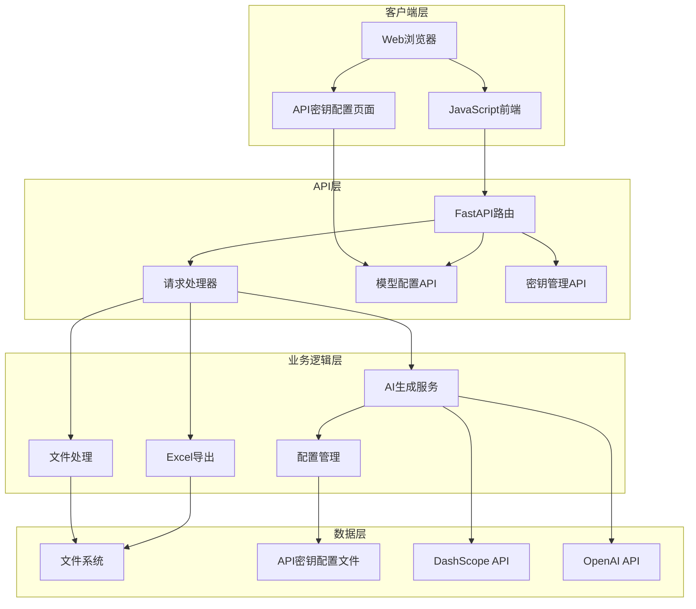
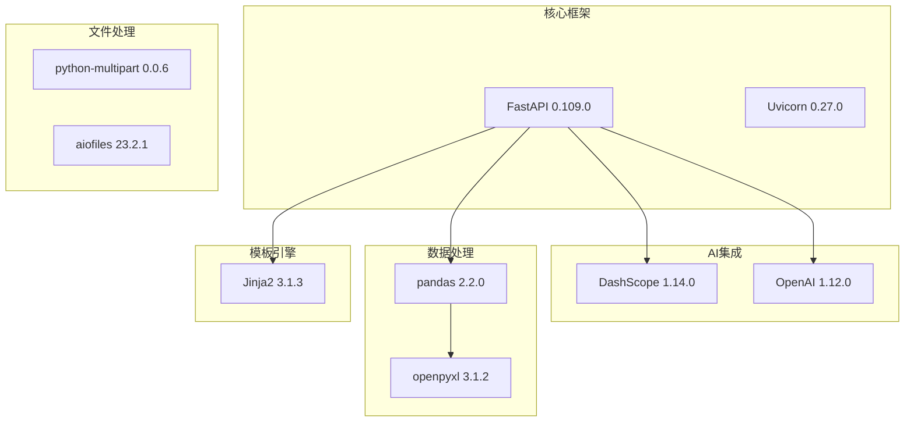
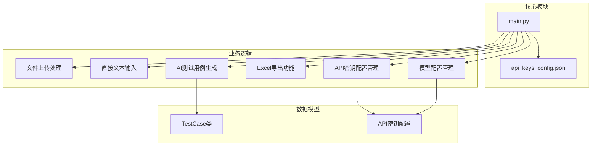
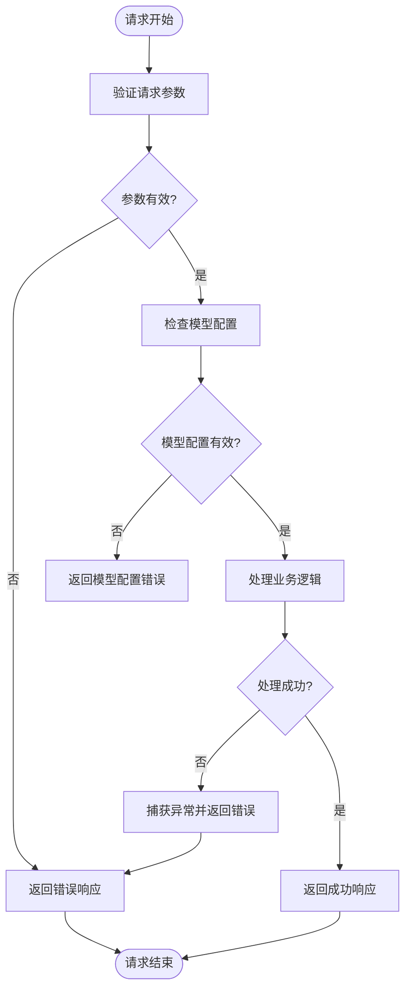

# API接口文档

<cite>
**本文档引用的文件**
- [main.py](file://main.py)
- [api_keys_config.json](file://api_keys_config.json)
- [templates/index.html](file://templates/index.html)
- [templates/api_config.html](file://templates/api_config.html)
- [requirements.txt](file://requirements.txt)
</cite>

## 更新摘要
**变更内容**
- 新增API密钥配置管理API端点
- 新增模型配置API端点
- 增强测试用例生成API，支持多模型选择
- 新增直接文本输入接口
- 更新文件上传接口参数

## 目录
1. [简介](#简介)
2. [项目结构](#项目结构)
3. [核心组件](#核心组件)
4. [架构概览](#架构概览)
5. [详细组件分析](#详细组件分析)
6. [API密钥配置管理](#api密钥配置管理)
7. [依赖分析](#依赖分析)
8. [性能考虑](#性能考虑)
9. [故障排除指南](#故障排除指南)
10. [结论](#结论)
11. [附录](#附录)

## 简介

AI测试用例生成工具是一个基于FastAPI构建的RESTful Web服务，集成了多种AI模型来智能生成测试用例。该工具提供了完整的测试用例生成工作流程，包括文件上传、AI生成、Excel导出和文件下载等功能。

**更新** 系统现已支持多模型配置，包括通义千问、OpenAI和示例模型，并提供了完整的API密钥管理功能。

本项目采用现代化的技术栈，后端使用Python + FastAPI，前端使用HTML5 + Bootstrap5 + JavaScript，AI模型基于DashScope和OpenAI，数据处理使用pandas + openpyxl，模板引擎使用Jinja2。

## 项目结构

项目采用标准的FastAPI项目结构，包含以下核心目录和文件：



**图表来源**
- [main.py:18](file://main.py#L18)
- [api_keys_config.json:1-16](file://api_keys_config.json#L1-L16)

**章节来源**
- [main.py:18](file://main.py#L18)
- [api_keys_config.json:1-16](file://api_keys_config.json#L1-L16)

## 核心组件

### 应用程序实例

应用程序使用FastAPI框架创建，配置了标题为"AI测试用例生成工具"。应用启动时会自动创建必要的目录结构，包括static、templates、uploads和exports目录。

### 数据模型

系统定义了一个`TestCase`类来表示测试用例的数据结构，包含以下字段：
- 功能模块 (module)
- 用例编号 (case_id)  
- 用例名称 (case_name)
- 前置条件 (precondition)
- 测试步骤 (steps)
- 预期结果 (expected_result)
- 优先级 (priority)
- 用例类型 (case_type)

### AI集成层

系统集成了多种AI模型，使用专门的系统提示来指导AI生成符合专业测试工程师标准的测试用例。AI模型支持多种类型，包括功能测试、接口测试、性能测试和安全测试。

**更新** 新增对DashScope和OpenAI的支持，提供灵活的模型选择机制。

**章节来源**
- [main.py:28-40](file://main.py#L28-L40)
- [main.py:82-136](file://main.py#L82-L136)

## 架构概览

系统采用分层架构设计，包含以下主要层次：



**图表来源**
- [main.py:18](file://main.py#L18)
- [main.py:290-339](file://main.py#L290-L339)

## 详细组件分析

### 文件上传接口 (/upload)

#### 接口规范

**HTTP方法**: POST
**URL模式**: `/upload`
**请求类型**: multipart/form-data
**Content-Type**: `multipart/form-data`

#### 请求参数

| 参数名 | 类型 | 必填 | 描述 | 示例 |
|--------|------|------|------|------|
| file | File | 是 | 需求文档文件 | .txt, .doc, .docx, .pdf |

#### 支持的文件格式

- `.txt` - 纯文本文件
- `.doc` - Word文档
- `.docx` - Word文档(2007+)
- `.pdf` - PDF文档

#### 响应格式

**成功响应**:
```json
{
  "success": true,
  "content": "文件内容的预览...",
  "full_content": "完整的文件内容"
}
```

**失败响应**:
```json
{
  "success": false,
  "error": "错误描述"
}
```

#### 实际使用示例

使用curl命令:
```bash
curl -X POST "http://localhost:8000/upload" \
  -H "Content-Type: multipart/form-data" \
  -F "file=@/path/to/requirement.txt"
```

使用JavaScript:
```javascript
const formData = new FormData();
formData.append('file', fileInput.files[0]);

fetch('/upload', {
    method: 'POST',
    body: formData
});
```

#### 错误码说明

- `400 Bad Request`: 文件上传失败或文件格式不支持
- `500 Internal Server Error`: 服务器内部错误

**章节来源**
- [main.py:48-64](file://main.py#L48-L64)

### 直接文本输入接口 (/direct_input)

#### 接口规范

**HTTP方法**: POST  
**URL模式**: `/direct_input`
**请求类型**: application/x-www-form-urlencoded
**Content-Type**: `application/x-www-form-urlencoded`

#### 请求参数

| 参数名 | 类型 | 必填 | 描述 | 默认值 |
|--------|------|------|------|--------|
| requirement_text | string | 是 | 需求文档内容 | - |
| normal_case_count | int | 否 | 正常用例数量 | 10 |
| abnormal_case_count | int | 否 | 异常用例数量 | 5 |
| test_types | string | 否 | JSON格式的测试类型数组 | `["功能测试"]` |

#### 响应格式

**成功响应**:
```json
{
  "success": true,
  "content": "需求内容的预览...",
  "full_content": "完整的需求内容",
  "normal_case_count": 10,
  "abnormal_case_count": 5,
  "test_types": "[\"功能测试\"]"
}
```

**失败响应**:
```json
{
  "success": false,
  "error": "错误描述"
}
```

#### 实际使用示例

使用curl命令:
```bash
curl -X POST "http://localhost:8000/direct_input" \
  -H "Content-Type: application/x-www-form-urlencoded" \
  -d "requirement_text=用户登录系统需求文档内容" \
  -d "normal_case_count=3" \
  -d "abnormal_case_count=2" \
  -d "test_types=[\"功能测试\",\"接口测试\"]"
```

#### 错误码说明

- `400 Bad Request`: 需求文档为空
- `500 Internal Server Error`: 服务器内部错误

**章节来源**
- [main.py:65-80](file://main.py#L65-L80)

### 测试用例生成接口 (/generate)

#### 接口规范

**HTTP方法**: POST  
**URL模式**: `/generate`
**请求类型**: application/x-www-form-urlencoded
**Content-Type**: `application/x-www-form-urlencoded`

#### 请求参数

| 参数名 | 类型 | 必填 | 描述 | 默认值 |
|--------|------|------|------|--------|
| requirement_text | string | 是 | 需求文档内容 | - |
| model_type | string | 是 | AI模型类型 | - |
| api_key | string | 否 | API密钥 | - |
| normal_case_count | int | 否 | 正常用例数量 | 10 |
| abnormal_case_count | int | 否 | 异常用例数量 | 5 |
| test_types | string | 否 | JSON格式的测试类型数组 | `["功能测试"]` |

#### 支持的模型类型

- `qwen` - 通义千问 (DashScope)
- `openai` - OpenAI GPT
- `example` - 示例模型 (Mock数据)

#### 响应格式

**成功响应**:
```json
{
  "success": true,
  "test_cases": [
    {
      "module": "用户登录",
      "case_id": "TC001",
      "case_name": "正确用户名密码登录",
      "precondition": "用户已注册账号",
      "steps": "1. 打开登录页面\\n2. 输入正确的用户名\\n3. 输入正确的密码\\n4. 点击登录按钮",
      "expected_result": "成功跳转到首页，显示用户名",
      "priority": "高",
      "case_type": "功能测试"
    }
  ],
  "model_used": "qwen"
}
```

**失败响应**:
```json
{
  "success": false,
  "error": "错误描述"
}
```

#### AI生成逻辑

系统使用专门的AI提示模板，要求AI生成符合以下标准的测试用例：
- 覆盖所有功能点，包括正常场景和异常场景
- 考虑边界值、等价类划分等测试方法
- 包含功能测试、兼容性测试、性能测试等多种类型
- 测试用例要详细、可执行

**更新** 新增多模型支持，根据模型类型自动选择对应的API密钥和配置参数。

#### 实际使用示例

使用curl命令:
```bash
curl -X POST "http://localhost:8000/generate" \
  -H "Content-Type: application/x-www-form-urlencoded" \
  -d "requirement_text=用户登录系统需求文档内容" \
  -d "model_type=qwen" \
  -d "api_key=sk-your-dashscope-api-key" \
  -d "normal_case_count=3" \
  -d "abnormal_case_count=2" \
  -d "test_types=[\"功能测试\",\"接口测试\"]"
```

#### 错误码说明

- `400 Bad Request`: API密钥无效或需求文档为空
- `500 Internal Server Error`: AI调用失败

**章节来源**
- [main.py:137-255](file://main.py#L137-L255)

### Excel导出接口 (/export)

#### 接口规范

**HTTP方法**: POST
**URL模式**: `/export`
**请求类型**: application/x-www-form-urlencoded
**Content-Type**: `application/x-www-form-urlencoded`

#### 请求参数

| 参数名 | 类型 | 必填 | 描述 | 示例 |
|--------|------|------|------|------|
| test_cases_json | string | 是 | JSON格式的测试用例数组 | "[{...}]" |

#### 响应格式

**成功响应**:
```json
{
  "success": true,
  "filename": "test_cases_20241201_143022.xlsx",
  "filepath": "exports/test_cases_20241201_143022.xlsx"
}
```

**失败响应**:
```json
{
  "success": false,
  "error": "错误描述"
}
```

#### 导出功能

系统将测试用例转换为Excel格式，包含以下中文列名：
- 功能模块
- 用例编号  
- 用例名称
- 前置条件
- 测试步骤
- 预期结果
- 优先级
- 用例类型

文件名采用时间戳格式：`test_cases_YYYYMMDD_HHMMSS.xlsx`

#### 实际使用示例

使用curl命令:
```bash
curl -X POST "http://localhost:8000/export" \
  -H "Content-Type: application/x-www-form-urlencoded" \
  -d "test_cases_json=[{\"module\":\"用户登录\",\"case_id\":\"TC001\",...}]"
```

#### 错误码说明

- `400 Bad Request`: JSON格式无效或测试用例数据为空
- `500 Internal Server Error`: Excel文件生成失败

**章节来源**
- [main.py:279-289](file://main.py#L279-L289)

### 文件下载接口 (/download/{filename})

#### 接口规范

**HTTP方法**: GET
**URL模式**: `/download/{filename}`
**路径参数**: filename

#### 路径参数

| 参数名 | 类型 | 必填 | 描述 | 示例 |
|--------|------|------|------|------|
| filename | string | 是 | 要下载的文件名 | "test_cases_20241201_143022.xlsx" |

#### 响应格式

**成功响应**:
- Content-Type: application/vnd.openxmlformats-officedocument.spreadsheetml.sheet
- Content-Disposition: attachment; filename="filename.xlsx"
- 文件内容: Excel文件二进制数据

**失败响应**:
```json
{
  "success": false,
  "error": "文件不存在"
}
```

#### 实际使用示例

使用JavaScript:
```javascript
// 自动下载文件
window.open(`/download/${filename}`, '_blank');

// 或者使用fetch获取文件
fetch(`/download/${filename}`)
    .then(response => response.blob())
    .then(blob => {
        const url = window.URL.createObjectURL(blob);
        const a = document.createElement('a');
        a.href = url;
        a.download = filename;
        document.body.appendChild(a);
        a.click();
        window.URL.revokeObjectURL(url);
    });
```

#### 错误码说明

- `404 Not Found`: 指定的文件不存在
- `500 Internal Server Error`: 文件读取失败

**章节来源**
- [main.py:226-234](file://main.py#L226-L234)

## API密钥配置管理

### 模型配置API

#### 获取支持的AI模型列表 (/api/config/models)

**HTTP方法**: GET
**URL模式**: `/api/config/models`

**响应格式**:
```json
{
  "qwen": "通义千问 (Qwen)",
  "openai": "OpenAI GPT",
  "example": "示例模型 (Mock)"
}
```

#### 获取API密钥状态和模型配置 (/api/config/api-keys)

**HTTP方法**: GET
**URL模式**: `/api/config/api-keys`

**响应格式**:
```json
{
  "qwen": {
    "configured": true,
    "has_key": true,
    "masked_key": "****d27a1",
    "max_cases_per_request": 25,
    "max_tokens": 4000
  },
  "openai": {
    "configured": false,
    "has_key": false,
    "masked_key": "",
    "max_cases_per_request": 25,
    "max_tokens": 4000
  },
  "example": {
    "configured": false,
    "has_key": false,
    "masked_key": "",
    "max_cases_per_request": 50,
    "max_tokens": 2000
  }
}
```

#### 保存API密钥 (/api/config/api-keys/{model_name})

**HTTP方法**: POST
**URL模式**: `/api/config/api-keys/{model_name}`

**路径参数**:
- `model_name`: 模型名称 (qwen, openai, example)

**请求参数**:
- `api_key`: API密钥字符串

**响应格式**:
```json
{
  "success": true,
  "message": "qwen 的API密钥已保存"
}
```

#### 删除API密钥 (/api/config/api-keys/{model_name})

**HTTP方法**: DELETE
**URL模式**: `/api/config/api-keys/{model_name}`

**路径参数**:
- `model_name`: 模型名称 (qwen, openai, example)

**响应格式**:
```json
{
  "success": true,
  "message": "qwen 的API密钥已移除"
}
```

**章节来源**
- [main.py:290-339](file://main.py#L290-L339)
- [api_keys_config.json:1-16](file://api_keys_config.json#L1-L16)

## 依赖分析

### 外部依赖

项目使用以下主要依赖：



**图表来源**
- [requirements.txt:1-9](file://requirements.txt#L1-L9)

### 内部组件依赖



**图表来源**
- [main.py:28-40](file://main.py#L28-L40)
- [main.py:290-339](file://main.py#L290-L339)

**章节来源**
- [requirements.txt:1-9](file://requirements.txt#L1-L9)
- [main.py:28-40](file://main.py#L28-L40)

## 性能考虑

### 并发处理

系统基于异步IO架构，能够有效处理多个并发请求。FastAPI和Uvicorn的组合提供了高性能的ASGI服务器支持。

### 文件处理优化

- **内存管理**: 文件上传采用流式处理，避免大文件占用过多内存
- **临时文件**: 使用tempfile模块处理临时文件，确保资源及时清理
- **文件大小限制**: 可通过FastAPI的UploadFile参数设置文件大小限制

### AI调用优化

- **错误恢复**: AI调用失败时提供默认测试用例，确保系统可用性
- **超时处理**: OpenAI API调用设置了合理的超时时间
- **缓存策略**: 可以考虑添加本地缓存来减少重复的AI调用
- **模型限制**: 每个模型都有最大用例数量和token限制，避免超出API限制

### 配置管理优化

- **配置文件**: API密钥配置存储在JSON文件中，支持热更新
- **模型选择**: 支持动态模型切换，无需重启服务
- **密钥掩码**: 在UI中显示掩码后的API密钥，保护敏感信息

### 建议的性能优化

1. **限流机制**: 添加API限流，防止滥用
2. **CDN加速**: 对静态资源使用CDN
3. **数据库**: 考虑添加数据库存储测试用例历史
4. **队列系统**: 对耗时的AI生成任务使用异步队列
5. **缓存策略**: 为常用的AI响应添加缓存

## 故障排除指南

### 常见问题及解决方案

#### OpenAI API密钥问题

**问题**: "API密钥无效或未设置"
**解决方案**:
1. 确认API密钥格式正确
2. 检查OpenAI账户余额和配额
3. 验证网络连接正常
4. 使用API密钥配置页面进行设置

#### DashScope API密钥问题

**问题**: "DashScope API密钥无效或未设置"
**解决方案**:
1. 确认DashScope API密钥格式正确
2. 检查阿里云账户状态
3. 验证网络连接正常
4. 使用API密钥配置页面进行设置

#### 文件上传失败

**问题**: "文件上传失败"
**解决方案**:
1. 检查文件格式是否支持
2. 确认文件大小未超过限制
3. 验证uploads目录权限

#### Excel导出错误

**问题**: "Excel文件生成失败"
**解决方案**:
1. 检查测试用例数据格式
2. 确认exports目录可写
3. 验证pandas和openpyxl版本兼容性

#### 下载文件失败

**问题**: "文件不存在"
**解决方案**:
1. 检查文件名是否正确
2. 确认文件仍在exports目录中
3. 验证文件权限设置

#### 模型配置错误

**问题**: "模型配置无效"
**解决方案**:
1. 检查模型名称是否正确
2. 确认API密钥格式正确
3. 验证模型配置文件格式
4. 重启服务使配置生效

### 错误处理机制

系统实现了统一的错误处理机制：



**图表来源**
- [main.py:48-64](file://main.py#L48-L64)
- [main.py:137-255](file://main.py#L137-L255)

**章节来源**
- [main.py:48-64](file://main.py#L48-L64)
- [main.py:137-255](file://main.py#L137-L255)
- [main.py:279-289](file://main.py#L279-L289)
- [main.py:226-234](file://main.py#L226-L234)

## 结论

AI测试用例生成工具提供了一个完整、易用且功能强大的测试用例生成解决方案。通过集成多种AI模型和提供完善的API密钥管理功能，系统能够智能地分析需求文档并生成专业的测试用例。

### 主要优势

1. **智能化**: 基于AI的测试用例生成，提高效率和质量
2. **多模型支持**: 支持通义千问、OpenAI和示例模型
3. **易用性**: 提供直观的Web界面和清晰的工作流程
4. **灵活性**: 支持多种文件格式和导出选项
5. **安全性**: 提供API密钥管理和配置功能
6. **可扩展性**: 基于FastAPI的模块化架构便于功能扩展

### 改进建议

1. **安全性增强**: 添加API认证和限流机制
2. **监控完善**: 添加日志记录和性能监控
3. **国际化**: 支持多语言界面
4. **数据库集成**: 添加持久化存储功能
5. **模型管理**: 提供更灵活的模型配置界面

## 附录

### 安装和部署

1. **克隆项目**: `git clone <repository-url>`
2. **安装依赖**: `pip install -r requirements.txt`
3. **启动服务**: `python3 main.py`
4. **访问应用**: 打开浏览器访问 `http://localhost:8000`
5. **配置API密钥**: 访问 `http://localhost:8000/api_config.html`

### 客户端集成最佳实践

#### 前端集成

1. **表单处理**: 使用FormData对象处理文件上传
2. **进度反馈**: 显示加载状态和错误信息
3. **文件预览**: 实时预览上传的文件内容
4. **错误处理**: 统一处理各种错误情况
5. **模型选择**: 动态选择合适的AI模型

#### 后端集成

1. **异步处理**: 利用FastAPI的异步特性处理并发请求
2. **错误恢复**: 实现优雅的错误恢复机制
3. **资源管理**: 确保文件和内存资源的正确释放
4. **日志记录**: 添加详细的日志记录用于调试
5. **配置管理**: 实现灵活的配置管理机制

#### 安全考虑

1. **API密钥管理**: 不要在客户端代码中硬编码API密钥
2. **输入验证**: 对所有用户输入进行严格验证
3. **文件安全**: 验证上传文件的类型和大小
4. **CORS配置**: 正确配置跨域资源共享策略
5. **配置安全**: 对敏感配置信息进行适当的保护

#### 性能优化

1. **缓存策略**: 对频繁访问的数据实施缓存
2. **批量处理**: 支持批量文件上传和处理
3. **压缩传输**: 对大文件启用压缩传输
4. **连接池**: 使用连接池管理数据库和外部API连接
5. **模型优化**: 根据不同模型的特点进行性能优化

### API密钥配置指南

#### 配置步骤

1. **访问配置页面**: 打开 `http://localhost:8000/api_config.html`
2. **选择模型**: 在模型卡片中点击"配置密钥"
3. **输入密钥**: 在弹出的对话框中输入API密钥
4. **保存配置**: 点击"保存"按钮完成配置
5. **验证状态**: 刷新页面确认密钥状态显示为"已配置"

#### 支持的模型

- **通义千问 (qwen)**: 免费使用，可选填写API密钥
- **OpenAI (openai)**: 需要有效的API密钥
- **示例模型 (example)**: 完全免费，无需配置

#### 配置文件格式

```json
{
  "qwen": {
    "api_key": "sk-xxxxxxxxxxxxxxxxxxxxxxxxxxxxxxxx",
    "max_tokens": 4000,
    "max_cases_per_request": 25
  },
  "openai": {
    "api_key": "",
    "max_tokens": 4000,
    "max_cases_per_request": 25
  },
  "example": {
    "max_tokens": 2000,
    "max_cases_per_request": 50
  }
}
```