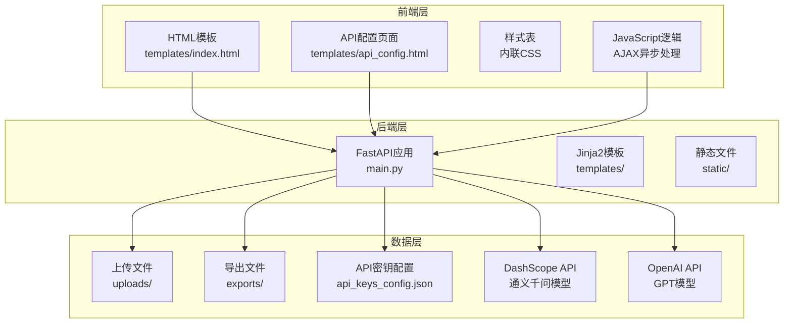
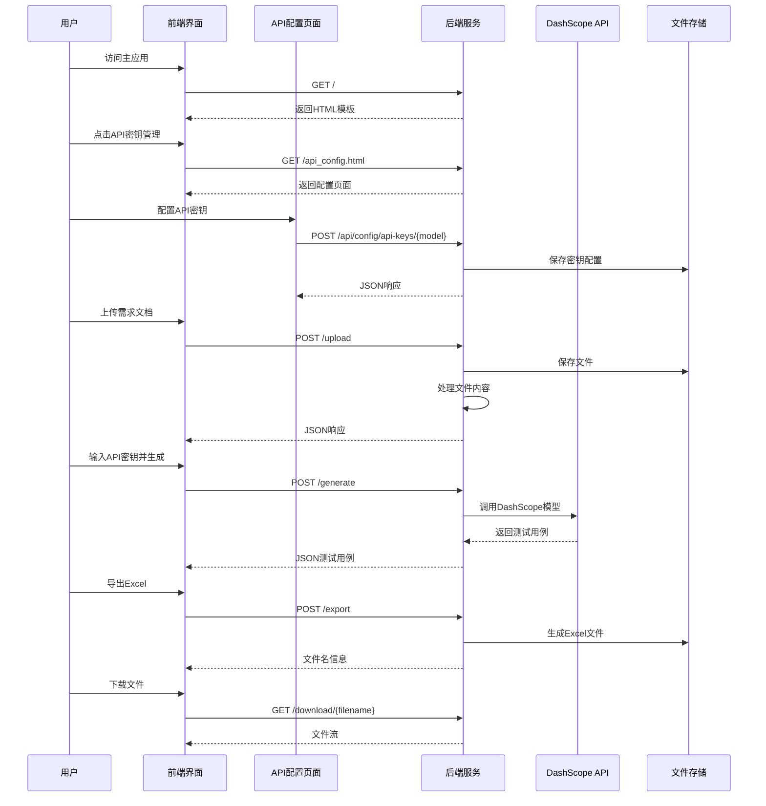
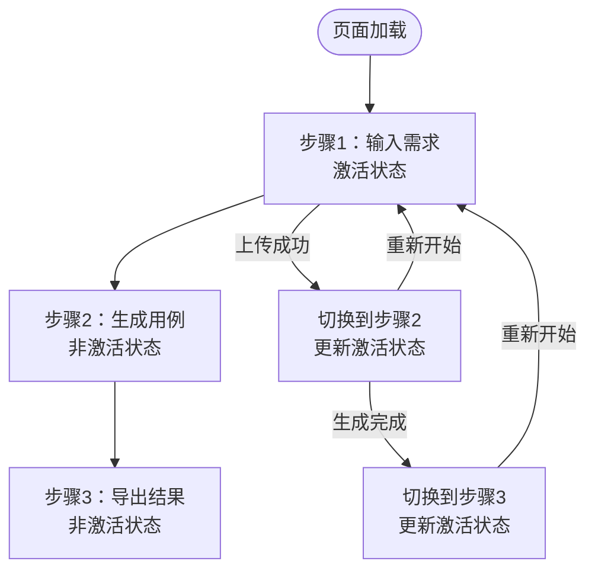
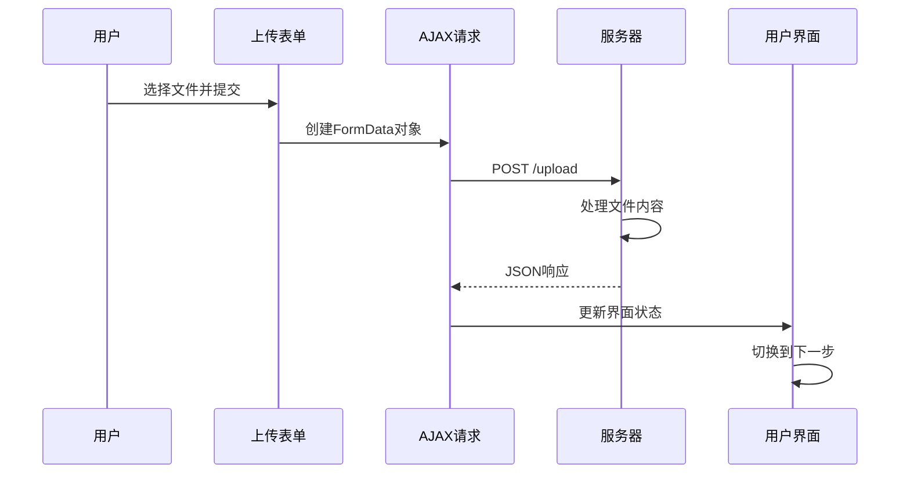
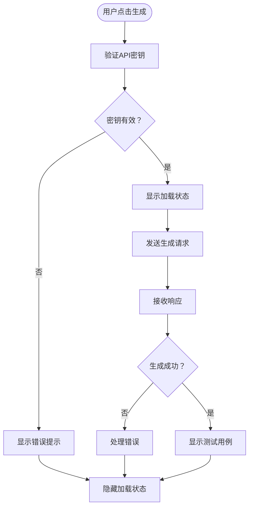
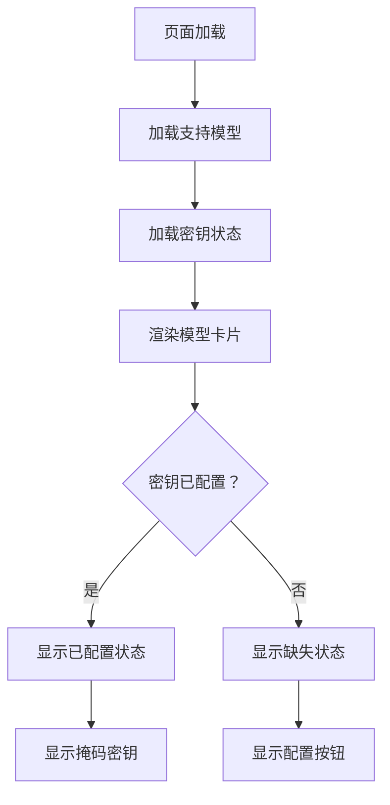
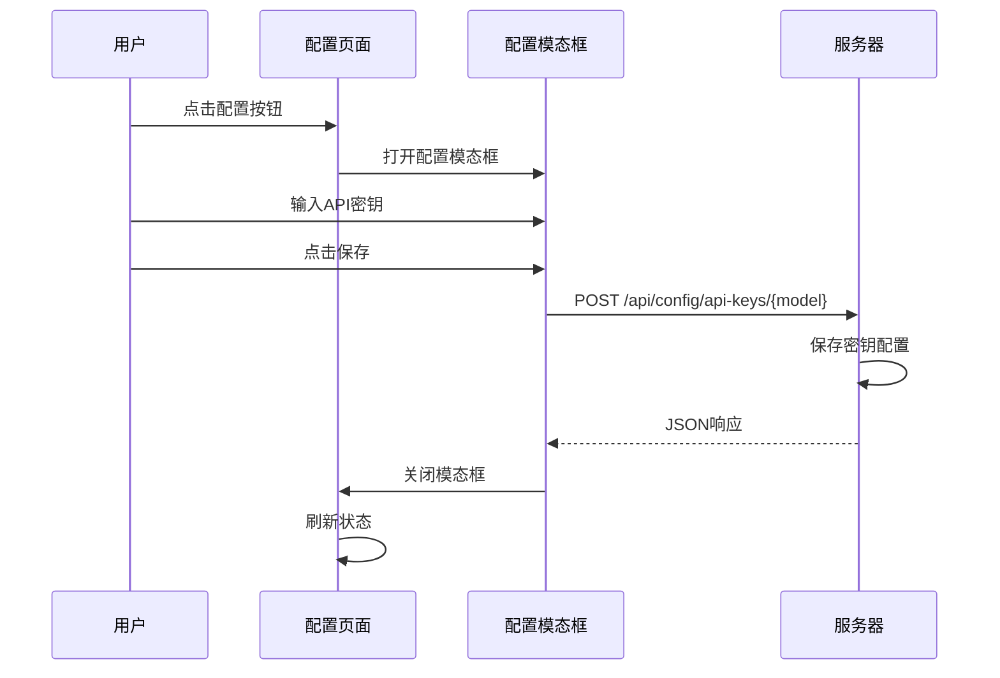
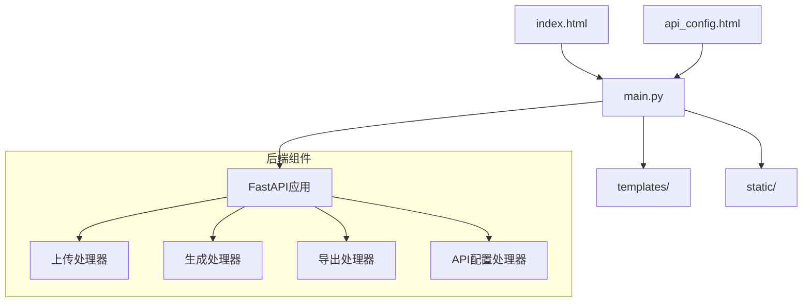

# 前端用户界面

<cite>
**本文档引用的文件**
- [templates/index.html](file://templates/index.html)
- [templates/api_config.html](file://templates/api_config.html)
- [main.py](file://main.py)
- [api_keys_config.json](file://api_keys_config.json)
- [requirements.txt](file://requirements.txt)
</cite>

## 更新摘要
**变更内容**
- 新增API密钥配置页面，支持多模型密钥管理
- 改进的用户界面交互和Bootstrap样式优化
- 增强的API密钥状态检查和自动配置功能
- 优化的三步操作流程用户体验
- 改进的响应式设计和现代化UI组件

## 目录
1. [简介](#简介)
2. [项目结构](#项目结构)
3. [核心组件](#核心组件)
4. [架构概览](#架构概览)
5. [详细组件分析](#详细组件分析)
6. [依赖关系分析](#依赖关系分析)
7. [性能考虑](#性能考虑)
8. [故障排除指南](#故障排除指南)
9. [结论](#结论)

## 简介

AI测试用例生成工具是一个基于人工智能的智能测试用例生成平台，采用前后端分离架构设计。该工具集成了现代Web技术栈，提供了直观的用户界面和强大的AI生成功能。系统通过三步操作流程帮助用户从需求文档生成专业的测试用例，并支持导出为Excel格式。

**更新** 新增了专门的API密钥配置页面，支持多AI模型的密钥管理，包括通义千问、OpenAI等模型的配置和状态检查功能。

该前端界面基于Bootstrap 5框架构建，实现了响应式设计和现代化的用户交互体验。界面采用渐进式步骤指示器，为用户提供清晰的操作路径和状态反馈。新增的API密钥配置页面提供了直观的密钥管理界面，支持密钥的配置、修改和删除操作。

## 项目结构

该项目采用简洁的分层架构，主要包含以下核心组件：



**图表来源**
- [templates/index.html:1-1271](file://templates/index.html#L1-L1271)
- [templates/api_config.html:1-272](file://templates/api_config.html#L1-L272)
- [main.py:1-342](file://main.py#L1-L342)

**章节来源**
- [templates/index.html:1-1271](file://templates/index.html#L1-L1271)
- [templates/api_config.html:1-272](file://templates/api_config.html#L1-L272)
- [main.py:1-342](file://main.py#L1-L342)

## 核心组件

### Bootstrap 5框架集成

系统完全基于Bootstrap 5构建，充分利用了其响应式网格系统和组件库：

- **响应式网格系统**：使用`container`和`row`类实现自适应布局
- **卡片组件**：每个操作步骤都封装在Bootstrap卡片中，提供清晰的视觉层次
- **按钮样式**：采用Bootstrap内置的按钮变体和尺寸
- **表单控件**：使用Bootstrap标准化的表单元素和验证样式
- **模态框组件**：API密钥配置页面使用Bootstrap模态框实现弹窗交互

### 三步操作流程

系统设计了直观的三步操作流程，每步都有明确的步骤指示器：

1. **第一步：输入测试需求**
   - 文件上传和直接输入两种方式
   - 实时需求预览功能
   - 测试类型和用例数量配置
   - 错误处理和验证提示

2. **第二步：配置并生成**
   - 多AI模型选择（通义千问、OpenAI、示例数据）
   - 自动API密钥状态检查和显示
   - 用例数量和类型的参数配置
   - AI生成过程的加载状态

3. **第三步：查看和导出**
   - 结构化测试用例表格
   - 详情查看功能
   - Excel导出功能

**更新** 新增了API密钥状态检查功能，在第二步中会自动检测已配置的API密钥并显示掩码密钥。

**章节来源**
- [templates/index.html:150-480](file://templates/index.html#L150-L480)
- [templates/index.html:480-1271](file://templates/index.html#L480-L1271)

### API密钥配置管理

**新增** 系统提供了专门的API密钥配置页面，支持多模型密钥管理：

- **多模型支持**：通义千问、OpenAI、示例数据模型
- **状态可视化**：通过颜色指示密钥配置状态
- **模态框交互**：配置和修改密钥时使用Bootstrap模态框
- **实时状态检查**：页面加载时自动检查各模型密钥状态
- **帮助文本提示**：针对不同模型提供具体的密钥说明

**章节来源**
- [templates/api_config.html:1-272](file://templates/api_config.html#L1-L272)
- [main.py:290-339](file://main.py#L290-L339)

## 架构概览

系统采用客户端-服务器架构，前端负责用户交互，后端处理业务逻辑和AI集成：



**图表来源**
- [main.py:40-80](file://main.py#L40-L80)
- [main.py:137-255](file://main.py#L137-L255)
- [main.py:279-339](file://main.py#L279-L339)

## 详细组件分析

### 步骤指示器组件

步骤指示器是用户界面的核心导航组件，采用渐进式设计：



**更新** 新增了API密钥状态检查功能，会在步骤1中自动检查当前模型的API密钥配置状态。

**图表来源**
- [templates/index.html:159-173](file://templates/index.html#L159-L173)
- [templates/index.html:820-865](file://templates/index.html#L820-L865)

### AJAX异步处理机制

前端实现了完整的AJAX异步处理流程，确保用户体验的流畅性：

#### 文件上传处理流程



**图表来源**
- [templates/index.html:552-617](file://templates/index.html#L552-L617)
- [main.py:48-64](file://main.py#L48-L64)

#### 测试用例生成流程



**更新** 新增了API密钥状态检查和自动配置功能，会在生成前检查并显示已配置的密钥状态。

**图表来源**
- [templates/index.html:678-778](file://templates/index.html#L678-L778)
- [main.py:137-255](file://main.py#L137-L255)

### API密钥配置管理

**新增** API密钥配置页面提供了完整的密钥管理功能：

#### 密钥状态可视化



**图表来源**
- [templates/api_config.html:100-175](file://templates/api_config.html#L100-L175)
- [main.py:299-313](file://main.py#L299-L313)

#### 密钥配置流程



**图表来源**
- [templates/api_config.html:177-234](file://templates/api_config.html#L177-L234)
- [main.py:315-327](file://main.py#L315-L327)

### 表单验证逻辑

系统实现了多层次的表单验证机制：

#### 前端验证
- 必填字段检查（API密钥、文件选择）
- 文件格式验证（.txt, .doc, .docx）
- 数值范围验证（用例数量1-25）
- 实时状态反馈

#### 后端验证
- 文件内容处理和转换
- JSON响应格式验证
- 错误处理和异常捕获
- API密钥有效性检查

**更新** 新增了API密钥配置验证，确保密钥格式正确且有效。

**章节来源**
- [templates/index.html:99-146](file://templates/index.html#L99-L146)
- [templates/index.html:253-298](file://templates/index.html#L253-L298)

### 状态管理系统

前端实现了完整的状态管理机制：

#### 全局状态变量
- `currentRequirementText`: 当前需求文档内容
- `generatedTestCases`: 已生成的测试用例数组
- `modelConfigs`: 模型配置信息
- `currentRequestController`: 当前请求控制器

#### 界面状态切换
- 卡片显示/隐藏控制
- 步骤指示器状态更新
- 加载状态管理
- API密钥状态检查

**更新** 新增了`modelConfigs`全局状态变量，用于存储和管理各模型的配置信息。

**章节来源**
- [templates/index.html:496-499](file://templates/index.html#L496-L499)
- [templates/index.html:1135-1137](file://templates/index.html#L1135-L1137)

### 加载指示器和错误处理

系统提供了完善的用户反馈机制：

#### 加载指示器
- 生成按钮禁用状态
- 旋转加载动画
- 进度文本提示
- 全屏加载遮罩

#### 错误处理
- 弹窗错误提示
- 控制台日志记录
- 优雅降级处理
- 请求取消机制

**更新** 新增了全屏加载遮罩功能，提供更好的用户体验。

**章节来源**
- [templates/index.html:140-146](file://templates/index.html#L140-L146)
- [templates/index.html:248-250](file://templates/index.html#L248-L250)

## 依赖关系分析

### 外部依赖

系统依赖以下关键外部库：

```mermaid
graph LR
subgraph "前端依赖"
Bootstrap[Bootstrap 5.1.3]
FontAwesome[Font Awesome 6.0.0]
jQuery[jQuery (CDN)]
end
subgraph "后端依赖"
FastAPI[FastAPI 0.109.0]
DashScope[DashScope 1.14.0]
OpenAI[OpenAI 1.12.0]
Pandas[pandas 2.2.0]
Jinja2[Jinja2 3.1.3]
end
subgraph "文件处理"
OpenPyXL[openpyxl 3.1.2]
Uvicorn[uvicorn 0.27.0]
end
Bootstrap --> FastAPI
DashScope --> FastAPI
OpenAI --> FastAPI
Pandas --> FastAPI
OpenPyXL --> FastAPI
Uvicorn --> FastAPI
```

**更新** 新增了DashScope依赖，用于通义千问模型的API调用。

**图表来源**
- [requirements.txt:1-9](file://requirements.txt#L1-L9)
- [templates/index.html:7-8](file://templates/index.html#L7-L8)

### 内部模块依赖



**更新** 新增了API配置处理器，专门处理API密钥的配置和管理。

**图表来源**
- [main.py:13-23](file://main.py#L13-L23)
- [templates/index.html:151-156](file://templates/index.html#L151-L156)

**章节来源**
- [requirements.txt:1-9](file://requirements.txt#L1-L9)
- [main.py:1-342](file://main.py#L1-L342)

## 性能考虑

### 前端性能优化

1. **资源加载优化**
   - 使用CDN加速Bootstrap和Font Awesome加载
   - 内联关键CSS减少HTTP请求
   - 按需加载JavaScript功能
   - 模态框懒加载优化

2. **内存管理**
   - 及时清理事件监听器
   - 合理使用DOM操作
   - 避免内存泄漏
   - 请求控制器管理

3. **用户体验优化**
   - 加载状态反馈
   - 错误处理和重试机制
   - 响应式设计适配
   - API密钥状态缓存

**更新** 新增了API密钥状态缓存机制，避免重复的API调用。

### 后端性能考虑

1. **API调用优化**
   - 合理设置温度参数（0.7）
   - 控制最大令牌数（2000-4000）
   - 错误恢复机制
   - 模型配置缓存

2. **文件处理优化**
   - 限制预览内容长度（1000字符）
   - 临时文件管理
   - 内存使用控制
   - API密钥配置文件缓存

**更新** 新增了模型配置文件缓存机制，提高API密钥状态检查的响应速度。

## 故障排除指南

### 常见问题及解决方案

#### OpenAI API相关问题
- **问题**：API密钥无效或过期
- **解决方案**：重新获取有效的API密钥，确保网络连接正常

#### DashScope API相关问题
- **问题**：通义千问API密钥配置错误
- **解决方案**：通过API配置页面重新配置正确的密钥

#### 文件上传问题
- **问题**：文件格式不支持
- **解决方案**：确认文件扩展名为.txt, .doc, .docx, 或.pdf

#### 生成失败问题
- **问题**：AI生成过程异常
- **解决方案**：检查API密钥配置，查看控制台错误日志

#### 导出功能问题
- **问题**：Excel文件生成失败
- **解决方案**：确认pandas和openpyxl库正确安装

#### API密钥配置问题
- **问题**：API密钥状态检查失败
- **解决方案**：检查api_keys_config.json文件格式，确认密钥配置正确

**更新** 新增了API密钥配置相关的故障排除指南。

**章节来源**
- [main.py:108-122](file://main.py#L108-L122)
- [api_keys_config.json:1-16](file://api_keys_config.json#L1-L16)

## 结论

AI测试用例生成工具前端界面展现了现代Web开发的最佳实践。通过精心设计的三步操作流程、响应式的Bootstrap布局和完善的AJAX异步处理机制，为用户提供了流畅、直观的使用体验。

**更新** 新增的API密钥配置页面进一步增强了系统的易用性和安全性，用户可以通过直观的界面管理多个AI模型的密钥配置。

该界面的主要优势包括：

1. **用户友好性**：清晰的步骤指示器和即时反馈
2. **响应式设计**：适配各种设备和屏幕尺寸
3. **现代化组件**：利用Bootstrap 5的强大功能
4. **完善的错误处理**：提供友好的错误提示和恢复机制
5. **可扩展性**：模块化的代码结构便于功能扩展
6. **安全性**：API密钥的掩码显示和安全存储
7. **多模型支持**：支持通义千问、OpenAI等多种AI模型

未来可以考虑的功能增强包括：
- 添加更多的测试用例类型支持
- 实现用户账户系统和历史记录
- 增强主题定制能力
- 添加多语言支持
- 实现测试用例的编辑和修改功能
- 增加API密钥的安全存储选项
- 实现批量API密钥导入功能