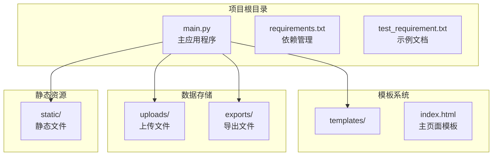
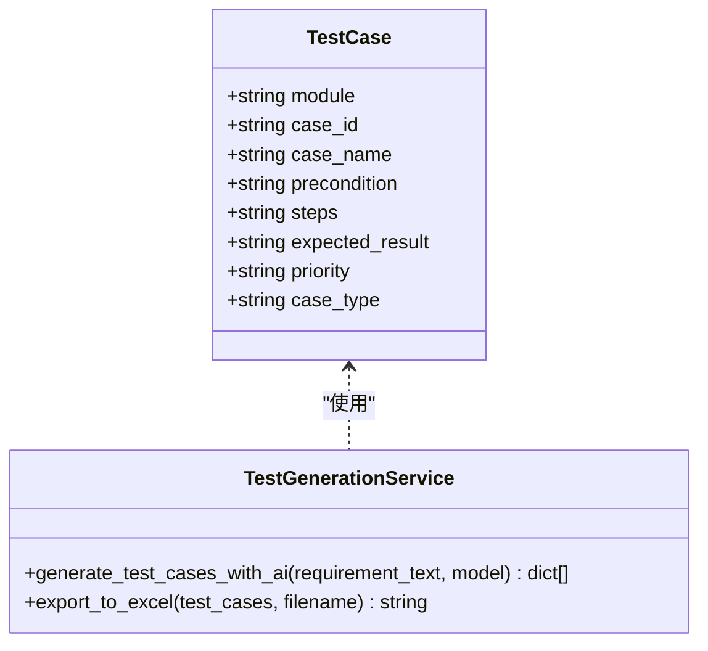
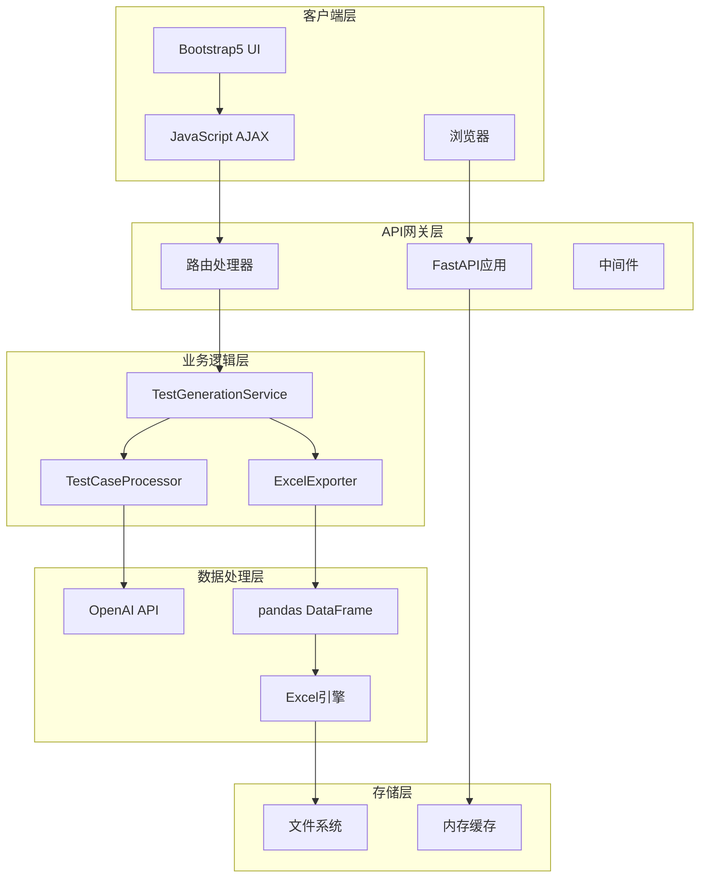
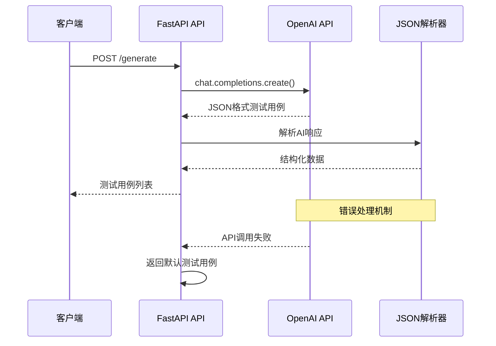
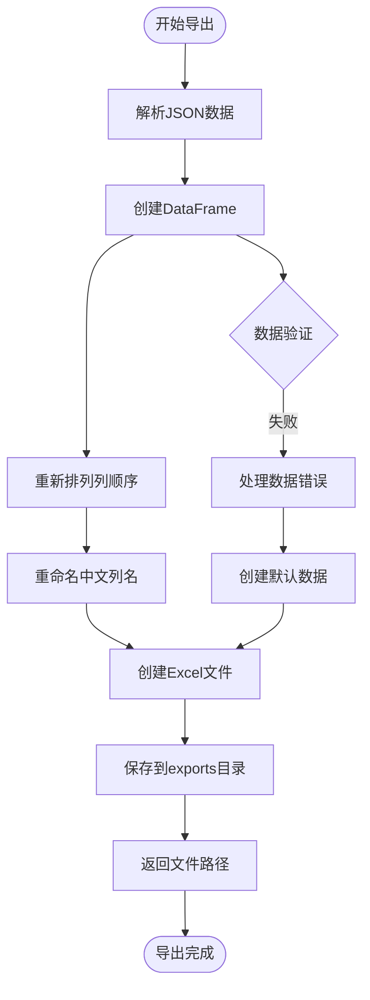
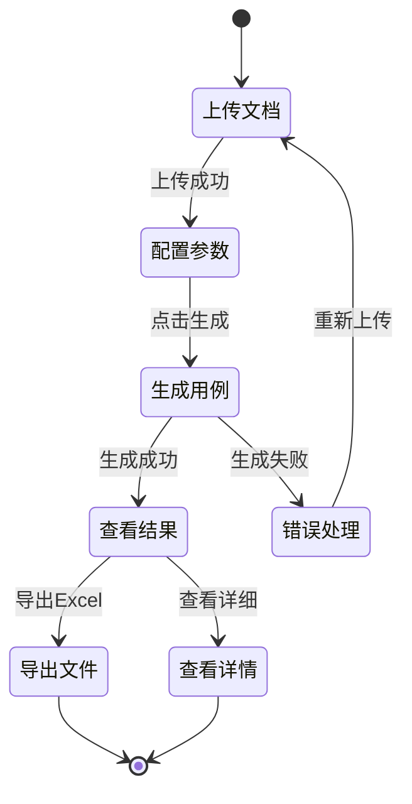
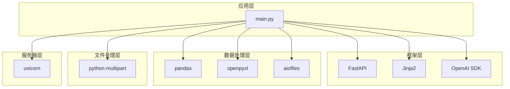

# 开发指南

<cite>
**本文引用的文件**
- [README.md](file://README.md)
- [main.py](file://main.py)
- [requirements.txt](file://requirements.txt)
- [test_requirement.txt](file://test_requirement.txt)
- [templates/index.html](file://templates/index.html)
</cite>

## 目录
1. [简介](#简介)
2. [项目结构](#项目结构)
3. [核心组件](#核心组件)
4. [架构概览](#架构概览)
5. [详细组件分析](#详细组件分析)
6. [依赖分析](#依赖分析)
7. [性能考虑](#性能考虑)
8. [故障排除指南](#故障排除指南)
9. [结论](#结论)
10. [附录](#附录)

## 简介

AI测试用例生成工具是一个基于人工智能的智能测试用例生成平台，旨在帮助测试工程师快速生成专业的测试用例。该工具结合了FastAPI后端框架、OpenAI GPT模型、pandas数据处理和现代化的Web界面技术栈。

### 主要功能特性
- 🤖 基于OpenAI GPT模型智能生成测试用例
- 📁 支持多种文档格式上传（txt, doc, docx）
- 📊 自动生成结构化的测试用例表格
- 📤 支持导出为Excel格式
- 💻 现代化Web界面，操作简单直观

### 技术栈
- **后端**：Python + FastAPI
- **前端**：HTML5 + Bootstrap5 + JavaScript
- **AI模型**：OpenAI GPT系列
- **数据处理**：pandas + openpyxl
- **模板引擎**：Jinja2

**章节来源**
- [README.md:1-103](file://README.md#L1-L103)

## 项目结构

该项目采用简洁的分层架构设计，主要包含以下目录结构：

```
AI_Test/
├── main.py              # 主应用程序文件
├── requirements.txt     # Python依赖包
├── templates/           # HTML模板目录
│   └── index.html      # 主页面模板
├── static/             # 静态文件目录
├── uploads/            # 上传文件存储目录
├── exports/            # 导出文件存储目录
└── test_requirement.txt # 测试用需求文档示例
```

### 目录职责说明
- **main.py**：应用程序主入口，包含所有API路由和业务逻辑
- **templates/**：Jinja2模板目录，存放HTML页面模板
- **static/**：静态资源目录（当前未使用）
- **uploads/**：用户上传文件的临时存储目录
- **exports/**：生成的Excel文件导出目录
- **test_requirement.txt**：示例需求文档，用于演示功能



**图表来源**
- [main.py:15-19](file://main.py#L15-L19)
- [templates/index.html:1-383](file://templates/index.html#L1-L383)

**章节来源**
- [README.md:29-41](file://README.md#L29-L41)
- [main.py:15-19](file://main.py#L15-L19)

## 核心组件

### 应用程序入口与配置

应用程序使用FastAPI框架构建，具有以下核心配置：

- **应用实例创建**：初始化FastAPI应用并设置标题
- **目录结构初始化**：自动创建必要的目录结构
- **静态文件挂载**：配置静态文件服务
- **模板引擎配置**：设置Jinja2模板系统

### 数据模型定义

系统定义了一个`TestCase`类来封装测试用例数据结构：



**图表来源**
- [main.py:28-40](file://main.py#L28-L40)
- [main.py:41-123](file://main.py#L41-L123)

### API路由设计

系统提供了完整的RESTful API接口：

1. **GET /** - 主页面路由
2. **POST /upload** - 文件上传路由  
3. **POST /generate** - 测试用例生成路由
4. **POST /export** - Excel导出路由
5. **GET /download/{filename}** - 文件下载路由

**章节来源**
- [main.py:13](file://main.py#L13)
- [main.py:151-233](file://main.py#L151-L233)

## 架构概览

该系统采用前后端分离的架构模式，结合了现代Web开发的最佳实践：



**图表来源**
- [main.py:1-12](file://main.py#L1-L12)
- [main.py:41-123](file://main.py#L41-L123)
- [main.py:124-149](file://main.py#L124-L149)

### 数据流处理

系统的数据处理流程遵循标准的Web应用模式：

1. **文件上传**：客户端上传需求文档 → 服务器接收并保存
2. **AI分析**：服务器调用OpenAI API → 获取测试用例建议
3. **数据转换**：AI响应解析 → 结构化数据处理
4. **结果展示**：数据渲染 → HTML表格展示
5. **文件导出**：用户导出 → Excel文件生成

**章节来源**
- [main.py:155-233](file://main.py#L155-L233)

## 详细组件分析

### OpenAI集成组件

#### AI测试用例生成器

系统的核心AI组件负责将自然语言需求文档转换为结构化的测试用例：



**图表来源**
- [main.py:41-123](file://main.py#L41-L123)

#### Prompt工程设计

AI系统使用精心设计的系统提示词，确保生成的测试用例质量：

- **角色设定**：资深软件测试工程师（10年经验）
- **能力要求**：覆盖功能测试、接口测试、性能测试
- **输出格式**：严格的JSON数组格式
- **字段规范**：包含8个标准化字段

#### 错误恢复机制

系统实现了多层次的错误处理和恢复策略：

1. **JSON解析失败**：自动提取JSON片段
2. **API调用异常**：降级到默认测试用例
3. **网络超时**：重试机制和超时处理
4. **数据格式不匹配**：字段验证和修正

**章节来源**
- [main.py:41-123](file://main.py#L41-L123)

### 数据处理组件

#### Excel导出系统

系统使用pandas和openpyxl库实现高效的数据导出功能：



**图表来源**
- [main.py:124-149](file://main.py#L124-L149)

#### 数据验证与清洗

系统对输入数据进行了多层验证和清洗：

1. **字段完整性检查**：确保8个必要字段存在
2. **数据类型验证**：验证字符串类型的字段
3. **特殊字符处理**：转义换行符和特殊字符
4. **编码处理**：支持UTF-8和Latin-1编码

**章节来源**
- [main.py:124-149](file://main.py#L124-L149)

### Web界面组件

#### 前端交互流程

用户界面采用渐进式步骤设计，提供清晰的操作指导：



**图表来源**
- [templates/index.html:78-91](file://templates/index.html#L78-L91)

#### 响应式设计

界面采用Bootstrap5框架，支持多种设备和屏幕尺寸：

- **移动端适配**：响应式网格系统
- **触摸友好**：大按钮和触摸目标
- **无障碍访问**：语义化HTML结构
- **国际化支持**：中文界面和提示

**章节来源**
- [templates/index.html:1-383](file://templates/index.html#L1-L383)

## 依赖分析

### 核心依赖关系

系统依赖关系清晰，遵循单一职责原则：



**图表来源**
- [requirements.txt:1-8](file://requirements.txt#L1-L8)

### 版本兼容性

各组件版本经过精心选择以确保兼容性：

- **FastAPI 0.109.0**：最新稳定版本，支持异步特性
- **OpenAI 1.12.0**：官方SDK，支持最新的API功能
- **pandas 2.2.0**：高性能数据处理，支持Excel格式
- **uvicorn 0.27.0**：ASGI服务器，生产就绪

**章节来源**
- [requirements.txt:1-8](file://requirements.txt#L1-L8)

## 性能考虑

### 异步处理优化

系统充分利用FastAPI的异步特性：

- **文件上传**：异步读取文件内容
- **API调用**：异步等待OpenAI响应
- **数据库操作**：异步文件系统操作

### 内存管理

- **流式处理**：大文件采用流式读取
- **及时释放**：处理完成后立即清理临时文件
- **缓存策略**：合理使用内存缓存避免重复计算

### 并发处理

- **多线程支持**：Uvicorn服务器支持并发请求
- **连接池**：OpenAI API连接复用
- **超时控制**：防止长时间阻塞

## 故障排除指南

### 常见问题诊断

#### OpenAI API相关问题

**问题症状**：生成测试用例失败，返回默认用例

**可能原因**：
1. API密钥无效或过期
2. 网络连接不稳定
3. API配额不足
4. 请求频率过高

**解决方案**：
1. 验证API密钥格式和有效性
2. 检查网络连接状态
3. 查看OpenAI账户余额
4. 实现请求限速和重试机制

#### 文件处理问题

**问题症状**：文件上传失败或Excel导出错误

**可能原因**：
1. 文件格式不支持
2. 文件大小超出限制
3. 磁盘空间不足
4. 权限问题

**解决方案**：
1. 验证文件扩展名和MIME类型
2. 检查文件大小限制
3. 清理磁盘空间
4. 设置正确的文件权限

#### 前端交互问题

**问题症状**：界面响应缓慢或功能异常

**可能原因**：
1. JavaScript错误
2. AJAX请求失败
3. 浏览器兼容性问题
4. 缓存问题

**解决方案**：
1. 检查浏览器开发者工具控制台
2. 验证API响应格式
3. 测试不同浏览器兼容性
4. 清除浏览器缓存

**章节来源**
- [main.py:108-122](file://main.py#L108-L122)
- [README.md:76-82](file://README.md#L76-L82)

## 结论

AI测试用例生成工具是一个功能完整、架构清晰的现代化Web应用。它成功地将AI技术与传统测试工作流程相结合，为测试工程师提供了高效的自动化工具。

### 技术优势

1. **架构设计**：采用分层架构，职责分离清晰
2. **技术选型**：选择了成熟稳定的主流技术栈
3. **用户体验**：提供了直观易用的Web界面
4. **扩展性**：模块化设计便于功能扩展

### 改进建议

1. **测试覆盖率**：增加单元测试和集成测试
2. **监控告警**：添加应用性能监控和错误追踪
3. **安全加固**：增强API安全和数据保护
4. **文档完善**：补充详细的API文档和开发指南

## 附录

### 开发环境搭建

#### 系统要求
- Python 3.7+
- pip包管理器
- Git版本控制

#### 安装步骤
1. 克隆项目仓库
2. 创建虚拟环境
3. 安装依赖包
4. 配置环境变量
5. 启动应用服务器

#### 环境变量配置

| 变量名 | 描述 | 默认值 |
|--------|------|--------|
| OPENAI_API_KEY | OpenAI API密钥 | 空字符串 |
| HOST | 服务器主机地址 | 0.0.0.0 |
| PORT | 服务器端口号 | 8000 |

### API参考

#### 文件上传接口
- **URL**: `/upload`
- **方法**: POST
- **参数**: file (multipart/form-data)
- **响应**: JSON对象包含文件信息

#### 测试用例生成接口
- **URL**: `/generate`
- **方法**: POST
- **参数**: requirement_text, api_key
- **响应**: JSON数组包含测试用例

#### Excel导出接口
- **URL**: `/export`
- **方法**: POST
- **参数**: test_cases_json
- **响应**: JSON对象包含文件信息

#### 文件下载接口
- **URL**: `/download/{filename}`
- **方法**: GET
- **参数**: filename (路径参数)
- **响应**: Excel文件流

### 最佳实践

#### 代码组织
- 按功能模块划分文件
- 使用有意义的函数和变量命名
- 添加适当的注释和文档字符串
- 遵循PEP 8编码规范

#### 错误处理
- 实现统一的异常处理机制
- 提供有意义的错误消息
- 记录详细的日志信息
- 实现优雅的降级策略

#### 性能优化
- 使用异步编程模式
- 实现合理的缓存策略
- 优化数据库查询
- 减少不必要的网络请求

#### 安全考虑
- 验证和清理用户输入
- 实施适当的访问控制
- 使用HTTPS协议
- 定期更新依赖包