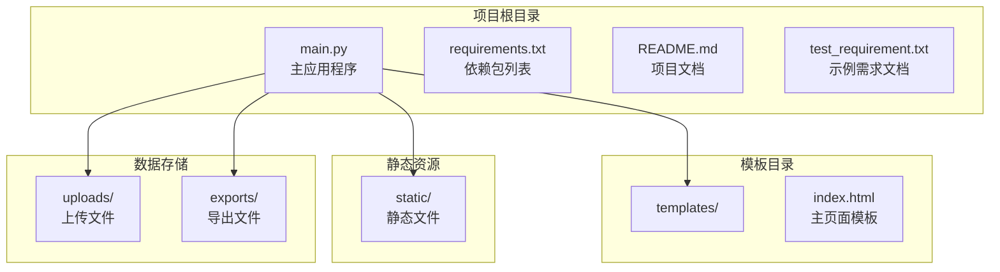
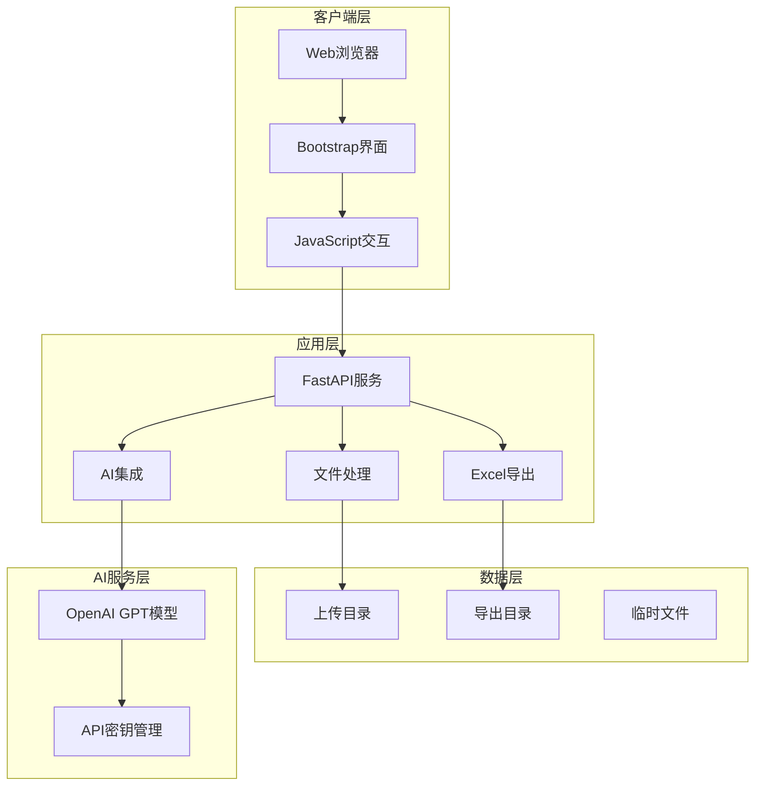
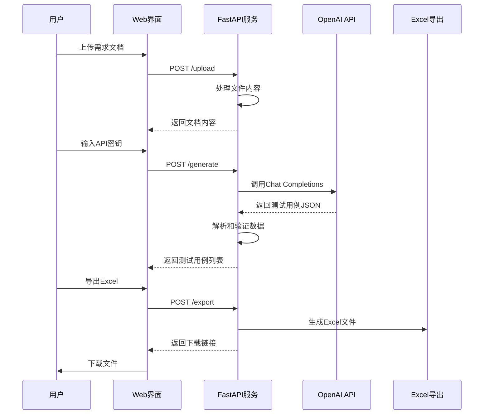
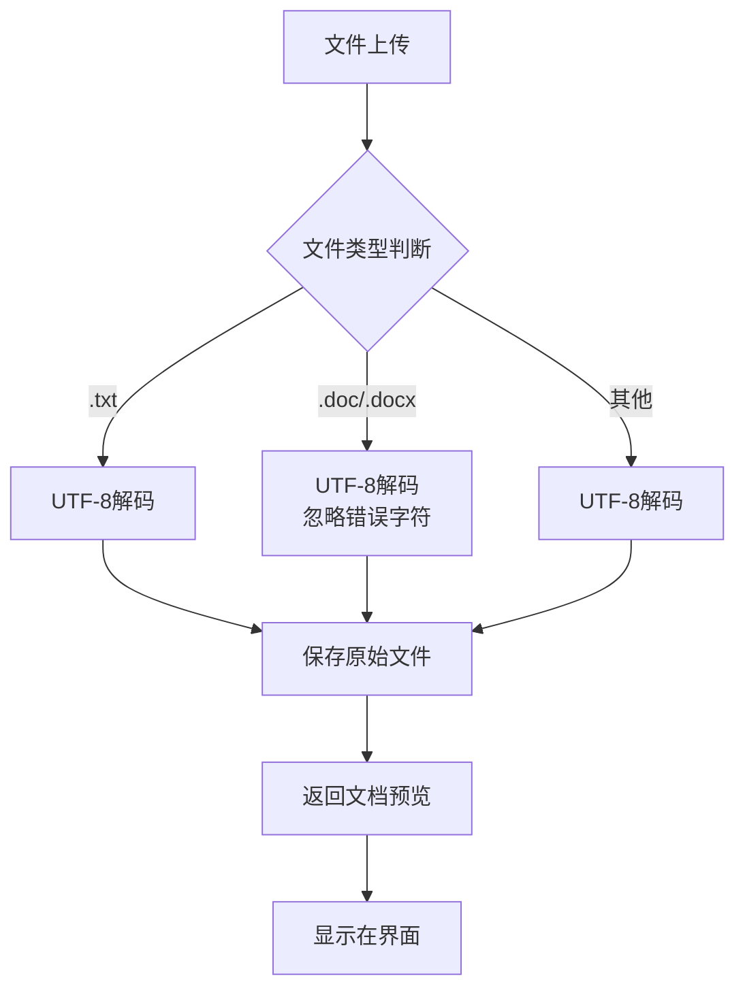
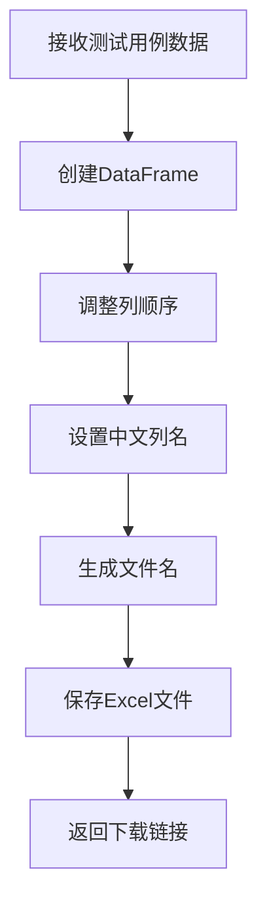
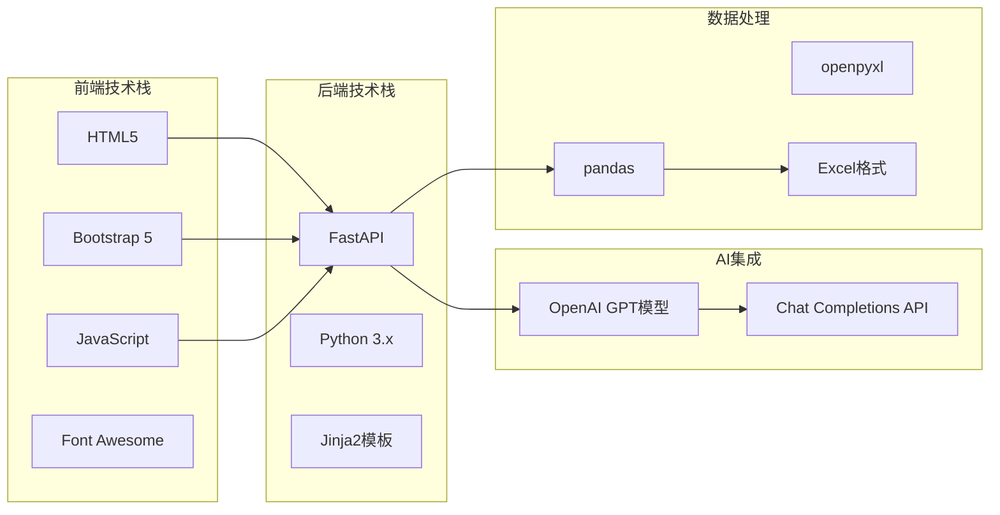

# 快速开始

<cite>
**本文引用的文件**
- [README.md](file://README.md)
- [main.py](file://main.py)
- [requirements.txt](file://requirements.txt)
- [templates/index.html](file://templates/index.html)
- [test_requirement.txt](file://test_requirement.txt)
</cite>

## 目录
1. [简介](#简介)
2. [项目结构](#项目结构)
3. [核心组件](#核心组件)
4. [架构概览](#架构概览)
5. [详细组件分析](#详细组件分析)
6. [依赖分析](#依赖分析)
7. [性能考虑](#性能考虑)
8. [故障排除指南](#故障排除指南)
9. [结论](#结论)

## 简介

AI测试用例生成工具是一个基于人工智能的智能测试用例生成平台，专门帮助测试工程师快速生成专业的测试用例。该工具集成了OpenAI GPT模型，支持多种文档格式上传，能够自动生成结构化的测试用例表格并导出为Excel格式。

### 主要功能特性
- 🤖 基于OpenAI GPT模型智能生成测试用例
- 📁 支持多种文档格式上传（txt, doc, docx）
- 📊 自动生成结构化的测试用例表格
- 📤 支持导出为Excel格式
- 💻 现代化Web界面，操作简单直观

## 项目结构

该项目采用前后端分离的架构设计，包含完整的Web应用结构：

**图表来源**
- [main.py:15-19](file://main.py#L15-L19)
- [README.md:29-41](file://README.md#L29-L41)

**章节来源**
- [README.md:29-41](file://README.md#L29-L41)
- [main.py:15-19](file://main.py#L15-L19)

## 核心组件

### 后端服务组件

系统的核心由FastAPI框架构建，提供了完整的RESTful API接口：

#### 主要服务端点
- `/` - 主页面路由，提供Web界面
- `/upload` - 文件上传处理
- `/generate` - AI测试用例生成
- `/export` - Excel文件导出
- `/download/{filename}` - 文件下载

#### 数据模型定义
系统定义了`TestCase`类来封装测试用例数据结构，包含以下字段：
- 功能模块（module）
- 用例编号（case_id）  
- 用例名称（case_name）
- 前置条件（precondition）
- 测试步骤（steps）
- 预期结果（expected_result）
- 优先级（priority）
- 用例类型（case_type）

**章节来源**
- [main.py:28-40](file://main.py#L28-L40)
- [main.py:151-237](file://main.py#L151-L237)

### 前端界面组件

采用现代化的Bootstrap 5框架构建，提供直观的用户交互体验：

#### 三步操作流程
1. **上传需求文档** - 支持.txt、.doc、.docx格式
2. **配置API密钥** - 输入OpenAI API密钥
3. **生成测试用例** - AI智能生成并展示结果
4. **导出Excel文件** - 将结果导出为Excel格式

#### 用户界面特色
- 渐变色彩设计的头部区域
- 分步骤的操作指示器
- 实时的加载状态反馈
- 响应式的表格展示
- 优先级颜色标识系统

**章节来源**
- [templates/index.html:78-91](file://templates/index.html#L78-L91)
- [templates/index.html:213-251](file://templates/index.html#L213-L251)

## 架构概览

系统采用客户端-服务器架构，结合AI模型服务实现完整的测试用例生成流程：

**图表来源**
- [main.py:135-237](file://main.py#L135-L237)
- [templates/index.html:213-298](file://templates/index.html#L213-L298)

## 详细组件分析

### AI测试用例生成组件

该组件是整个系统的核心，负责与OpenAI API交互并生成测试用例：

#### AI生成流程

**图表来源**
- [main.py:41-123](file://main.py#L41-L123)
- [main.py:185-201](file://main.py#L185-L201)

#### AI提示词设计
系统使用精心设计的系统提示词，要求AI扮演资深测试工程师角色，具备以下能力：
- 覆盖所有功能点，包括正常和异常场景
- 考虑边界值、等价类划分等测试方法
- 包含功能测试、兼容性测试、性能测试等多种类型
- 生成详细、可执行的测试用例

**章节来源**
- [main.py:41-77](file://main.py#L41-L77)
- [main.py:185-201](file://main.py#L185-L201)

### 文件处理组件

系统支持多种文档格式的处理，包括文本文件和Word文档：

#### 文件处理流程

**图表来源**
- [main.py:155-183](file://main.py#L155-L183)
- [templates/index.html:100-115](file://templates/index.html#L100-L115)

**章节来源**
- [main.py:155-183](file://main.py#L155-L183)
- [templates/index.html:100-115](file://templates/index.html#L100-L115)

### Excel导出组件

将生成的测试用例转换为标准的Excel格式，便于团队协作和存档：

#### 导出流程

**图表来源**
- [main.py:124-149](file://main.py#L124-L149)

**章节来源**
- [main.py:124-149](file://main.py#L124-L149)

## 依赖分析

系统使用现代化的Python技术栈构建，所有依赖都通过requirements.txt统一管理：

### 核心依赖包

| 依赖包 | 版本 | 用途 |
|--------|------|------|
| fastapi | 0.109.0 | Web应用框架 |
| uvicorn | 0.27.0 | ASGI服务器 |
| python-multipart | 0.0.6 | 处理multipart表单数据 |
| openai | 1.12.0 | OpenAI API客户端 |
| pandas | 2.2.0 | 数据处理和分析 |
| openpyxl | 3.1.2 | Excel文件读写 |
| jinja2 | 3.1.3 | 模板渲染引擎 |
| aiofiles | 23.2.1 | 异步文件操作 |

### 技术栈架构

**图表来源**
- [requirements.txt:1-8](file://requirements.txt#L1-L8)
- [README.md:83-89](file://README.md#L83-L89)

**章节来源**
- [requirements.txt:1-8](file://requirements.txt#L1-L8)
- [README.md:83-89](file://README.md#L83-L89)

## 性能考虑

### 网络性能优化
- 使用异步文件操作减少I/O等待时间
- 实现文件上传进度显示
- 优化Excel文件生成过程

### AI调用优化
- 设置合理的温度参数（0.7）平衡创造性与稳定性
- 控制最大令牌数（2000）避免过长响应
- 实现错误回退机制确保系统稳定性

### 内存管理
- 限制文档预览显示长度（1000字符）
- 及时清理临时文件
- 合理的文件大小检查

## 故障排除指南

### 常见问题及解决方案

#### 1. OpenAI API密钥相关问题
**问题症状**：生成测试用例时出现API调用错误
**解决方法**：
- 确认API密钥格式正确且有效
- 检查网络连接是否正常
- 验证OpenAI账户余额充足
- 考虑使用环境变量配置API密钥

#### 2. 文件上传失败
**问题症状**：上传文档时出现错误提示
**解决方法**：
- 确认文件格式为.txt、.doc或.docx
- 检查文件大小是否超出限制
- 验证文件编码格式
- 确认uploads目录有写入权限

#### 3. Excel导出失败
**问题症状**：导出Excel文件时报错
**解决方法**：
- 检查exports目录权限
- 确认pandas和openpyxl版本兼容
- 验证测试用例数据格式正确
- 清理磁盘空间不足问题

#### 4. 服务启动失败
**问题症状**：无法启动Web服务
**解决方法**：
- 检查端口8000是否被占用
- 确认Python环境版本兼容
- 验证所有依赖包正确安装
- 查看详细的错误日志信息

### 系统要求

#### 硬件要求
- CPU：1 GHz以上处理器
- 内存：1 GB RAM以上
- 存储：至少500 MB可用空间

#### 软件要求
- Python：3.7+
- 网络：稳定的互联网连接
- 浏览器：现代Web浏览器（Chrome、Firefox、Safari）

**章节来源**
- [README.md:76-82](file://README.md#L76-L82)
- [README.md:91-103](file://README.md#L91-L103)

## 结论

AI测试用例生成工具为测试工程师提供了一个强大而易用的自动化测试用例生成平台。通过集成OpenAI GPT模型和现代化的Web界面，用户可以在30分钟内完成完整的部署和使用流程。

### 快速部署清单

1. **环境准备**（5分钟）
   - 安装Python 3.7+
   - 准备稳定的网络连接

2. **项目安装**（10分钟）
   - 克隆项目代码
   - 安装依赖包
   - 配置OpenAI API密钥

3. **服务启动**（2分钟）
   - 启动Web服务
   - 访问本地应用

4. **首次使用**（10分钟）
   - 上传示例需求文档
   - 生成测试用例
   - 导出Excel文件

该工具特别适合以下场景：
- 新项目启动阶段的测试用例设计
- 团队协作中的测试用例标准化
- 测试流程自动化改进
- 测试工程师效率提升

通过遵循本指南的步骤，新手用户可以快速掌握工具的使用方法，并在实际工作中发挥其价值。