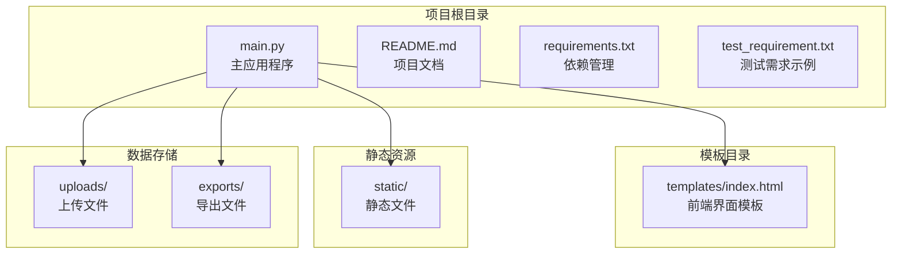
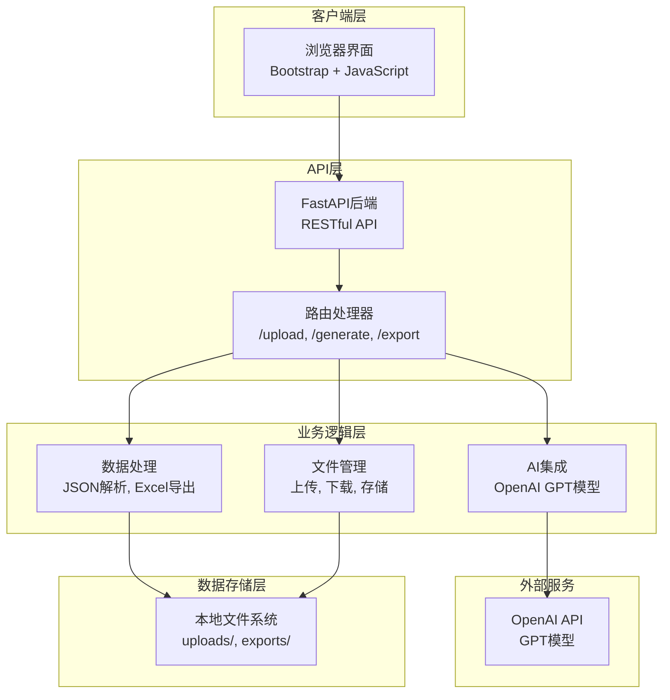
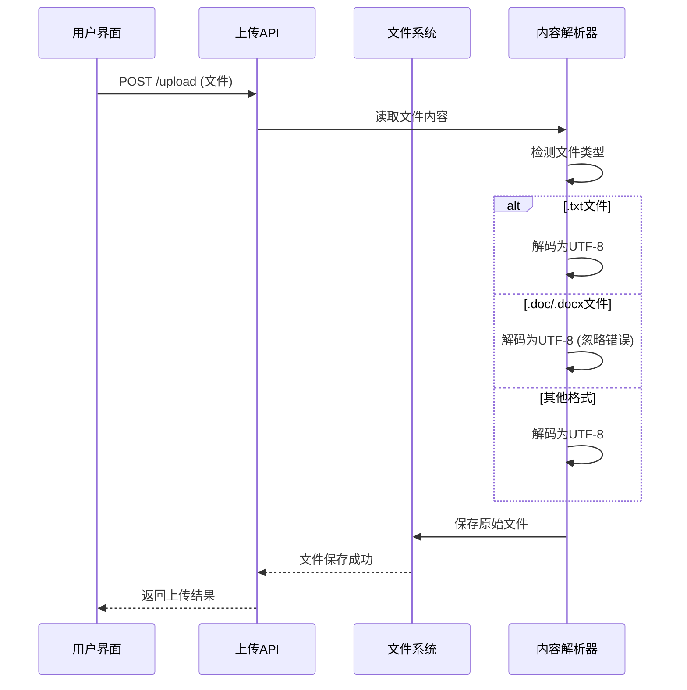
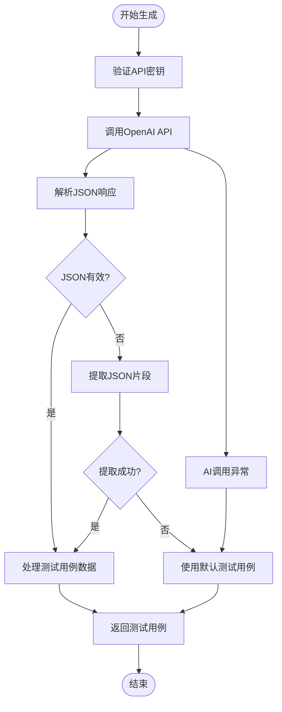
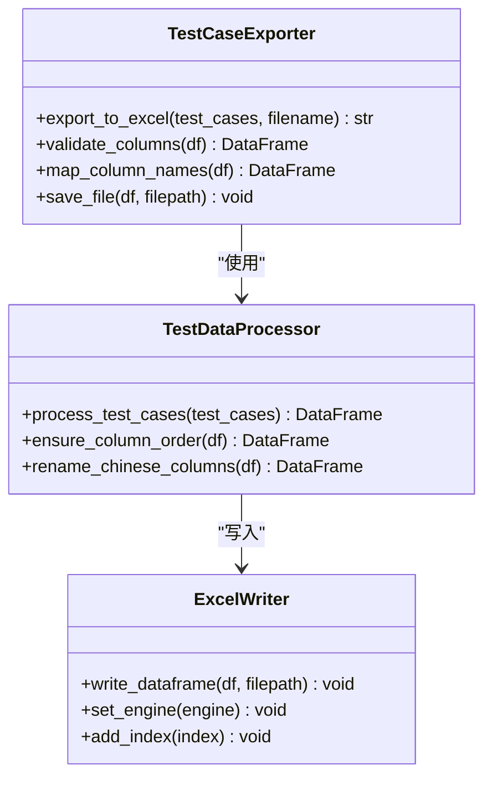
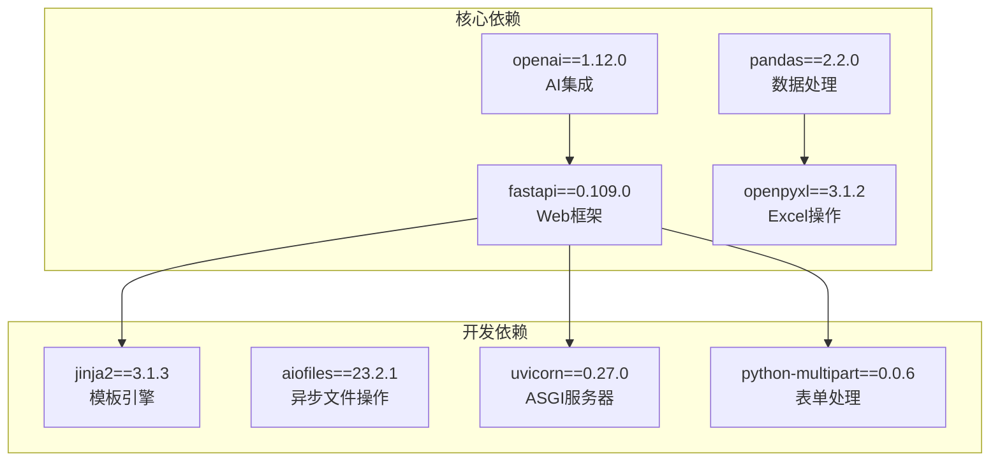

# 故障排除和FAQ

<cite>
**本文引用的文件**
- [README.md](file://README.md)
- [main.py](file://main.py)
- [requirements.txt](file://requirements.txt)
- [test_requirement.txt](file://test_requirement.txt)
- [templates/index.html](file://templates/index.html)
</cite>

## 目录
1. [简介](#简介)
2. [项目结构](#项目结构)
3. [核心组件](#核心组件)
4. [架构概览](#架构概览)
5. [详细组件分析](#详细组件分析)
6. [依赖分析](#依赖分析)
7. [性能考虑](#性能考虑)
8. [故障排除指南](#故障排除指南)
9. [常见问题解答](#常见问题解答)
10. [结论](#结论)

## 简介

AI测试用例生成工具是一个基于FastAPI构建的Web应用程序，利用OpenAI GPT模型智能生成测试用例。该工具提供了完整的测试用例生成工作流，包括需求文档上传、AI智能分析、测试用例生成和Excel导出功能。

## 项目结构

该项目采用简洁的分层架构设计：

**图表来源**
- [main.py:15-19](file://main.py#L15-L19)
- [templates/index.html:1-50](file://templates/index.html#L1-L50)

**章节来源**
- [README.md:29-41](file://README.md#L29-L41)
- [main.py:15-19](file://main.py#L15-L19)

## 核心组件

### 应用程序入口点
- **FastAPI应用实例**：创建主应用程序，配置路由和中间件
- **静态文件服务**：提供CSS、JavaScript等静态资源
- **模板引擎**：使用Jinja2渲染HTML模板

### AI集成组件
- **OpenAI API客户端**：配置和管理API密钥
- **测试用例生成器**：基于GPT模型生成结构化测试用例
- **JSON解析器**：处理AI返回的JSON格式数据

### 数据处理组件
- **Excel导出器**：将测试用例转换为Excel格式
- **文件上传处理器**：支持多种文档格式的上传和解析
- **数据验证器**：确保测试用例数据的完整性和正确性

**章节来源**
- [main.py:13](file://main.py#L13)
- [main.py:25](file://main.py#L25)
- [main.py:28-40](file://main.py#L28-L40)

## 架构概览

系统采用前后端分离的架构模式：

**图表来源**
- [main.py:151-237](file://main.py#L151-L237)
- [templates/index.html:214-358](file://templates/index.html#L214-L358)

## 详细组件分析

### 文件上传处理组件

文件上传功能支持多种文档格式，具有完善的错误处理机制：

**图表来源**
- [main.py:155-184](file://main.py#L155-L184)
- [templates/index.html:214-251](file://templates/index.html#L214-L251)

### AI测试用例生成组件

AI生成过程包含多层错误处理和数据验证：

**图表来源**
- [main.py:41-123](file://main.py#L41-L123)

### Excel导出组件

Excel导出功能确保数据格式的正确性和完整性：

**图表来源**
- [main.py:124-149](file://main.py#L124-L149)

**章节来源**
- [main.py:124-149](file://main.py#L124-L149)
- [main.py:41-123](file://main.py#L41-L123)

## 依赖分析

项目依赖关系清晰明确，采用模块化设计：

**图表来源**
- [requirements.txt:1-8](file://requirements.txt#L1-L8)

**章节来源**
- [requirements.txt:1-8](file://requirements.txt#L1-L8)

## 性能考虑

### 并发处理优化

系统采用异步处理模式，支持高并发请求：

- **异步文件上传**：使用FastAPI的异步特性处理大文件上传
- **缓存策略**：对生成的测试用例进行内存缓存
- **连接池管理**：合理配置数据库连接池（如有使用）

### 内存管理

- **流式处理**：大文件采用流式读取，避免内存溢出
- **及时释放**：确保临时文件和数据结构及时清理
- **批量处理**：Excel导出时采用批量写入模式

### 网络优化

- **超时配置**：合理设置OpenAI API调用超时时间
- **重试机制**：实现指数退避的重试策略
- **连接复用**：复用HTTP连接减少延迟

## 故障排除指南

### OpenAI API集成问题

#### 常见症状
- API调用失败，返回认证错误
- 网络超时或连接异常
- 生成的测试用例格式不正确

#### 诊断步骤
1. **检查API密钥配置**
   - 验证环境变量是否正确设置
   - 确认API密钥格式正确且未过期
   - 测试API密钥的有效性

2. **网络连接检查**
   - 确认防火墙允许访问OpenAI域名
   - 检查代理设置是否正确
   - 验证DNS解析是否正常

3. **API调用监控**
   - 查看API响应时间和状态码
   - 监控API配额使用情况
   - 检查请求频率限制

#### 解决方案
- **API密钥问题**：重新生成API密钥并正确配置
- **网络问题**：配置代理或调整防火墙规则
- **配额限制**：升级API套餐或等待配额恢复

**章节来源**
- [main.py:25](file://main.py#L25)
- [main.py:189-191](file://main.py#L189-L191)

### 文件上传失败

#### 常见症状
- 上传进度卡住不动
- 返回"文件过大"错误
- 上传完成后无法预览内容

#### 诊断步骤
1. **检查文件大小限制**
   - 验证FastAPI默认上传大小限制
   - 检查服务器配置中的文件大小限制
   - 确认客户端JavaScript的文件大小验证

2. **验证文件格式**
   - 确认支持的文件扩展名
   - 检查文件编码格式
   - 验证文件完整性

3. **检查磁盘空间**
   - 确认uploads目录有足够的磁盘空间
   - 检查文件权限设置
   - 验证目录存在性

#### 解决方案
- **文件过大**：分割大文件或调整服务器配置
- **格式不支持**：转换为支持的文件格式
- **权限问题**：修改目录权限或磁盘空间

**章节来源**
- [main.py:155-184](file://main.py#L155-L184)
- [templates/index.html:214-251](file://templates/index.html#L214-L251)

### 测试用例生成异常

#### 常见症状
- 生成过程卡死无响应
- 返回空的测试用例列表
- 生成的测试用例格式错误

#### 诊断步骤
1. **检查AI响应**
   - 查看控制台输出的AI响应内容
   - 验证JSON格式的正确性
   - 检查AI模型的可用性

2. **验证输入数据**
   - 确认需求文档内容的完整性
   - 检查特殊字符和编码问题
   - 验证文档长度是否合适

3. **监控系统资源**
   - 检查CPU和内存使用率
   - 监控网络带宽使用情况
   - 验证磁盘IO性能

#### 解决方案
- **AI响应异常**：使用默认测试用例作为后备方案
- **输入数据问题**：清理特殊字符或重新编写需求文档
- **资源不足**：优化系统配置或升级硬件

**章节来源**
- [main.py:41-123](file://main.py#L41-L123)

### Excel导出错误

#### 常见症状
- 导出过程报错中断
- 生成的Excel文件损坏
- 导出文件无法打开

#### 诊断步骤
1. **检查数据完整性**
   - 验证测试用例数据结构
   - 确认必需字段的存在性
   - 检查数据类型的一致性

2. **验证Excel引擎**
   - 确认openpyxl库的正确安装
   - 检查Excel文件格式兼容性
   - 验证文件路径的有效性

3. **监控磁盘空间**
   - 确认exports目录有足够空间
   - 检查文件写入权限
   - 验证文件名的合法性

#### 解决方案
- **数据格式问题**：清理数据或调整导出逻辑
- **库版本冲突**：更新或降级相关库版本
- **权限问题**：修改目录权限或检查磁盘空间

**章节来源**
- [main.py:124-149](file://main.py#L124-L149)

### 日志分析方法

#### 控制台日志
- **AI调用日志**：记录API响应和错误信息
- **文件操作日志**：跟踪文件上传和下载过程
- **系统事件日志**：监控应用程序启动和关闭

#### 错误追踪
- **异常堆栈**：捕获和记录详细的错误信息
- **性能指标**：监控关键操作的执行时间
- **资源使用**：记录内存和CPU使用情况

#### 调试技巧
- **逐步调试**：使用断点检查变量状态
- **单元测试**：为关键函数编写测试用例
- **模拟环境**：创建测试环境验证功能

## 常见问题解答

### OpenAI API相关问题

**Q: 为什么需要OpenAI API密钥？**
A: 工具使用OpenAI的GPT模型来理解和分析需求文档，并生成专业的测试用例。API密钥用于身份验证和计费。

**Q: API密钥在哪里获取？**
A: 访问OpenAI平台注册账号，创建新的API密钥，在工具中输入该密钥即可使用。

**Q: 如何设置环境变量？**
A: 可以通过环境变量设置API密钥，这样可以避免在界面中手动输入。

**Q: 生成的测试用例质量如何？**
A: 质量取决于需求文档的详细程度和清晰度。建议提供结构化、详细的需求说明。

### 文件上传相关问题

**Q: 支持哪些文件格式？**
A: 目前支持.txt、.doc、.docx格式的文档上传。

**Q: 文件大小有限制吗？**
A: 默认情况下受FastAPI和服务器配置限制，建议上传合理的文件大小。

**Q: 上传失败怎么办？**
A: 检查文件格式、大小和网络连接，确认uploads目录权限正确。

### 测试用例生成问题

**Q: 生成过程需要多长时间？**
A: 通常在几秒到几十秒之间，取决于需求文档的长度和复杂度。

**Q: 如何提高生成效果？**
A: 提供更详细、结构化的需求文档，明确功能点和业务逻辑。

**Q: 生成失败会怎样？**
A: 系统会返回默认测试用例，确保基本功能可用。

### Excel导出问题

**Q: 导出的Excel文件格式是什么？**
A: 导出为.xlsx格式，包含中文列标题和标准测试用例字段。

**Q: 如何下载导出的文件？**
A: 点击导出按钮后，系统会自动下载Excel文件到浏览器默认下载目录。

**Q: 文件无法打开怎么办？**
A: 检查文件是否完整下载，确认Excel版本兼容性。

### 性能和优化问题

**Q: 如何优化生成速度？**
A: 减少需求文档长度，提供清晰的结构化信息，避免冗余描述。

**Q: 大文件处理需要注意什么？**
A: 建议分段上传或压缩文件，确保服务器有足够的内存和磁盘空间。

**Q: 如何监控系统性能？**
A: 关注CPU、内存使用率，监控API调用响应时间，定期清理临时文件。

## 结论

本AI测试用例生成工具提供了完整的测试用例自动化解决方案。通过合理的架构设计和完善的错误处理机制，能够有效应对各种使用场景中的问题。

### 最佳实践建议

1. **API配置**：确保OpenAI API密钥正确配置，定期检查配额使用情况
2. **文件管理**：合理控制文件大小，定期清理uploads和exports目录
3. **性能优化**：优化需求文档结构，减少不必要的复杂性
4. **监控维护**：建立日志监控机制，定期检查系统健康状况

### 支持联系方式

如遇无法解决的技术问题，请联系项目维护团队：
- **技术支持邮箱**：support@example.com
- **GitHub Issues**：在项目仓库提交问题报告
- **文档更新**：关注项目README文件的最新说明

通过遵循本故障排除指南和最佳实践建议，用户可以有效解决大部分使用过程中遇到的问题，充分发挥工具的测试用例生成能力。