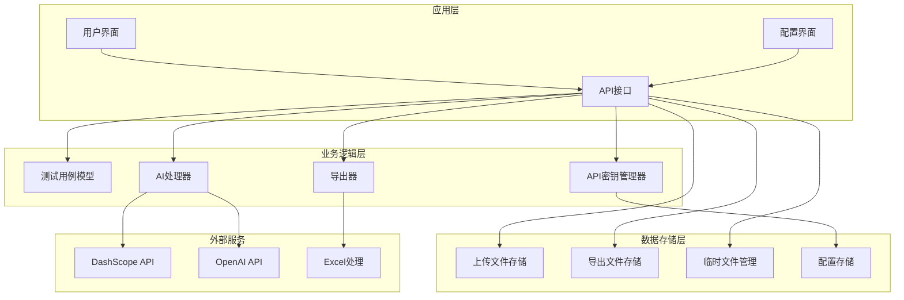
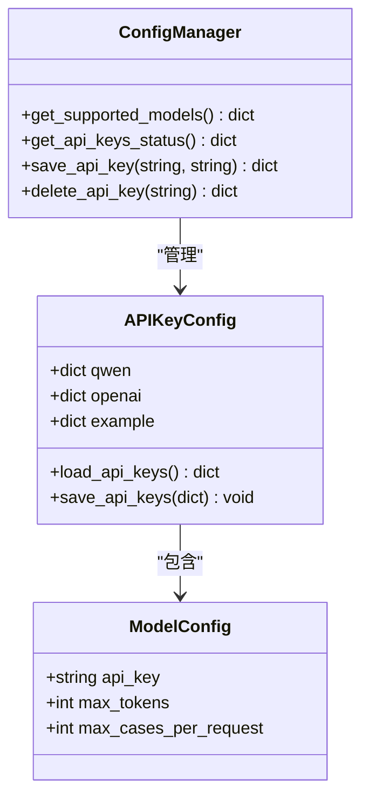
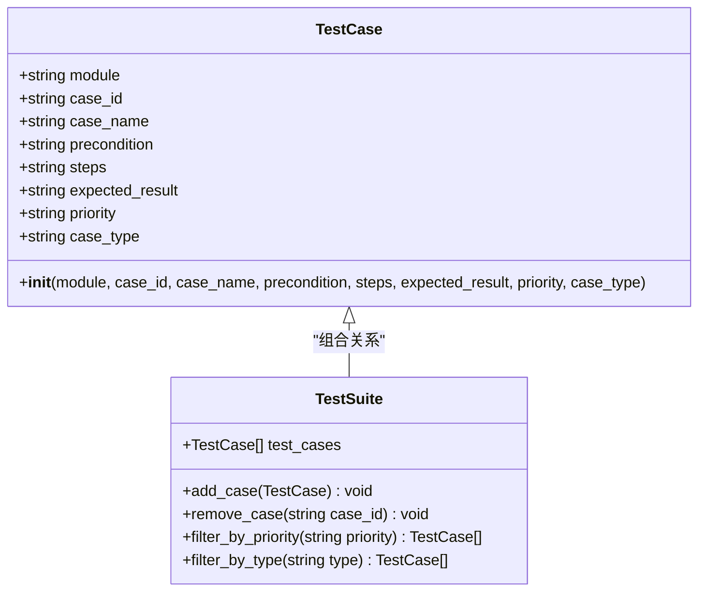
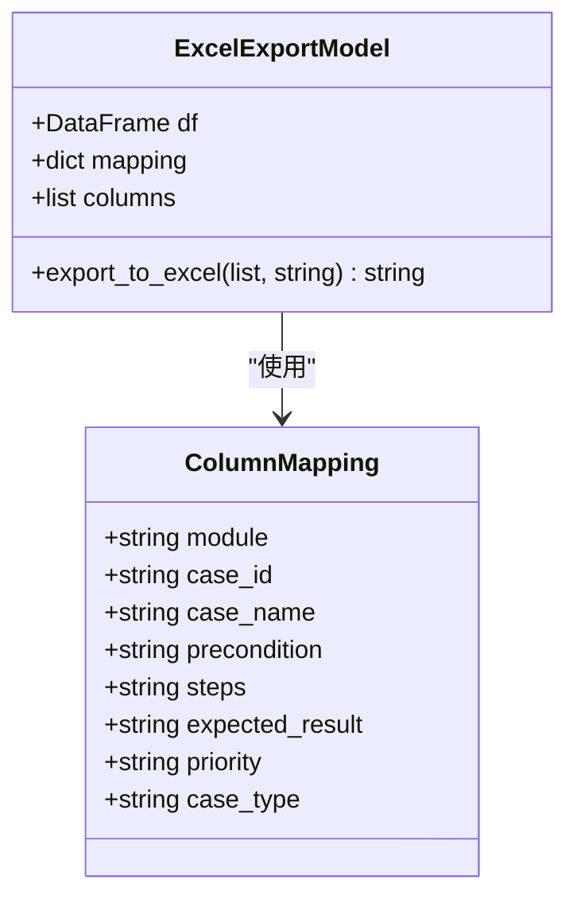
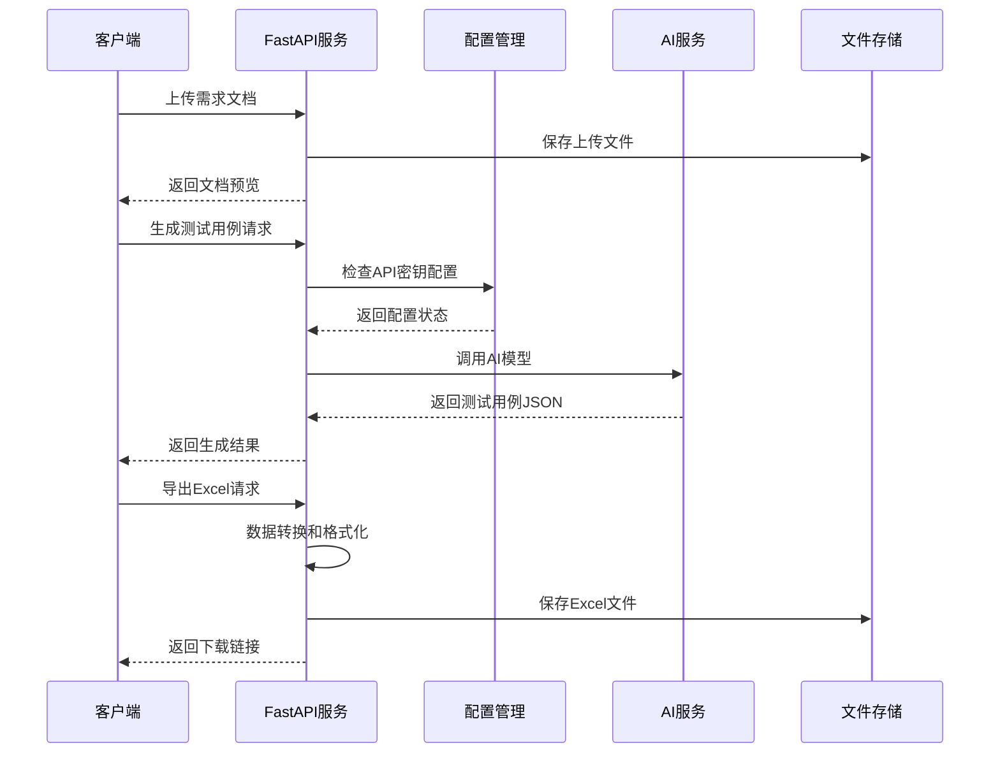
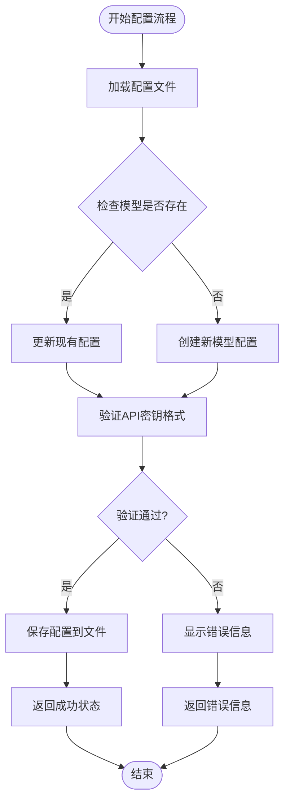
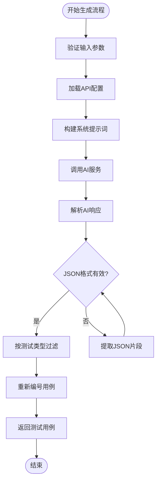
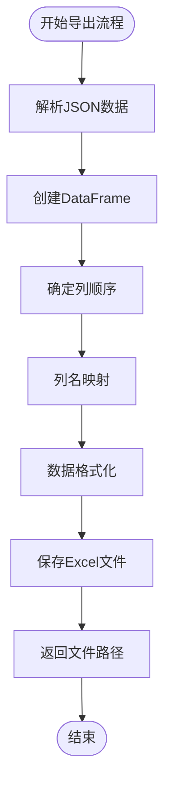
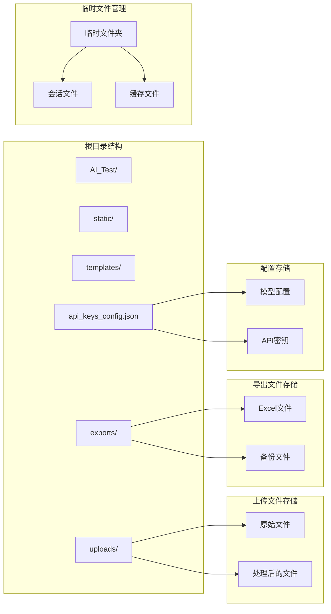
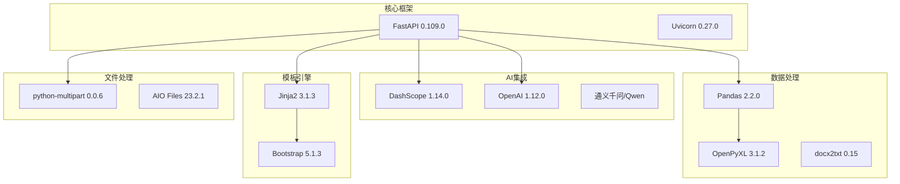

# 数据模型设计

<cite>
**本文引用的文件**
- [main.py](file://main.py)
- [api_keys_config.json](file://api_keys_config.json)
- [templates/api_config.html](file://templates/api_config.html)
- [templates/index.html](file://templates/index.html)
- [requirements.txt](file://requirements.txt)
</cite>

## 更新摘要
**变更内容**
- 新增API密钥配置数据模型及其管理功能
- 完善测试用例数据模型的字段定义和验证规则
- 增强Excel导出数据模型的列映射和格式化机制
- 更新数据存储结构和文件组织方式
- 扩展数据模型的扩展性和定制指导原则

## 目录
1. [简介](#简介)
2. [项目结构](#项目结构)
3. [核心数据模型](#核心数据模型)
4. [架构概览](#架构概览)
5. [详细组件分析](#详细组件分析)
6. [依赖关系分析](#依赖关系分析)
7. [性能考虑](#性能考虑)
8. [故障排除指南](#故障排除指南)
9. [结论](#结论)
10. [附录](#附录)

## 简介

本项目是一个基于AI的智能测试用例生成工具，旨在帮助测试工程师快速生成专业的测试用例。系统采用现代Web技术栈构建，结合DashScope和OpenAI等AI服务实现智能化的需求分析和测试用例生成。

该项目的核心价值在于其完善的数据模型设计，通过标准化的测试用例结构、API密钥配置管理和Excel导出机制，为测试工作提供了统一的数据格式、安全的密钥管理和便捷的数据输出功能。本文将深入分析数据模型的设计理念、实现细节以及扩展策略。

## 项目结构

项目采用分层架构设计，主要包含以下核心组件：

**图表来源**
- [main.py:18-342](file://main.py#L18-L342)
- [templates/index.html:145-481](file://templates/index.html#L145-L481)
- [templates/api_config.html:20-47](file://templates/api_config.html#L20-L47)

**章节来源**
- [main.py:18-342](file://main.py#L18-L342)
- [templates/index.html:145-481](file://templates/index.html#L145-L481)

## 核心数据模型

### API密钥配置数据模型

系统引入了完整的API密钥配置数据模型，支持多模型密钥管理：

**图表来源**
- [main.py:27-38](file://main.py#L27-L38)
- [main.py:299-338](file://main.py#L299-L338)

### TestCase类设计

系统的核心数据模型围绕TestCase类构建，该类定义了测试用例的标准结构：

**图表来源**
- [main.py:82-135](file://main.py#L82-L135)

### Excel导出数据模型

系统提供了完整的Excel导出数据模型，支持数据格式化和列映射：

**图表来源**
- [main.py:256-277](file://main.py#L256-L277)

**章节来源**
- [main.py:27-38](file://main.py#L27-L38)
- [main.py:82-135](file://main.py#L82-L135)
- [main.py:256-277](file://main.py#L256-L277)

## 架构概览

系统采用RESTful API架构，结合FastAPI框架实现高性能的Web服务：

**图表来源**
- [main.py:137-254](file://main.py#L137-L254)

**章节来源**
- [main.py:18-342](file://main.py#L18-L342)

## 详细组件分析

### API密钥配置管理系统

系统提供了完整的API密钥配置管理功能，支持多模型密钥的安全存储和管理：

**图表来源**
- [main.py:30-38](file://main.py#L30-L38)
- [main.py:315-338](file://main.py#L315-L338)

#### API密钥配置结构

API密钥配置采用JSON格式存储，支持以下字段：

| 字段名 | 类型 | 必填 | 默认值 | 描述 |
|--------|------|------|--------|------|
| api_key | string | 否 | "" | AI服务的API密钥 |
| max_tokens | int | 否 | 4000 | 单次请求的最大token数 |
| max_cases_per_request | int | 否 | 25 | 单次请求的最大用例数 |

**章节来源**
- [api_keys_config.json:1-16](file://api_keys_config.json#L1-L16)
- [main.py:30-38](file://main.py#L30-L38)

### AI驱动的测试用例生成

系统通过精心设计的提示词工程，引导AI模型生成符合标准的测试用例：

**图表来源**
- [main.py:137-254](file://main.py#L137-L254)

#### 数据验证规则

系统实现了多层次的数据验证机制：

1. **格式验证**：确保AI响应符合JSON格式要求
2. **字段完整性**：验证必需字段的存在性和有效性
3. **类型约束**：对不同字段实施类型检查
4. **业务规则**：验证优先级和用例类型的合法性
5. **模型限制**：根据配置限制单次生成的数量

**章节来源**
- [main.py:82-135](file://main.py#L82-L135)
- [main.py:137-254](file://main.py#L137-L254)

### Excel导出功能

系统提供完整的Excel导出功能，支持数据格式化和列映射：

**图表来源**
- [main.py:256-277](file://main.py#L256-L277)

#### 列映射关系

系统实现了完整的列映射机制：

| 英文字段 | 中文列名 | 数据类型 | 描述 |
|---------|---------|---------|------|
| module | 功能模块 | string | 测试的功能模块名称 |
| case_id | 用例编号 | string | 唯一的测试用例ID |
| case_name | 用例名称 | string | 测试用例的描述性名称 |
| precondition | 前置条件 | string | 执行测试前需要满足的条件 |
| steps | 测试步骤 | string | 详细的测试执行步骤 |
| expected_result | 预期结果 | string | 期望的测试结果 |
| priority | 优先级 | string | 测试用例的重要程度 |
| case_type | 用例类型 | string | 测试类型分类 |

**章节来源**
- [main.py:256-277](file://main.py#L256-L277)

### 文件存储和管理

系统采用分层文件存储策略：

**图表来源**
- [main.py:24-25](file://main.py#L24-L25)
- [api_keys_config.json:1-16](file://api_keys_config.json#L1-L16)

**章节来源**
- [main.py:24-25](file://main.py#L24-L25)
- [api_keys_config.json:1-16](file://api_keys_config.json#L1-L16)

## 依赖关系分析

系统的技术栈和依赖关系如下：

**图表来源**
- [requirements.txt:1-9](file://requirements.txt#L1-L9)

**章节来源**
- [requirements.txt:1-9](file://requirements.txt#L1-L9)

## 性能考虑

### 数据处理优化

系统在数据处理方面采用了多项优化策略：

1. **内存管理**：使用pandas DataFrame进行高效的数据操作
2. **异步处理**：利用FastAPI的异步特性提升并发处理能力
3. **缓存策略**：合理使用临时文件减少重复计算
4. **流式处理**：对大文件采用流式读取避免内存溢出
5. **请求限制**：根据模型配置限制单次生成数量

### API性能优化

- **请求限制**：合理设置max_tokens防止过长响应
- **错误处理**：实现优雅的降级机制确保服务稳定性
- **资源清理**：及时清理临时文件避免磁盘空间占用
- **配置缓存**：缓存API密钥配置减少文件I/O操作

## 故障排除指南

### 常见问题及解决方案

#### API密钥配置问题
- **问题**：API密钥无效或过期
- **解决方案**：重新生成API密钥并通过配置界面更新
- **预防措施**：定期检查API配额和使用情况

#### AI服务调用问题
- **问题**：AI响应不符合预期格式
- **解决方案**：检查系统提示词配置和输入参数
- **预防措施**：实现更严格的JSON解析和验证

#### Excel导出问题
- **问题**：Excel导出失败或格式错误
- **解决方案**：检查文件权限和磁盘空间
- **预防措施**：实现文件存在性检查和错误恢复机制

#### 文件处理问题
- **问题**：上传文件处理失败
- **解决方案**：检查文件格式和大小限制
- **预防措施**：实现文件类型验证和错误处理

**章节来源**
- [main.py:137-254](file://main.py#L137-L254)

## 结论

本项目的数据模型设计体现了现代软件工程的最佳实践，通过标准化的测试用例结构、完善的API密钥配置管理和Excel导出机制，为测试工作提供了可靠的技术支撑。

系统的核心优势包括：
- **标准化数据结构**：统一的TestCase模型确保数据一致性
- **智能化处理**：AI驱动的测试用例生成提升效率
- **安全的密钥管理**：完整的API密钥配置和管理功能
- **灵活的导出机制**：支持多种格式的数据输出
- **健壮的错误处理**：完善的异常处理和降级机制

未来可以考虑的改进方向：
- 扩展更多测试用例类型和字段
- 增强数据验证和质量控制机制
- 优化AI提示词以提高生成质量
- 实现更高级的数据分析和统计功能
- 增加配置文件的版本管理和备份功能

## 附录

### 数据模型扩展指南

#### 字段扩展原则
1. **向后兼容**：新增字段应保持向后兼容性
2. **语义清晰**：字段命名应具有明确的业务含义
3. **类型一致**：字段类型应与业务逻辑相匹配
4. **验证必要**：新增字段应有相应的验证规则

#### 自定义字段建议
- **automation_level**：自动化程度（手动/半自动/完全自动）
- **test_environment**：测试环境要求
- **data_requirements**：数据准备要求
- **risk_assessment**：风险评估等级
- **estimated_effort**：预计工作量
- **related_cases**：关联用例ID

### 最佳实践建议

1. **数据质量保证**：建立数据验证和清洗机制
2. **版本管理**：对测试用例模型进行版本控制
3. **文档维护**：保持数据字典和字段说明的更新
4. **性能监控**：建立数据处理性能的监控指标
5. **安全考虑**：确保API密钥的安全存储和传输
6. **错误处理**：实现完善的异常处理和日志记录

### 配置管理最佳实践

1. **配置文件保护**：确保配置文件的访问权限
2. **密钥轮换**：定期更新API密钥以提高安全性
3. **配置备份**：定期备份配置文件以防数据丢失
4. **环境隔离**：不同环境使用不同的配置文件
5. **配置验证**：启动时验证配置文件的有效性