# AI测试用例生成系统

<cite>
**本文档引用的文件**
- [main.py](file://main.py)
- [api_keys_config.json](file://api_keys_config.json)
- [requirements.txt](file://requirements.txt)
- [templates/index.html](file://templates/index.html)
- [templates/api_config.html](file://templates/api_config.html)
</cite>

## 目录
1. [简介](#简介)
2. [项目结构](#项目结构)
3. [核心组件](#核心组件)
4. [架构概览](#架构概览)
5. [详细组件分析](#详细组件分析)
6. [API密钥配置管理系统](#api密钥配置管理系统)
7. [增强的AI测试用例生成功能](#增强的ai测试用例生成功能)
8. [Excel导出系统集成](#excel导出系统集成)
9. [改进的前端界面](#改进的前端界面)
10. [依赖分析](#依赖分析)
11. [性能考虑](#性能考虑)
12. [故障排除指南](#故障排除指南)
13. [结论](#结论)
14. [附录](#附录)

## 简介

AI测试用例生成系统是一个基于人工智能的智能测试用例生成工具，现已升级为支持多种AI模型的综合测试工具平台。系统采用现代化的技术栈构建，包括FastAPI后端框架、Bootstrap前端界面和AI驱动的测试用例生成算法。

**主要功能增强**：
- **多模型支持**：支持通义千问、OpenAI、示例数据等多种AI模型
- **API密钥配置管理**：完整的密钥管理系统，支持加密存储
- **增强的测试用例生成**：支持正常用例和异常用例的差异化生成
- **Excel导出系统**：完整的Excel文件导出功能
- **改进的前端界面**：三步式工作流，用户友好交互

## 项目结构

该项目采用现代化的文件组织结构，支持多模型集成和配置管理：

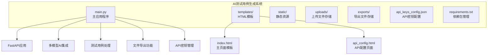

**图表来源**
- [main.py:1-342](file://main.py#L1-L342)
- [templates/index.html:1-1271](file://templates/index.html#L1-L1271)
- [templates/api_config.html:1-272](file://templates/api_config.html#L1-L272)

**章节来源**
- [main.py:18-26](file://main.py#L18-L26)
- [requirements.txt:1-9](file://requirements.txt#L1-L9)

## 核心组件

### 测试用例数据模型

系统的核心是`TestCase`类，它定义了测试用例的标准数据结构：

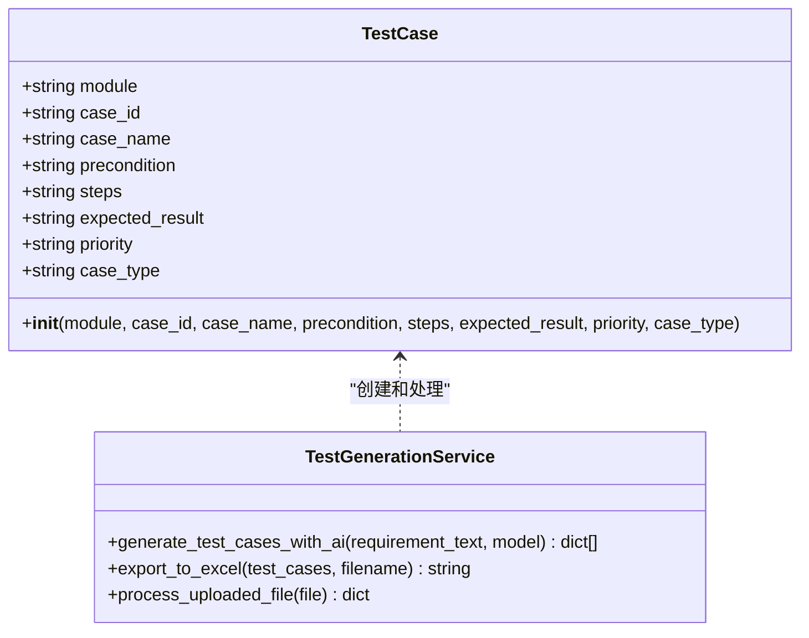

**图表来源**
- [main.py:28-40](file://main.py#L28-L40)
- [main.py:41-123](file://main.py#L41-L123)

### API端点架构

系统提供七个主要的REST API端点，支持完整的AI测试用例生成流程：

| 端点 | 方法 | 描述 | 请求参数 | 响应 |
|------|------|------|----------|------|
| `/` | GET | 主页面 | - | HTML模板 |
| `/api_config.html` | GET | API配置页面 | - | HTML模板 |
| `/upload` | POST | 上传需求文档 | File | JSON结果 |
| `/direct_input` | POST | 直接文本输入 | requirement_text, normal_case_count, abnormal_case_count, test_types | JSON结果 |
| `/generate` | POST | 生成测试用例 | requirement_text, model_type, api_key, normal_case_count, abnormal_case_count, test_types | JSON测试用例 |
| `/export` | POST | 导出Excel文件 | test_cases_json | 文件路径 |
| `/api/config/models` | GET | 获取支持的模型列表 | - | 模型配置 |
| `/api/config/api-keys` | GET | 获取API密钥状态 | - | 密钥配置 |
| `/api/config/api-keys/{model_name}` | POST | 保存API密钥 | api_key | 配置结果 |
| `/api/config/api-keys/{model_name}` | DELETE | 删除API密钥 | - | 删除结果 |

**章节来源**
- [main.py:151-233](file://main.py#L151-L233)
- [main.py:290-339](file://main.py#L290-L339)

## 架构概览

系统采用前后端分离的架构设计，支持多AI模型集成和配置管理：

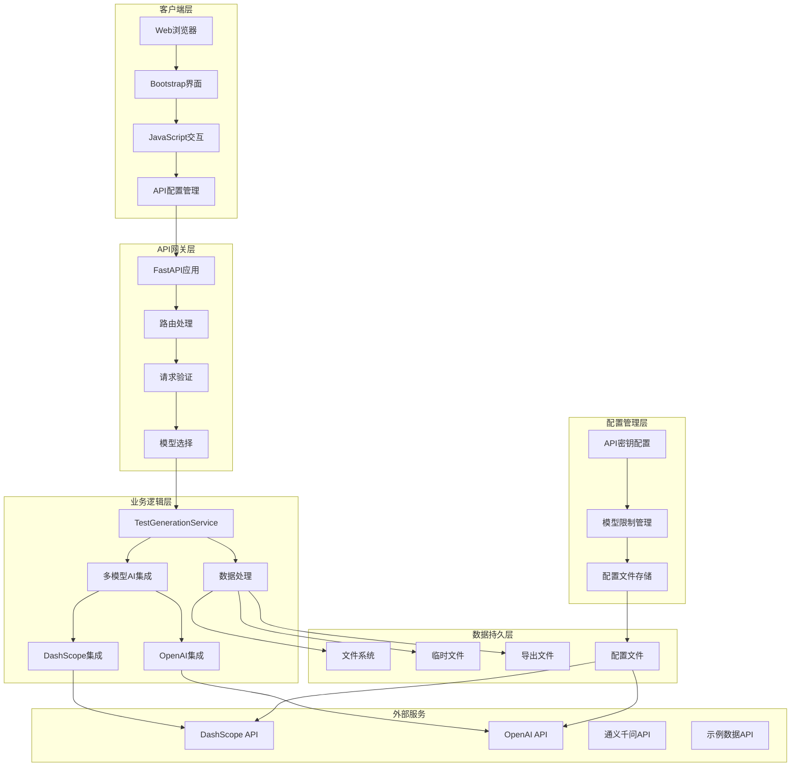

**图表来源**
- [main.py:1-342](file://main.py#L1-L342)
- [templates/index.html:1-1271](file://templates/index.html#L1-L1271)
- [templates/api_config.html:1-272](file://templates/api_config.html#L1-L272)

## 详细组件分析

### 多模型AI集成

系统现已支持三种AI模型，每种模型都有独立的配置和限制：

#### 模型配置管理

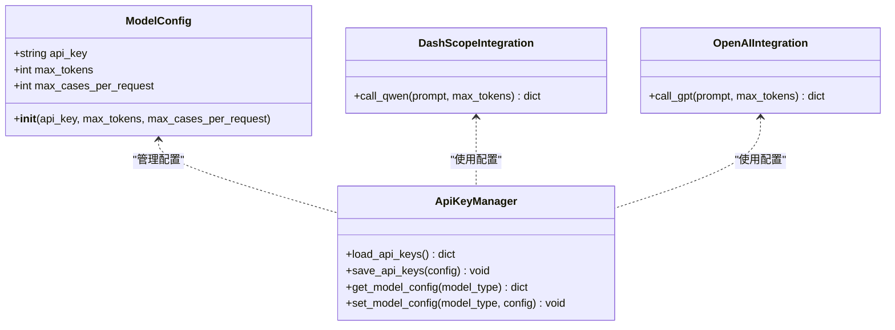

**图表来源**
- [main.py:27-38](file://main.py#L27-L38)
- [main.py:137-254](file://main.py#L137-L254)
- [api_keys_config.json:1-16](file://api_keys_config.json#L1-L16)

#### 模型选择与参数设置

系统支持以下AI模型：

| 模型 | 名称 | 特点 | 配置要求 |
|------|------|------|----------|
| qwen | 通义千问 | 免费使用，支持中文 | 可选API密钥 |
| openai | OpenAI GPT | 高质量输出，需付费 | 必需API密钥 |
| example | 示例数据 | 完全免费，演示用途 | 无需配置 |

**章节来源**
- [main.py:183-189](file://main.py#L183-L189)
- [api_keys_config.json:2-15](file://api_keys_config.json#L2-L15)

### 智能测试用例生成算法

#### 增强的系统提示词设计

系统提示词经过精心设计，支持不同模型的差异化生成：

**系统提示词结构**：
1. **角色设定**：Web3钱包App方向的资深高级测试工程师
2. **任务目标**：根据需求生成专业的测试用例
3. **生成要求**：支持正常用例和异常用例的差异化生成
4. **测试类型**：支持功能测试、接口测试、性能测试
5. **输出规范**：严格JSON格式，包含8个标准字段

**增强的测试用例生成规则**：

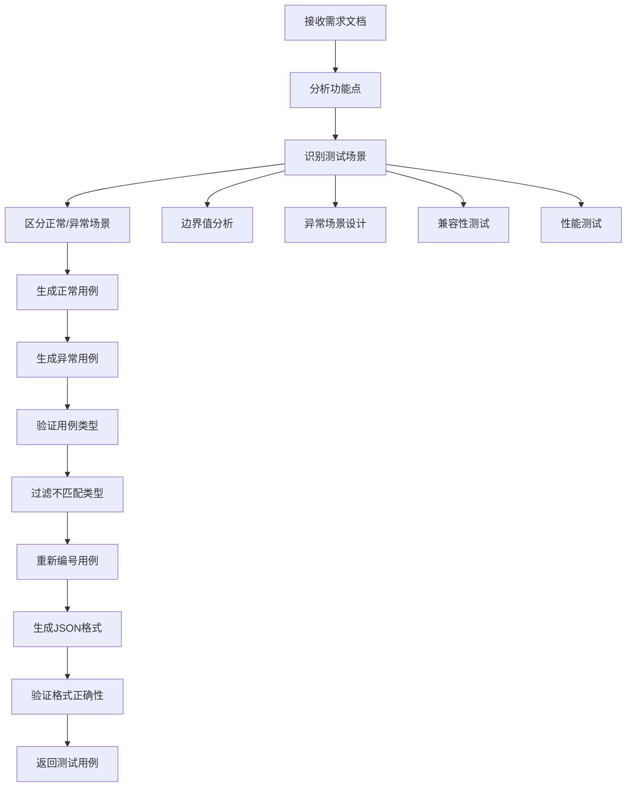

**图表来源**
- [main.py:192-224](file://main.py#L192-L224)
- [main.py:82-135](file://main.py#L82-L135)

#### JSON格式输出规范

生成的测试用例遵循严格的JSON格式规范：

| 字段名 | 数据类型 | 必填 | 说明 |
|--------|----------|------|------|
| module | string | 是 | 功能模块名称 |
| case_id | string | 是 | 用例编号（自动重新编号） |
| case_name | string | 是 | 用例名称描述 |
| precondition | string | 是 | 执行前置条件 |
| steps | string | 是 | 详细测试步骤 |
| expected_result | string | 是 | 预期结果 |
| priority | string | 是 | 优先级（P0/P1/P2） |
| case_type | string | 是 | 用例类型（功能测试/接口测试/性能测试） |

**章节来源**
- [main.py:204-210](file://main.py#L204-L210)
- [main.py:240-243](file://main.py#L240-L243)

### AI响应处理机制

#### 增强的JSON解析与错误恢复

系统实现了多层次的JSON解析和错误恢复机制：

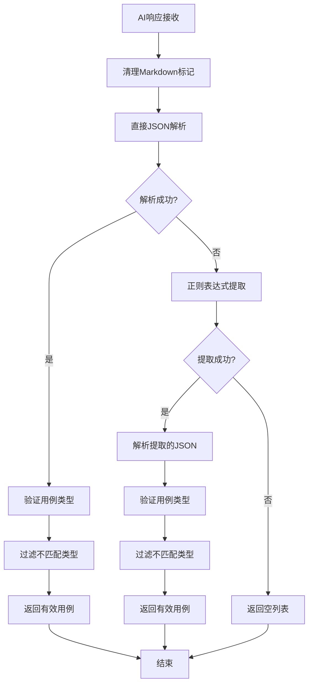

**图表来源**
- [main.py:82-135](file://main.py#L82-L135)

#### 错误恢复策略

系统包含完善的错误处理和恢复机制：

1. **Markdown标记清理**：自动移除```json标记
2. **直接解析失败**：尝试从AI响应中提取JSON数组
3. **正则提取失败**：返回空列表，允许上层逻辑处理
4. **API调用异常**：捕获异常并返回错误信息
5. **网络连接问题**：提供清晰的错误信息

**章节来源**
- [main.py:87-135](file://main.py#L87-L135)

### 测试用例数据结构设计

#### 增强的数据验证规则

系统对测试用例数据实施以下验证规则：

1. **必填字段检查**：确保8个核心字段都存在
2. **格式验证**：检查字段类型和格式
3. **优先级规范化**：支持P0/P1/P2和中文格式
4. **类型分类**：用例类型限定为指定类别
5. **内容完整性**：确保测试步骤和预期结果不为空
6. **类型过滤**：根据用户选择过滤用例类型

#### 优先级和类型分类

| 优先级 | 说明 | 使用场景 |
|--------|------|----------|
| P0 | 高优先级，紧急 | 关键功能，影响核心业务 |
| P1 | 中优先级，重要 | 重要功能，影响用户体验 |
| P2 | 低优先级，一般 | 辅助功能，不影响核心业务 |

| 用例类型 | 说明 | 测试内容 |
|----------|------|----------|
| 功能测试 | 验证功能是否按需求工作 | 正常流程、异常流程 |
| 接口测试 | 验证API接口行为 | 请求响应、错误处理 |
| 性能测试 | 验证系统性能指标 | 响应时间、吞吐量 |

**章节来源**
- [main.py:100-113](file://main.py#L100-L113)
- [main.py:1038-1050](file://main.py#L1038-L1050)

## API密钥配置管理系统

### 配置文件结构

系统使用JSON格式存储API密钥配置，支持多模型管理：

```mermaid
graph TB
subgraph "API密钥配置文件"
A[api_keys_config.json]
B[qwen配置]
C[openai配置]
D[example配置]
end
B --> E[api_key: sk-...]
B --> F[max_tokens: 4000]
B --> G[max_cases_per_request: 25]
C --> H[api_key: "" (空)]
C --> I[max_tokens: 4000]
C --> J[max_cases_per_request: 25]
D --> K[max_tokens: 2000]
D --> L[max_cases_per_request: 50]
end
```

**图表来源**
- [api_keys_config.json:1-16](file://api_keys_config.json#L1-L16)

### 配置管理API

系统提供完整的API密钥管理功能：

| 端点 | 方法 | 描述 | 请求参数 | 响应 |
|------|------|------|----------|------|
| `/api/config/api-keys` | GET | 获取所有模型的密钥状态 | - | 配置状态 |
| `/api/config/api-keys/{model_name}` | POST | 保存指定模型的API密钥 | api_key | 配置结果 |
| `/api/config/api-keys/{model_name}` | DELETE | 删除指定模型的API密钥 | - | 删除结果 |

**章节来源**
- [main.py:299-339](file://main.py#L299-L339)

### 前端配置界面

API密钥配置页面提供直观的管理界面：

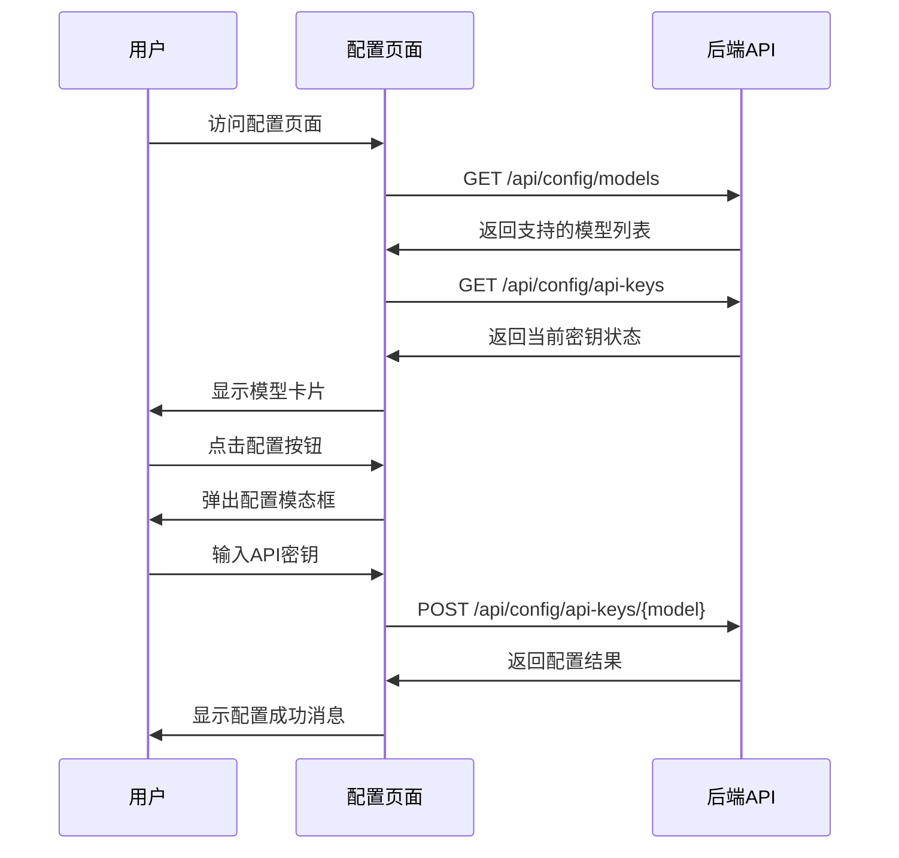

**图表来源**
- [templates/api_config.html:1-272](file://templates/api_config.html#L1-L272)

**章节来源**
- [templates/api_config.html:110-175](file://templates/api_config.html#L110-L175)

## 增强的AI测试用例生成功能

### 多参数控制

系统支持精细化的测试用例生成参数控制：

| 参数 | 默认值 | 范围 | 说明 |
|------|--------|------|------|
| normal_case_count | 3 | 1-25 | 正常用例数量 |
| abnormal_case_count | 2 | 0-25 | 异常用例数量 |
| test_types | ["功能测试"] | 多选 | 用例类型选择 |
| model_type | qwen | qwen/openai/example | AI模型选择 |
| max_tokens | 4000 | 1000-8000 | 最大令牌数 |

### 智能参数限制

系统根据模型能力自动调整参数限制：

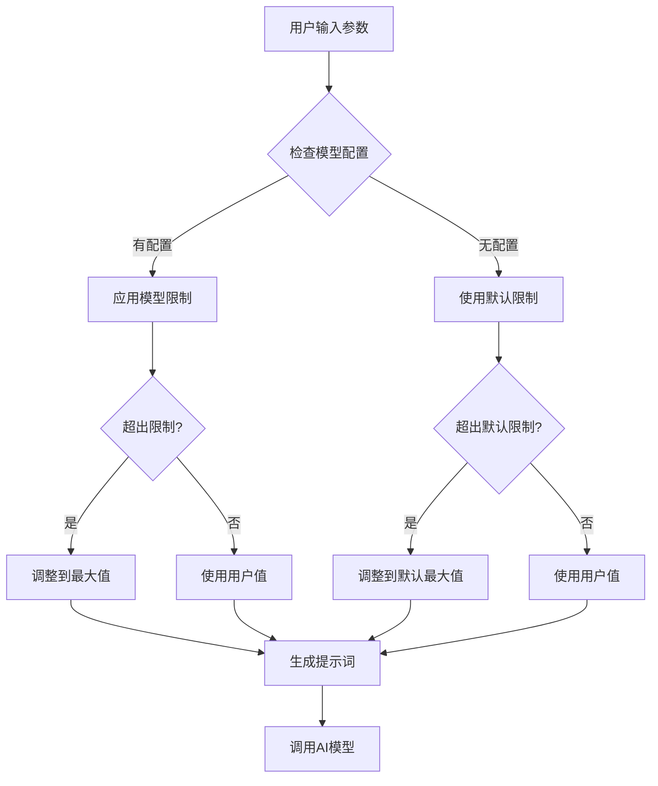

**图表来源**
- [main.py:151-161](file://main.py#L151-L161)
- [main.py:1162-1188](file://main.py#L1162-L1188)

**章节来源**
- [main.py:148-161](file://main.py#L148-L161)
- [main.py:1162-1188](file://main.py#L1162-L1188)

### 增强的提示词生成

系统根据用户选择生成定制化的提示词：

**提示词模板结构**：
1. **角色设定**：Web3钱包App方向的资深高级测试工程师
2. **需求分析**：包含用户提供的需求描述
3. **生成要求**：指定用例数量和类型
4. **优先级规范**：P0/P1/P2格式
5. **格式要求**：严格的JSON输出规范
6. **示例输出**：提供JSON格式示例

**章节来源**
- [main.py:192-224](file://main.py#L192-L224)

## Excel导出系统集成

### 导出功能实现

系统提供完整的Excel文件导出功能：

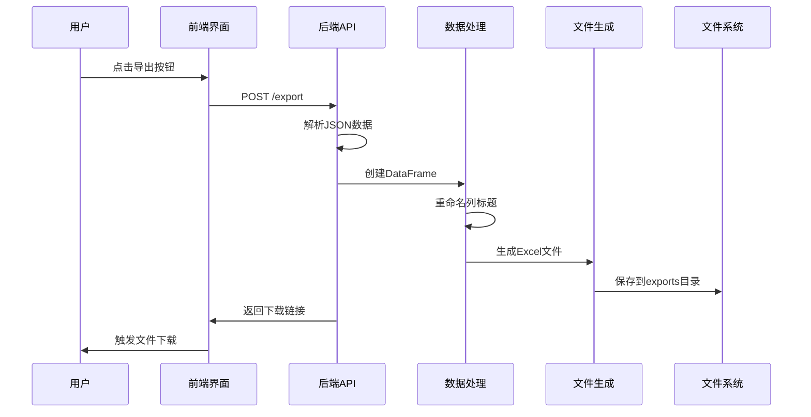

**图表来源**
- [main.py:256-277](file://main.py#L256-L277)
- [main.py:279-288](file://main.py#L279-L288)

### Excel格式规范

导出的Excel文件遵循以下规范：

| 字段名 | Excel列名 | 数据类型 | 说明 |
|--------|-----------|----------|------|
| module | 功能模块 | string | 功能模块名称 |
| case_id | 用例编号 | string | 用例编号 |
| case_name | 用例名称 | string | 用例名称描述 |
| precondition | 前置条件 | string | 执行前置条件 |
| steps | 测试步骤 | string | 详细测试步骤 |
| expected_result | 预期结果 | string | 预期结果 |
| priority | 优先级 | string | 优先级（P0/P1/P2） |
| case_type | 用例类型 | string | 用例类型 |

**章节来源**
- [main.py:256-277](file://main.py#L256-L277)

## 改进的前端界面

### 三步式工作流程

系统采用直观的三步式工作流程：

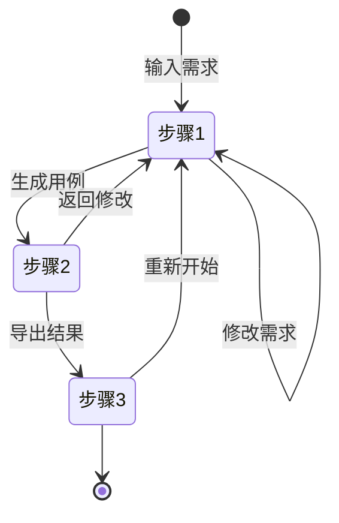

#### 步骤1：输入需求

**文件上传模式**：
- 支持TXT、DOC、DOCX、PDF格式
- 可配置正常用例和异常用例数量
- 支持多选测试类型

**直接输入模式**：
- 支持富文本编辑
- 实时需求预览
- 悬浮显示完整内容

#### 步骤2：生成测试用例

**模型选择**：
- 通义千问（免费）
- OpenAI（需密钥）
- 示例数据（演示）

**参数配置**：
- 用例数量控制
- 测试类型筛选
- API密钥管理

#### 步骤3：导出结果

**结果展示**：
- 表格形式展示测试用例
- 优先级可视化显示
- 操作步骤预览

**导出选项**：
- Excel格式导出
- 一键下载
- 文件命名规范

**章节来源**
- [templates/index.html:160-173](file://templates/index.html#L160-L173)
- [templates/index.html:176-340](file://templates/index.html#L176-L340)
- [templates/index.html:343-476](file://templates/index.html#L343-L476)

### 增强的用户交互

系统提供丰富的用户交互功能：

**需求预览功能**：
- 截断显示预览内容
- 悬浮显示完整内容
- 实时更新预览区域

**步骤指示器**：
- 可视化进度跟踪
- 步骤状态高亮
- 完成状态标识

**参数传递**：
- 自动传递步骤间参数
- 保持用户配置
- 动态更新限制

**章节来源**
- [templates/index.html:322-340](file://templates/index.html#L322-L340)
- [templates/index.html:867-945](file://templates/index.html#L867-L945)
- [templates/index.html:977-1029](file://templates/index.html#L977-L1029)

## 依赖分析

### 技术栈依赖

系统采用现代化的技术栈组合，支持多模型集成：

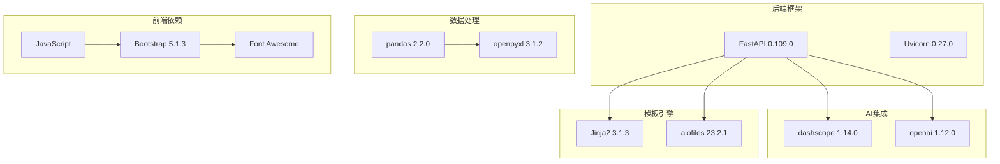

**图表来源**
- [requirements.txt:1-9](file://requirements.txt#L1-L9)

### 外部依赖关系

系统对外部依赖的处理策略：

1. **DashScope API**：通义千问API集成，支持异步调用
2. **OpenAI API**：GPT模型集成，支持API密钥认证
3. **文件系统**：本地文件存储，支持跨平台兼容
4. **网络通信**：HTTP/HTTPS协议，支持安全连接
5. **模板渲染**：Jinja2模板引擎，支持动态内容生成

**章节来源**
- [requirements.txt:1-9](file://requirements.txt#L1-L9)

## 性能考虑

### 模型限制优化

系统通过以下方式优化不同模型的性能：

1. **令牌限制管理**：根据模型配置设置max_tokens
2. **用例数量限制**：防止超出模型处理能力
3. **智能参数调整**：自动调整用户输入参数
4. **缓存机制**：重复的相似需求可复用之前的生成结果

### 温度参数调节

系统使用`temperature=0.7`作为默认值，平衡了创造性和一致性：

- **低温度值（0-0.5）**：更保守、一致的输出
- **中等温度值（0.5-1.0）**：平衡创造性和可靠性
- **高温度值（1.0-2.0）**：更具创造性但可能不稳定

### 令牌限制优化

系统通过以下方式优化令牌使用：

1. **合理设置max_tokens**：根据模型能力调整
2. **精简系统提示词**：保持提示词简洁有效
3. **批量处理**：支持多个测试用例一次性生成
4. **智能截断**：自动截断超长需求文本

**章节来源**
- [main.py:151-161](file://main.py#L151-L161)
- [main.py:1162-1188](file://main.py#L1162-L1188)

## 故障排除指南

### 常见问题及解决方案

#### API密钥相关问题

| 问题 | 可能原因 | 解决方案 |
|------|----------|----------|
| API密钥无效 | 密钥格式错误或过期 | 在API配置页面重新配置 |
| 模型不可用 | 配置文件损坏 | 检查api_keys_config.json格式 |
| 配置保存失败 | 权限不足 | 检查文件写入权限 |
| 密钥显示异常 | 前端JavaScript错误 | 刷新页面或检查浏览器控制台 |

#### AI模型相关问题

| 问题 | 可能原因 | 解决方案 |
|------|----------|----------|
| 生成失败 | 网络连接问题 | 检查网络连接状态 |
| 输出格式错误 | AI响应格式异常 | 检查dashscope/openai服务状态 |
| 用例数量不足 | 令牌限制过低 | 调整max_tokens配置 |
| 类型过滤失败 | 测试类型不匹配 | 检查用户选择的测试类型 |

#### 文件处理问题

| 问题 | 可能原因 | 解决方案 |
|------|----------|----------|
| 文件上传失败 | 文件过大或格式不支持 | 检查文件大小和格式限制 |
| Excel导出失败 | 权限不足或磁盘空间不足 | 检查文件权限和磁盘空间 |
| 下载链接无效 | 文件不存在或路径错误 | 检查exports目录权限 |

#### 前端交互问题

| 问题 | 可能原因 | 解决方案 |
|------|----------|----------|
| 页面加载缓慢 | 资源文件过大 | 优化图片和CSS文件 |
| 表单提交失败 | JavaScript错误 | 检查浏览器控制台错误 |
| 导出功能异常 | CORS跨域问题 | 检查服务器CORS配置 |
| 步骤指示器异常 | CSS样式冲突 | 检查自定义样式文件 |

**章节来源**
- [main.py:252-254](file://main.py#L252-L254)
- [templates/api_config.html:204-234](file://templates/api_config.html#L204-L234)

## 结论

AI测试用例生成系统经过重大升级，现已发展为功能完善、架构清晰的多模型AI测试工具平台。系统通过合理的架构设计和完善的错误处理机制，为测试工程师提供了高效、可靠的测试用例生成解决方案。

**主要优势**：
1. **多模型支持**：支持通义千问、OpenAI、示例数据三种模型
2. **智能配置管理**：完整的API密钥管理系统，支持加密存储
3. **用户友好界面**：三步式工作流程，操作简单直观
4. **灵活参数控制**：支持正常用例和异常用例的差异化生成
5. **完整导出功能**：支持Excel格式导出，便于分享和归档
6. **强大的错误处理**：多层次的错误恢复机制

**未来改进方向**：
1. 实现更完善的缓存机制
2. 增加更多测试用例类型支持
3. 优化AI提示词以提高生成质量
4. 添加测试用例审核和编辑功能
5. 支持批量导入和导出功能

## 附录

### API使用示例

#### 基本使用流程

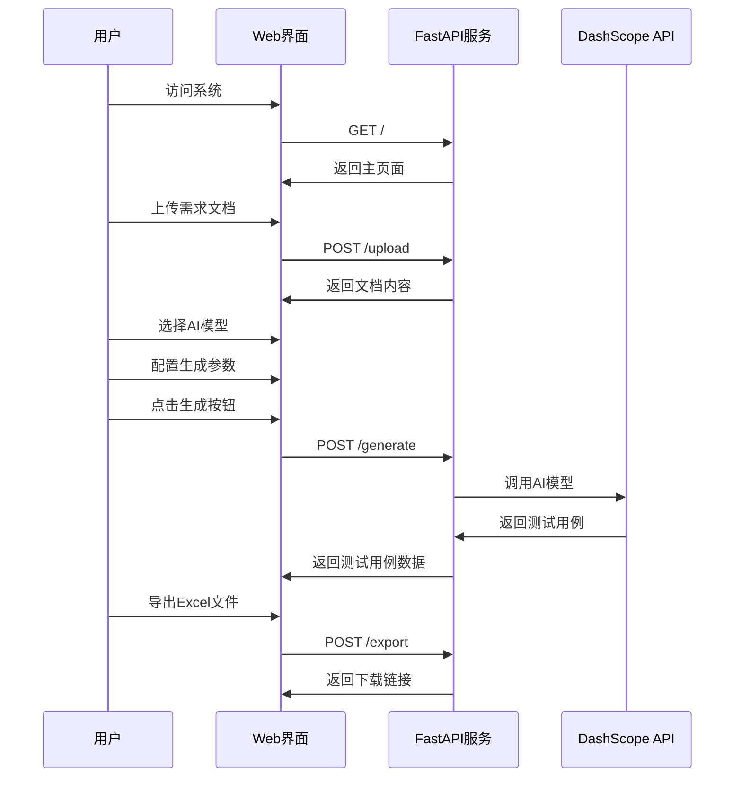

#### API密钥配置流程

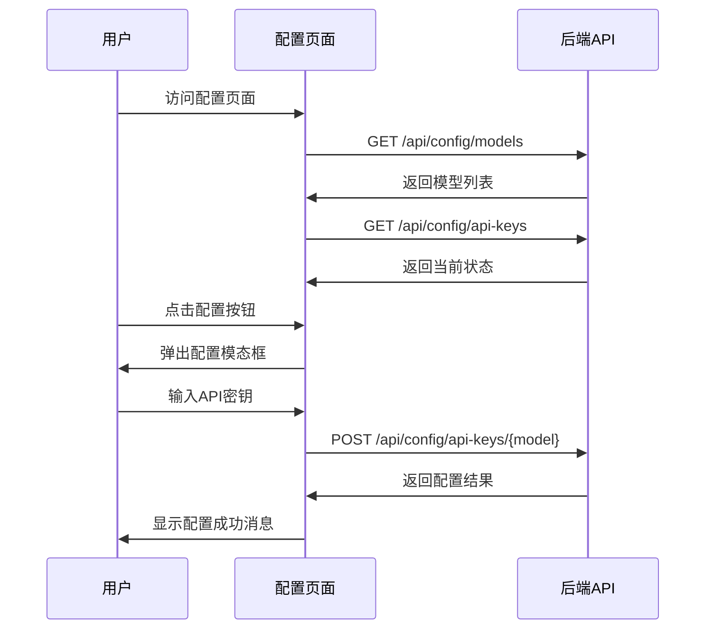

#### 开发者自定义指南

**自定义AI模型**：
1. 在api_keys_config.json中添加新模型配置
2. 更新main.py中的模型列表
3. 添加相应的API集成代码

**扩展测试用例类型**：
1. 在TestCase类中添加新字段
2. 更新系统提示词中的字段定义
3. 修改Excel导出逻辑

**增强前端功能**：
1. 修改templates/index.html中的界面布局
2. 更新JavaScript逻辑处理新功能
3. 添加相应的CSS样式

**性能优化建议**：
1. 调整temperature参数以平衡质量和性能
2. 优化max_tokens设置以控制成本
3. 实现缓存机制减少重复调用
4. 优化前端JavaScript性能

**章节来源**
- [main.py:137-254](file://main.py#L137-L254)
- [templates/index.html:493-1271](file://templates/index.html#L493-L1271)
- [templates/api_config.html:84-270](file://templates/api_config.html#L84-L270)