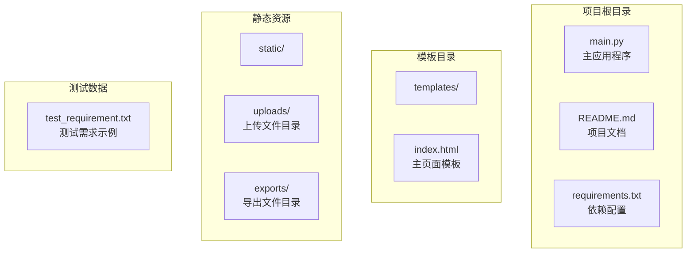
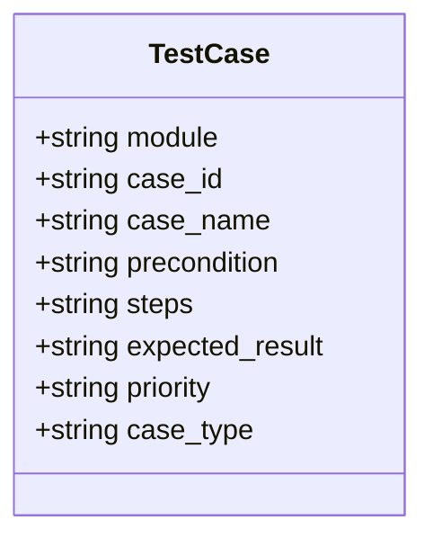
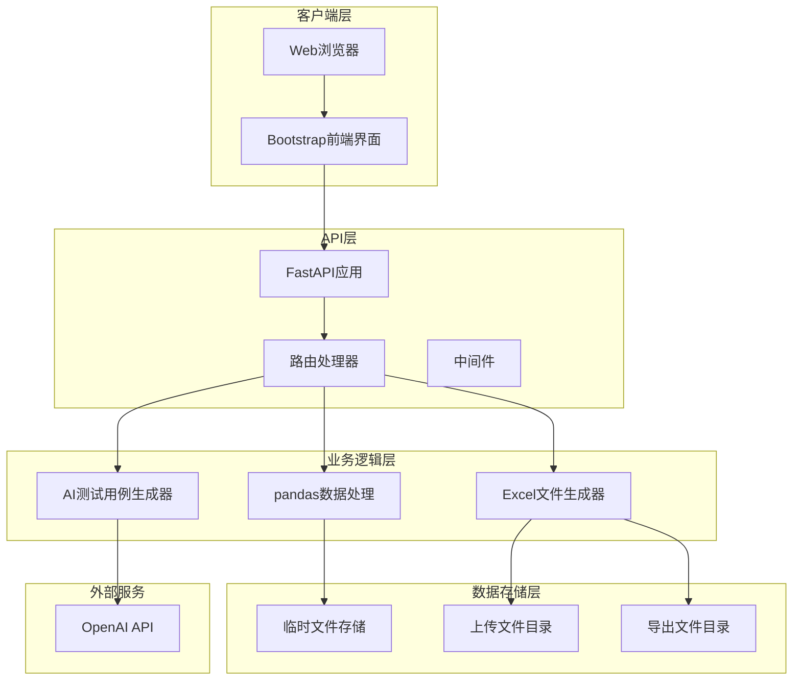
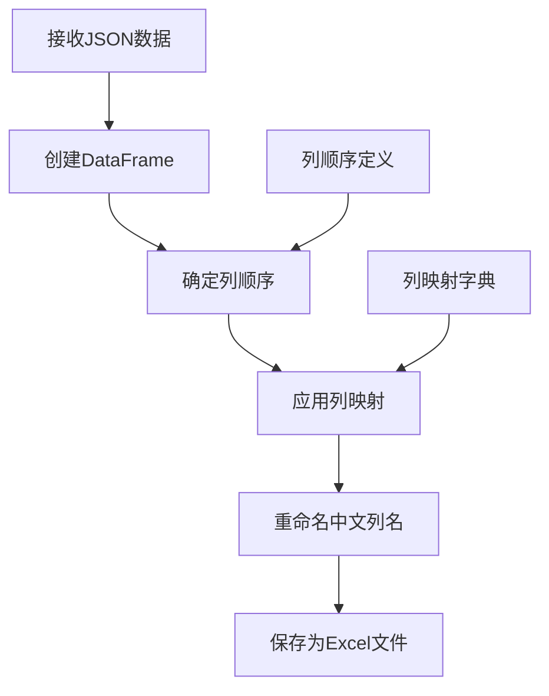
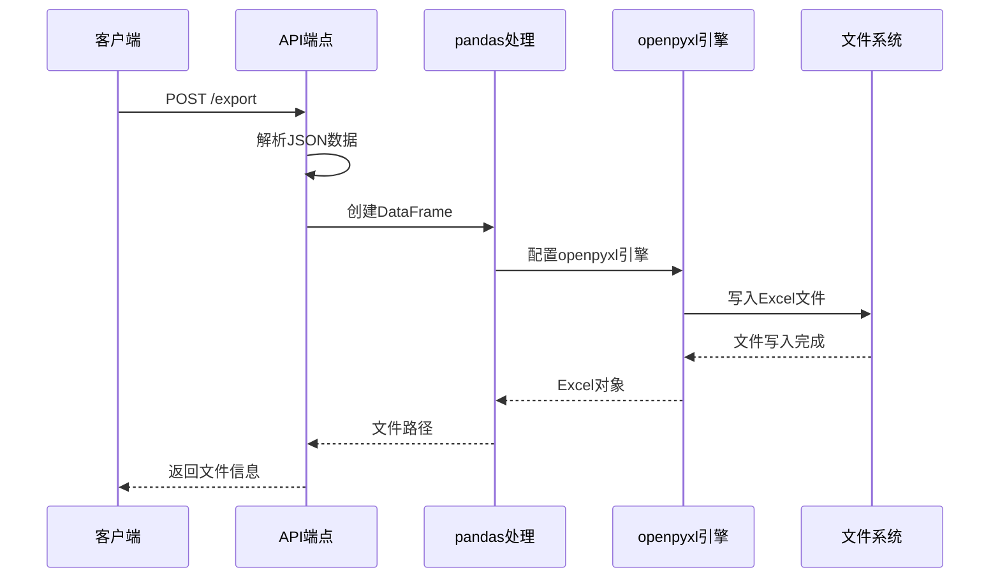
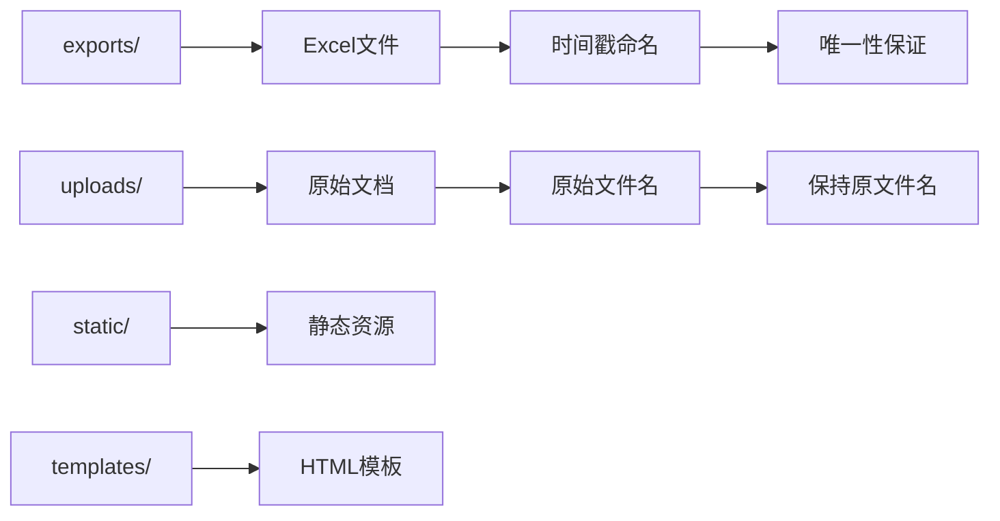
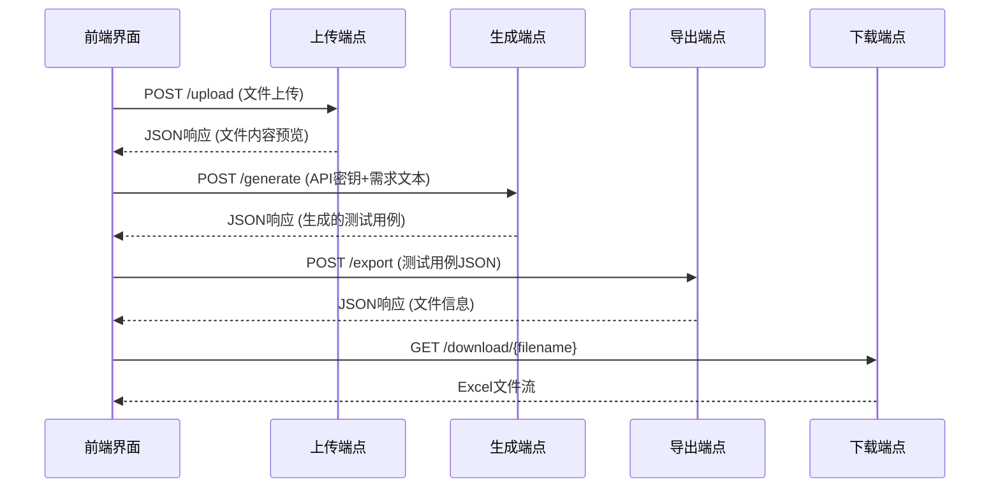
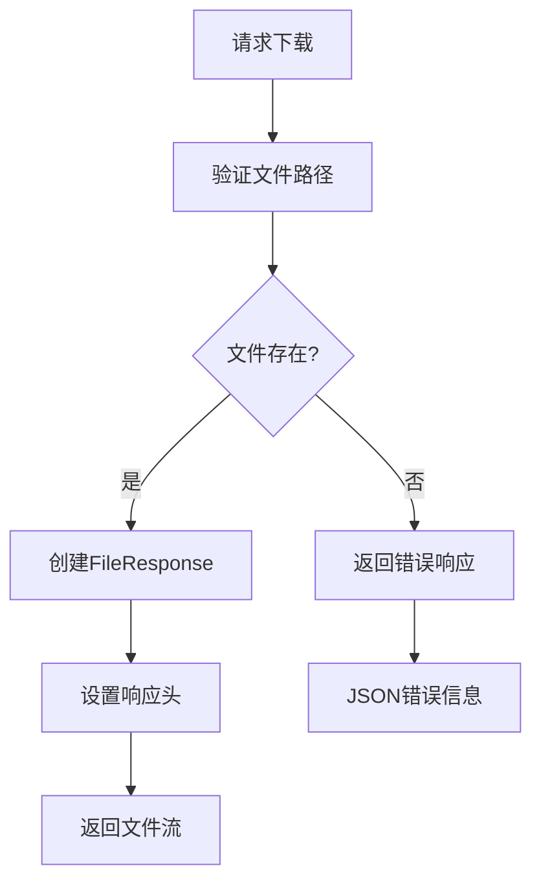
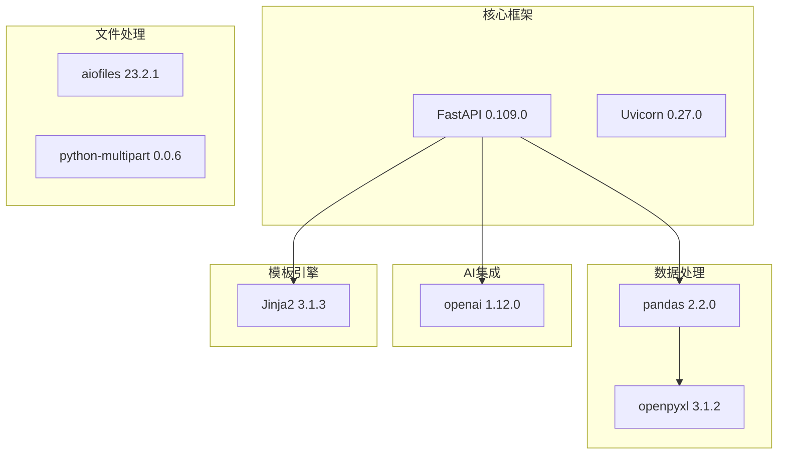

# Excel导出系统

<cite>
**本文档引用的文件**
- [main.py](file://main.py)
- [README.md](file://README.md)
- [requirements.txt](file://requirements.txt)
- [templates/index.html](file://templates/index.html)
- [test_requirement.txt](file://test_requirement.txt)
</cite>

## 目录
1. [简介](#简介)
2. [项目结构](#项目结构)
3. [核心组件](#核心组件)
4. [架构概览](#架构概览)
5. [详细组件分析](#详细组件分析)
6. [依赖分析](#依赖分析)
7. [性能考虑](#性能考虑)
8. [故障排除指南](#故障排除指南)
9. [结论](#结论)
10. [附录](#附录)

## 简介

Excel导出系统是一个基于FastAPI构建的AI驱动测试用例生成工具，专门用于将结构化的测试用例数据导出为Excel格式文件。该系统集成了OpenAI GPT模型来智能生成测试用例，并提供了完整的Web界面来展示和导出这些测试用例。

系统的核心功能包括：
- AI智能测试用例生成（基于OpenAI GPT模型）
- 多格式需求文档上传（txt、doc、docx）
- 结构化测试用例数据处理
- Excel文件导出功能
- Web界面交互体验

## 项目结构

该项目采用标准的FastAPI项目结构，包含后端API服务、前端模板和静态资源：



**图表来源**
- [main.py:15-19](file://main.py#L15-L19)
- [templates/index.html:1-383](file://templates/index.html#L1-L383)

**章节来源**
- [main.py:13-23](file://main.py#L13-L23)
- [README.md:29-41](file://README.md#L29-L41)

## 核心组件

### 数据模型类

系统定义了`TestCase`类来封装测试用例数据结构：



**图表来源**
- [main.py:28-39](file://main.py#L28-L39)

### 主要API端点

系统提供以下核心API端点：

| 端点 | 方法 | 描述 | 请求参数 | 响应 |
|------|------|------|----------|------|
| `/` | GET | 主页面 | - | HTML模板 |
| `/upload` | POST | 上传需求文档 | File: file | JSON响应 |
| `/generate` | POST | 生成测试用例 | Form: requirement_text, api_key | JSON响应 |
| `/export` | POST | 导出Excel文件 | Form: test_cases_json | JSON响应 |
| `/download/{filename}` | GET | 下载Excel文件 | Path: filename | FileResponse |

**章节来源**
- [main.py:151-233](file://main.py#L151-L233)

## 架构概览

系统采用前后端分离的架构设计，后端提供RESTful API，前端使用Bootstrap框架构建用户界面：



**图表来源**
- [main.py:13-23](file://main.py#L13-L23)
- [templates/index.html:1-383](file://templates/index.html#L1-L383)

## 详细组件分析

### pandas数据处理实现

#### DataFrame创建与数据格式转换

系统使用pandas进行数据处理，实现了完整的数据转换流程：



**图表来源**
- [main.py:124-149](file://main.py#L124-L149)

#### 列映射和重命名机制

系统实现了完整的列映射机制，确保Excel文件使用中文列标题：

| 英文列名 | 中文列名 | 用途 |
|----------|----------|------|
| module | 功能模块 | 测试用例所属功能模块 |
| case_id | 用例编号 | 唯一标识符 |
| case_name | 用例名称 | 测试用例描述性名称 |
| precondition | 前置条件 | 执行测试前的条件 |
| steps | 测试步骤 | 详细的测试执行步骤 |
| expected_result | 预期结果 | 期望的测试结果 |
| priority | 优先级 | 测试重要程度 |
| case_type | 用例类型 | 测试类型分类 |

**章节来源**
- [main.py:129-144](file://main.py#L129-L144)

### Excel文件生成过程

#### openpyxl引擎配置

系统使用openpyxl作为Excel文件生成引擎，提供了完整的配置选项：



**图表来源**
- [main.py:124-149](file://main.py#L124-L149)

#### 文件保存路径管理

系统采用分层目录结构管理文件存储：



**图表来源**
- [main.py:147-148](file://main.py#L147-L148)

**章节来源**
- [main.py:146-149](file://main.py#L146-L149)

### 导出文件命名策略

#### 时间戳生成与文件唯一性

系统实现了智能的文件命名策略：


**图表来源**
- [main.py:210-212](file://main.py#L210-L212)

#### 存储目录管理

系统自动创建必要的目录结构：

| 目录 | 用途 | 创建时机 |
|------|------|----------|
| static/ | 静态文件资源 | 应用启动时 |
| templates/ | HTML模板文件 | 应用启动时 |
| uploads/ | 用户上传文件 | 应用启动时 |
| exports/ | 导出的Excel文件 | 应用启动时 |

**章节来源**
- [main.py:15-19](file://main.py#L15-L19)

### API使用示例

#### 测试用例数据接收与JSON解析

系统提供了完整的API使用流程：



**图表来源**
- [templates/index.html:214-358](file://templates/index.html#L214-L358)

#### 数据格式化规则

系统遵循严格的数据格式化规范：

| 字段 | 数据类型 | 格式要求 | 示例 |
|------|----------|----------|------|
| module | string | 必填，中文描述 | "用户登录" |
| case_id | string | 必填，唯一标识 | "TC001" |
| case_name | string | 必填，描述性名称 | "正确用户名密码登录" |
| precondition | string | 可选，条件描述 | "用户已注册账号" |
| steps | string | 必填，步骤描述 | "1. 打开登录页面\\n2. 输入用户名\\n3. 输入密码" |
| expected_result | string | 必填，预期结果 | "跳转到首页" |
| priority | string | 必填，高/中/低 | "高" |
| case_type | string | 必填，测试类型 | "功能测试" |

**章节来源**
- [main.py:185-224](file://main.py#L185-L224)

### 文件下载功能实现

#### FileResponse响应机制

系统使用FastAPI的FileResponse来处理文件下载：



**图表来源**
- [main.py:226-233](file://main.py#L226-L233)

#### 错误处理机制

系统实现了完善的错误处理策略：

| 错误类型 | 触发条件 | 处理方式 |
|----------|----------|----------|
| 文件不存在 | 下载路径无效 | 返回JSON错误信息 |
| API密钥错误 | OpenAI认证失败 | 返回生成失败信息 |
| 文件格式错误 | JSON解析失败 | 返回解析错误信息 |
| 网络超时 | AI服务不可用 | 返回默认测试用例 |

**章节来源**
- [main.py:230-233](file://main.py#L230-L233)

## 依赖分析

### 外部依赖关系

系统依赖以下关键库：



**图表来源**
- [requirements.txt:1-8](file://requirements.txt#L1-L8)

### 组件耦合度分析

系统采用松耦合设计，各组件职责明确：

- **API层**：负责HTTP请求处理和响应
- **业务逻辑层**：处理AI生成和数据转换
- **数据层**：管理文件存储和读取
- **表示层**：提供Web界面和用户交互

**章节来源**
- [requirements.txt:1-8](file://requirements.txt#L1-L8)

## 性能考虑

### 大文件处理策略

对于大型测试用例数据集，建议采用以下优化策略：

1. **分批处理**：将大量测试用例分批导出，避免内存溢出
2. **流式写入**：使用pandas的chunksize参数进行分块写入
3. **异步处理**：在高并发场景下使用异步API端点
4. **缓存机制**：对频繁访问的测试用例进行缓存

### 内存优化建议

- **及时释放**：处理完数据后及时删除临时变量
- **批量操作**：使用pandas的向量化操作减少循环开销
- **数据类型优化**：合理选择数据类型以减少内存占用

### 并发处理能力

系统目前采用单进程模式，建议在生产环境中：

- 使用Uvicorn的多进程模式
- 实施负载均衡策略
- 添加数据库连接池管理

## 故障排除指南

### 常见问题及解决方案

#### OpenAI API相关问题

**问题**：API密钥无效或过期
**解决方案**：重新生成API密钥并在应用中更新

**问题**：网络连接超时
**解决方案**：检查网络连接，增加重试机制

#### 文件处理问题

**问题**：Excel文件无法生成
**解决方案**：检查exports目录权限，确保磁盘空间充足

**问题**：文件下载失败
**解决方案**：验证文件路径，检查文件是否存在

#### 数据格式问题

**问题**：JSON解析错误
**解决方案**：验证输入数据格式，添加数据验证逻辑

**章节来源**
- [main.py:108-122](file://main.py#L108-L122)
- [main.py:230-233](file://main.py#L230-L233)

## 结论

Excel导出系统是一个功能完整、架构清晰的测试用例管理工具。系统成功整合了AI智能生成、数据处理和文件导出等功能，为测试工程师提供了高效的测试用例管理解决方案。

**主要优势**：
- 基于AI的智能测试用例生成
- 完整的Web界面交互体验
- 标准化的Excel文件导出
- 良好的扩展性和维护性

**改进建议**：
- 添加CSV格式导出支持
- 实现文件上传进度监控
- 增加测试用例模板功能
- 添加用户认证和权限管理

## 附录

### 扩展导出格式支持

#### CSV格式导出

要在现有基础上添加CSV导出功能，可以参考以下实现思路：

```python
def export_to_csv(test_cases: List[dict], filename: str) -> str:
    """将测试用例导出为CSV文件"""
    df = pd.DataFrame(test_cases)
    # 确保列顺序和中文映射
    df = df[columns_order]
    df.rename(columns=column_mapping, inplace=True)
    
    filepath = os.path.join("exports", filename.replace(".xlsx", ".csv"))
    df.to_csv(filepath, index=False, encoding='utf-8-sig')
    return filepath
```

#### PDF格式导出

PDF导出需要额外的依赖库（如reportlab），实现思路类似Excel导出。

### 自定义文件命名规则

系统支持灵活的文件命名策略，可以根据业务需求进行定制：

```python
def generate_custom_filename(prefix: str, data: dict) -> str:
    """生成自定义文件名"""
    timestamp = datetime.now().strftime("%Y%m%d_%H%M%S")
    module = data.get('module', 'default')
    return f"{prefix}_{module}_{timestamp}.xlsx"
```

### 开发者最佳实践

1. **错误处理**：始终添加适当的异常处理机制
2. **日志记录**：添加详细的日志记录以便调试
3. **单元测试**：为关键函数编写单元测试
4. **文档维护**：保持API文档的实时更新
5. **安全考虑**：实施文件上传安全验证