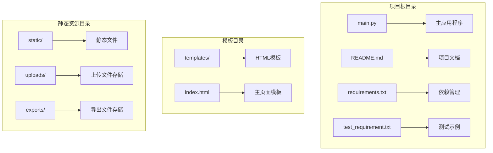
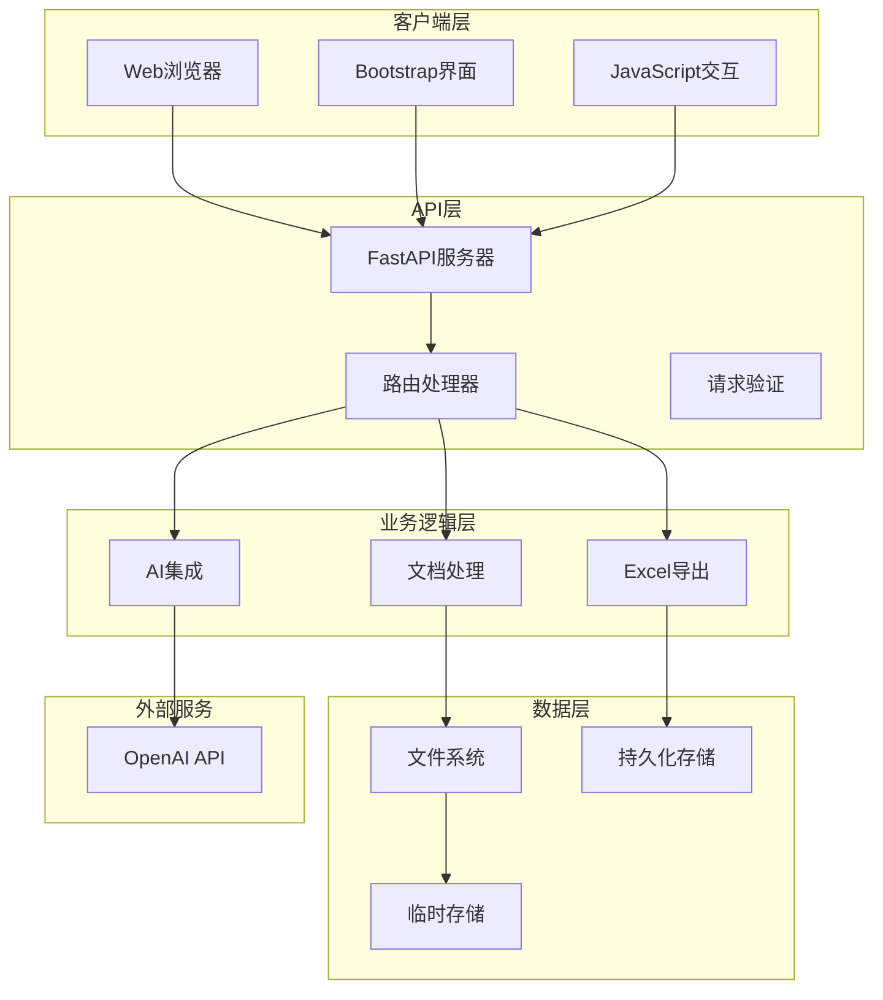
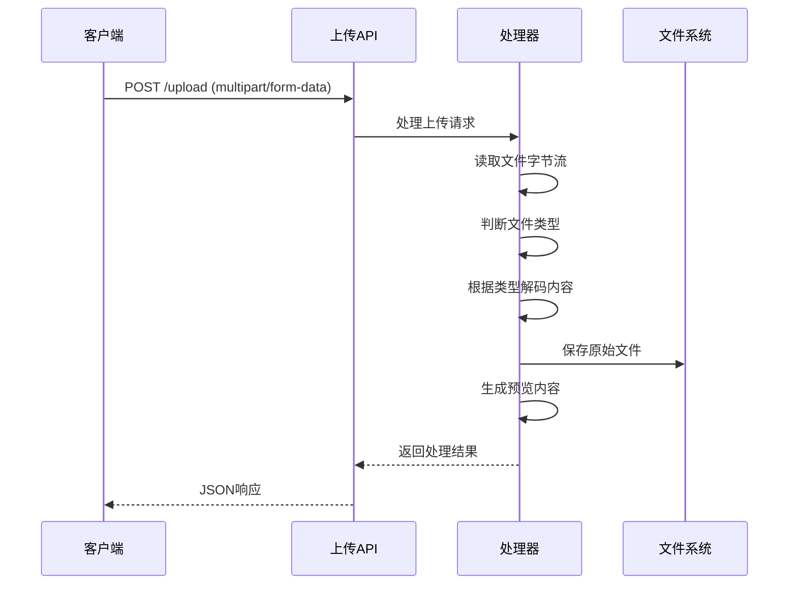
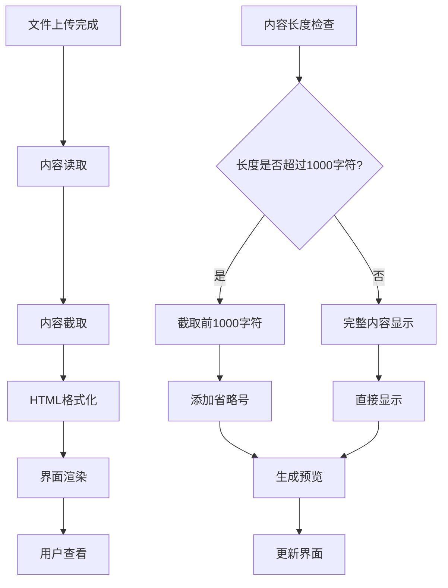
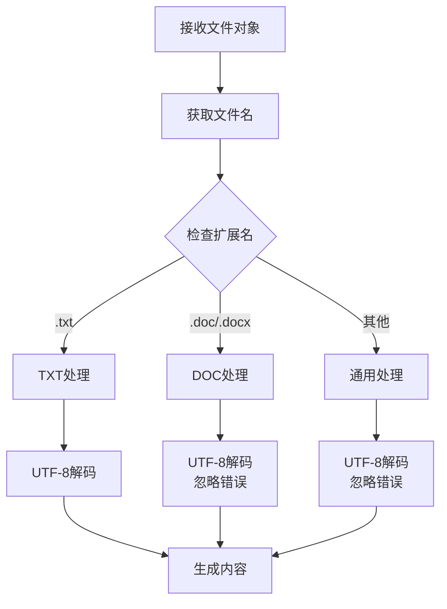
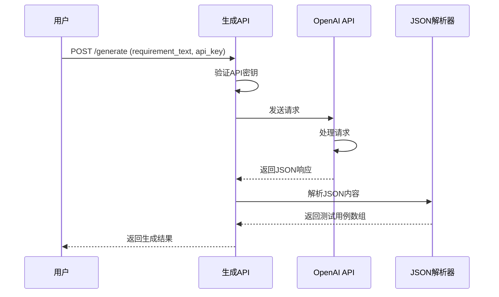
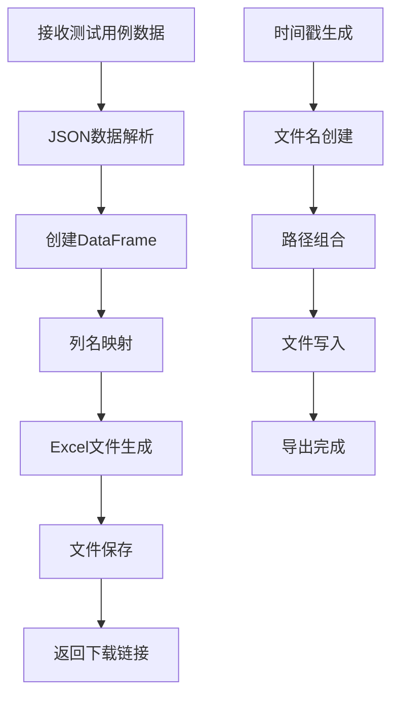
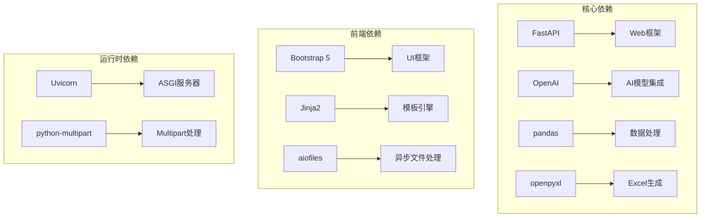

# 文档处理系统

<cite>
**本文档引用的文件**
- [main.py](file://main.py)
- [README.md](file://README.md)
- [templates/index.html](file://templates/index.html)
- [requirements.txt](file://requirements.txt)
- [test_requirement.txt](file://test_requirement.txt)
</cite>

## 目录
1. [简介](#简介)
2. [项目结构](#项目结构)
3. [核心组件](#核心组件)
4. [架构概览](#架构概览)
5. [详细组件分析](#详细组件分析)
6. [依赖分析](#依赖分析)
7. [性能考虑](#性能考虑)
8. [故障排除指南](#故障排除指南)
9. [结论](#结论)
10. [附录](#附录)

## 简介

AI测试用例生成工具是一个基于人工智能技术的智能测试用例生成平台。该系统结合了现代Web技术和AI模型，为测试工程师提供了一个高效、便捷的测试用例生成解决方案。系统的核心功能包括文档上传、内容解析、AI智能生成和结果导出等环节。

该工具的主要特色包括：
- 基于OpenAI GPT模型的智能测试用例生成
- 多格式文档支持（TXT、DOC、DOCX）
- 结构化的测试用例表格生成
- Excel格式导出功能
- 现代化的Web界面设计

## 项目结构

该项目采用简洁而清晰的目录结构，主要包含以下核心组件：



**图表来源**
- [main.py:15-19](file://main.py#L15-L19)
- [templates/index.html:1-383](file://templates/index.html#L1-L383)

**章节来源**
- [main.py:15-19](file://main.py#L15-L19)
- [README.md:29-41](file://README.md#L29-L41)

## 核心组件

### 主应用程序 (FastAPI)

应用程序使用FastAPI框架构建，提供了RESTful API接口和Web界面支持。核心特性包括：

- **路由定义**：包含上传、生成、导出和下载等主要功能路由
- **中间件支持**：静态文件服务、模板渲染
- **异步处理**：充分利用FastAPI的异步特性提升性能

### 文档处理模块

系统实现了完整的文档处理流程，支持多种文件格式的读取和解析：

- **TXT文件**：直接按UTF-8编码读取文本内容
- **DOC/DOCX文件**：通过字节流处理，支持Office文档格式
- **内容预览**：提供文档内容的实时预览功能

### AI集成模块

集成了OpenAI GPT模型，实现了智能化的测试用例生成：

- **系统提示词**：精心设计的提示词确保生成质量
- **JSON格式输出**：标准化的测试用例结构
- **错误处理**：完善的异常处理和降级机制

**章节来源**
- [main.py:13](file://main.py#L13)
- [main.py:28-40](file://main.py#L28-L40)
- [main.py:41-123](file://main.py#L41-L123)

## 架构概览

系统采用分层架构设计，清晰分离了前端界面、后端服务和AI处理层：



**图表来源**
- [main.py:151-237](file://main.py#L151-L237)
- [templates/index.html:209-381](file://templates/index.html#L209-L381)

## 详细组件分析

### 文件上传功能实现

文件上传功能是整个系统的核心组件之一，实现了多格式文档的支持和处理：

#### 支持的文件格式

系统当前支持以下文件格式：
- **TXT格式**：纯文本文件，直接按UTF-8编码处理
- **DOC格式**：Microsoft Word文档（旧版格式）
- **DOCX格式**：Microsoft Word文档（新版XML格式）

#### 文件内容读取机制

文件读取采用了统一的处理流程：



**图表来源**
- [main.py:155-183](file://main.py#L155-L183)

#### 内容解析算法

系统实现了智能的内容解析算法：

1. **文件类型检测**：通过文件扩展名判断文档类型
2. **编码处理**：针对不同格式采用相应的编码策略
3. **内容提取**：将二进制内容转换为可读文本
4. **预览生成**：截取部分内容用于界面显示

**章节来源**
- [main.py:155-183](file://main.py#L155-L183)

### 文档内容预览功能

内容预览功能提供了实时的文档内容展示，增强了用户体验：

#### 预览实现机制



**图表来源**
- [main.py:176-180](file://main.py#L176-L180)

#### HTML渲染优化

预览内容采用了专门的HTML渲染策略：
- **字符实体转换**：防止HTML注入攻击
- **换行符处理**：保持原文档的格式
- **特殊字符编码**：确保中文字符正确显示

**章节来源**
- [main.py:176-180](file://main.py#L176-L180)
- [templates/index.html:110-115](file://templates/index.html#L110-L115)

### 多格式文档处理技术

系统实现了灵活的多格式文档处理机制：

#### 字符编码处理

针对不同文件格式采用了差异化的编码处理策略：

| 文件格式 | 编码方式 | 错误处理 |
|---------|---------|---------|
| TXT | UTF-8 | 直接解码 |
| DOC/DOCX | UTF-8 | 忽略错误字符 |
| 其他格式 | UTF-8 | 忽略错误字符 |

#### 文件类型判断逻辑



**图表来源**
- [main.py:162-169](file://main.py#L162-L169)

**章节来源**
- [main.py:162-169](file://main.py#L162-L169)

### AI测试用例生成系统

系统集成了OpenAI GPT模型，实现了智能化的测试用例生成：

#### AI模型集成



**图表来源**
- [main.py:185-201](file://main.py#L185-L201)

#### 测试用例结构设计

生成的测试用例遵循统一的数据结构：

| 字段名 | 数据类型 | 描述 | 示例 |
|--------|----------|------|------|
| module | string | 功能模块 | "用户登录" |
| case_id | string | 用例编号 | "TC001" |
| case_name | string | 用例名称 | "正确用户名密码登录" |
| precondition | string | 前置条件 | "用户已注册账号" |
| steps | string | 测试步骤 | "1. 打开登录页面\\n2. 输入正确的用户名" |
| expected_result | string | 预期结果 | "成功跳转到首页" |
| priority | string | 优先级 | "高" |
| case_type | string | 用例类型 | "功能测试" |

**章节来源**
- [main.py:41-123](file://main.py#L41-L123)

### Excel导出功能

系统提供了完整的Excel文件导出功能：

#### 导出流程



**图表来源**
- [main.py:124-149](file://main.py#L124-L149)

#### 数据格式转换

系统实现了从内部数据结构到Excel格式的转换：

1. **数据结构映射**：将测试用例对象转换为DataFrame
2. **列名国际化**：中文列名映射到Excel表头
3. **格式保持**：保持测试步骤中的换行符
4. **文件生成**：使用openpyxl引擎生成Excel文件

**章节来源**
- [main.py:124-149](file://main.py#L124-L149)

## 依赖分析

系统依赖关系清晰，主要依赖项包括：



**图表来源**
- [requirements.txt:1-8](file://requirements.txt#L1-L8)

**章节来源**
- [requirements.txt:1-8](file://requirements.txt#L1-L8)

## 性能考虑

系统在设计时充分考虑了性能优化：

### 异步处理优势

- **非阻塞I/O**：利用FastAPI的异步特性提升并发处理能力
- **内存管理**：及时释放文件处理过程中的内存占用
- **缓存策略**：合理使用临时文件避免重复计算

### 内存优化

- **内容截取**：预览功能仅处理前1000字符
- **流式处理**：大文件采用流式读取避免内存溢出
- **及时清理**：处理完成后及时删除临时文件

### 并发处理

- **异步API**：所有主要API都支持异步处理
- **连接池**：合理配置数据库连接池（如有使用）
- **超时控制**：设置合理的请求超时时间

## 故障排除指南

### 常见问题及解决方案

#### 文件上传失败

**问题症状**：上传API返回错误信息

**可能原因**：
- 文件格式不支持
- 文件过大
- 磁盘空间不足
- 权限问题

**解决方法**：
1. 检查文件扩展名是否为支持格式
2. 确认文件大小未超过限制
3. 验证uploads目录权限
4. 清理磁盘空间

#### AI生成失败

**问题症状**：生成API返回错误

**可能原因**：
- API密钥无效
- 网络连接问题
- OpenAI服务不可用
- 请求频率过高

**解决方法**：
1. 验证OpenAI API密钥有效性
2. 检查网络连接状态
3. 稍后再试
4. 降低请求频率

#### Excel导出失败

**问题症状**：导出API返回错误

**可能原因**：
- 测试用例数据格式错误
- exports目录权限问题
- 磁盘空间不足

**解决方法**：
1. 验证测试用例数据结构
2. 检查exports目录权限
3. 清理磁盘空间

**章节来源**
- [main.py:182-183](file://main.py#L182-L183)
- [main.py:200-201](file://main.py#L200-L201)
- [main.py:223-224](file://main.py#L223-L224)

## 结论

AI测试用例生成工具是一个功能完整、架构清晰的现代化Web应用。系统成功地将AI技术与传统的测试用例生成流程相结合，为测试工程师提供了高效的自动化解决方案。

### 主要优势

1. **技术先进性**：采用最新的AI模型和Web技术栈
2. **用户体验**：提供直观易用的Web界面
3. **功能完整性**：覆盖从文档上传到结果导出的完整流程
4. **扩展性强**：模块化设计便于功能扩展

### 技术亮点

- **多格式支持**：灵活的文档处理机制
- **智能生成**：基于AI的测试用例生成
- **实时预览**：即时的文档内容展示
- **标准输出**：符合行业标准的Excel格式

### 发展前景

该系统为未来的功能扩展奠定了良好的基础，可以进一步增强AI模型能力、支持更多文档格式、优化性能表现，并提供更丰富的测试用例类型。

## 附录

### API使用示例

#### 文件上传API

**请求方式**：POST `/upload`

**请求参数**：
- `file` (multipart/form-data): 要上传的文档文件

**响应格式**：
```json
{
  "success": true,
  "filename": "example.txt",
  "content": "文档内容预览..."
}
```

#### 测试用例生成API

**请求方式**：POST `/generate`

**请求参数**：
- `requirement_text` (form): 需求文档内容
- `api_key` (form): OpenAI API密钥

**响应格式**：
```json
{
  "success": true,
  "test_cases": [
    {
      "module": "用户登录",
      "case_id": "TC001",
      "case_name": "正确用户名密码登录",
      "precondition": "用户已注册账号",
      "steps": "1. 打开登录页面\\n2. 输入正确的用户名\\n3. 输入正确的密码\\n4. 点击登录按钮",
      "expected_result": "成功跳转到首页，显示用户名",
      "priority": "高",
      "case_type": "功能测试"
    }
  ]
}
```

#### Excel导出API

**请求方式**：POST `/export`

**请求参数**：
- `test_cases_json` (form): 测试用例的JSON字符串

**响应格式**：
```json
{
  "success": true,
  "filename": "test_cases_20240101_123456.xlsx",
  "filepath": "exports/test_cases_20240101_123456.xlsx"
}
```

### 扩展新文件格式支持指南

#### 实现步骤

1. **添加文件类型检测**：在文件上传处理器中添加新的格式判断逻辑
2. **实现内容解析**：编写特定格式的解析函数
3. **更新前端支持**：修改HTML表单的accept属性
4. **测试验证**：编写单元测试确保功能正常

#### 最佳实践

- **编码一致性**：确保所有格式使用UTF-8编码
- **错误处理**：完善异常处理机制
- **性能优化**：考虑大文件的处理效率
- **安全性**：实施文件类型和大小限制

**章节来源**
- [main.py:155-183](file://main.py#L155-L183)
- [templates/index.html:102](file://templates/index.html#L102)