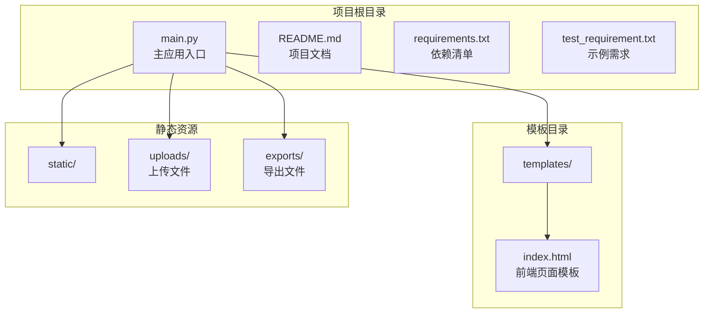
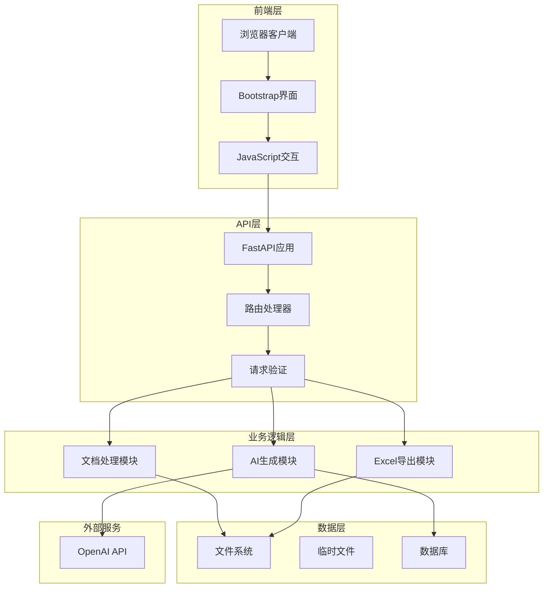
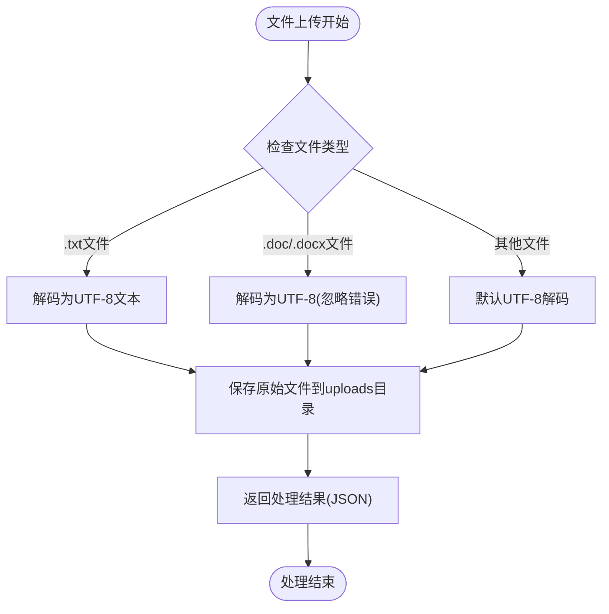
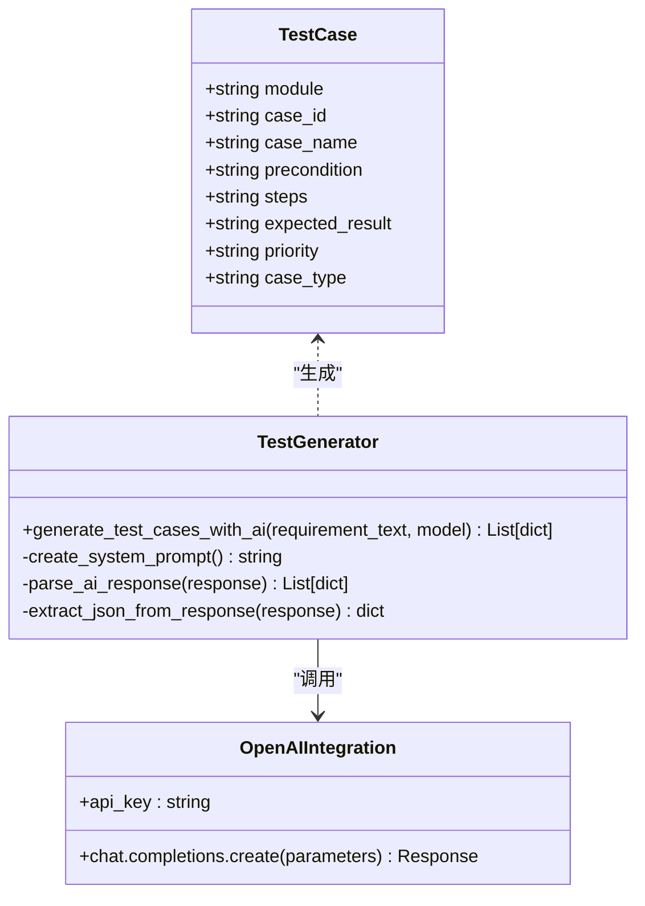
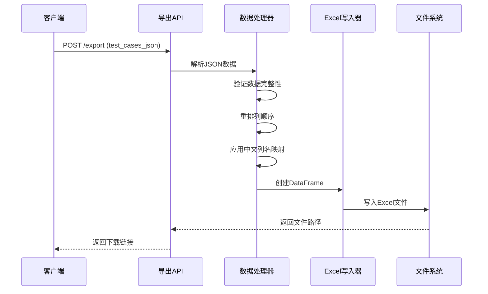
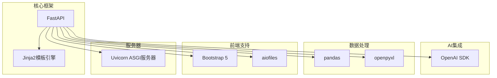

# 核心功能模块

<cite>
**本文引用的文件**
- [main.py](file://main.py)
- [README.md](file://README.md)
- [requirements.txt](file://requirements.txt)
- [templates/index.html](file://templates/index.html)
- [test_requirement.txt](file://test_requirement.txt)
</cite>

## 目录
1. [简介](#简介)
2. [项目结构](#项目结构)
3. [核心组件](#核心组件)
4. [架构总览](#架构总览)
5. [详细组件分析](#详细组件分析)
6. [依赖关系分析](#依赖关系分析)
7. [性能考虑](#性能考虑)
8. [故障排除指南](#故障排除指南)
9. [结论](#结论)
10. [附录](#附录)

## 简介
本项目是一个基于FastAPI构建的AI测试用例生成工具，提供三大核心功能：
- 文档处理系统：支持文件上传、多格式解析与内容预览
- AI测试用例生成系统：集成OpenAI GPT模型，实现智能测试用例生成与错误处理
- Excel导出系统：将生成的测试用例数据格式化并导出为Excel文件

系统采用前后端分离架构，前端使用Bootstrap和JavaScript实现交互式用户体验，后端通过RESTful API提供服务。

## 项目结构
项目采用模块化组织方式，主要包含以下目录和文件：
- main.py：主应用入口，定义FastAPI应用和所有路由
- templates/index.html：前端页面模板，提供用户交互界面
- requirements.txt：Python依赖包清单
- test_requirement.txt：示例需求文档，用于演示功能
- uploads/：上传文件存储目录
- exports/：导出文件存储目录

**图表来源**
- [main.py:13-23](file://main.py#L13-L23)
- [requirements.txt:1-8](file://requirements.txt#L1-L8)

**章节来源**
- [README.md:29-41](file://README.md#L29-L41)
- [main.py:15-23](file://main.py#L15-L23)

## 核心组件
系统由三个相互协作的核心组件构成：

### 文档处理系统
负责接收和处理用户上传的需求文档，支持多种文件格式的解析和内容预览。

### AI测试用例生成系统
集成OpenAI GPT模型，将需求文档转换为结构化的测试用例数据。

### Excel导出系统
将生成的测试用例数据转换为Excel格式，提供下载功能。

**章节来源**
- [main.py:28-40](file://main.py#L28-L40)
- [main.py:41-123](file://main.py#L41-L123)
- [main.py:124-149](file://main.py#L124-L149)

## 架构总览
系统采用分层架构设计，从前端到后端形成完整的处理链路：

**图表来源**
- [main.py:13-23](file://main.py#L13-L23)
- [main.py:155-233](file://main.py#L155-L233)

## 详细组件分析

### 文档处理系统

#### 组件架构
文档处理系统通过单一上传接口接收文件，根据文件扩展名进行相应的编码处理：

**图表来源**
- [main.py:155-183](file://main.py#L155-L183)

#### 处理流程
1. **文件接收**：使用FastAPI的UploadFile参数接收文件流
2. **内容读取**：异步读取文件二进制内容
3. **格式识别**：根据文件扩展名判断处理策略
4. **编码转换**：针对不同格式进行适当的字符编码处理
5. **持久化存储**：将原始文件保存到uploads目录
6. **结果返回**：返回JSON格式的处理结果，包含文件名和内容预览

#### 错误处理机制
- 文件读取异常捕获和错误返回
- 编码转换过程中的异常处理
- 文件保存失败的回滚机制

**章节来源**
- [main.py:155-183](file://main.py#L155-L183)

### AI测试用例生成系统

#### 核心算法架构
AI生成系统基于OpenAI GPT模型，通过精心设计的提示词工程实现专业级测试用例生成：

**图表来源**
- [main.py:28-40](file://main.py#L28-L40)
- [main.py:41-123](file://main.py#L41-L123)

#### 生成流程
1. **系统提示词构建**：定义测试工程师角色和生成规范
2. **用户输入整合**：将需求文档内容嵌入到消息结构中
3. **模型调用**：通过OpenAI API发送聊天完成请求
4. **响应解析**：提取并解析AI返回的JSON数据
5. **错误恢复**：提供降级策略确保系统稳定性

#### 智能生成算法
- **角色设定**：模拟资深测试工程师的专业视角
- **覆盖策略**：确保正常场景和异常场景的全面覆盖
- **边界分析**：运用边界值和等价类划分等测试技术
- **格式约束**：严格限定输出格式以确保数据一致性

#### 错误处理与容错
系统实现了多层次的错误处理机制：
- **API调用异常**：捕获网络和API错误
- **JSON解析失败**：提供正则表达式提取备用方案
- **降级策略**：在AI不可用时返回默认测试用例

**章节来源**
- [main.py:41-123](file://main.py#L41-L123)

### Excel导出系统

#### 数据处理架构
Excel导出系统将结构化数据转换为标准Excel格式：

**图表来源**
- [main.py:203-224](file://main.py#L203-L224)
- [main.py:124-149](file://main.py#L124-L149)

#### 导出流程
1. **数据接收**：接收前端传入的JSON格式测试用例
2. **数据验证**：解析JSON并验证数据结构完整性
3. **格式转换**：使用pandas DataFrame进行数据结构化
4. **列映射**：将英文列名转换为中文显示名称
5. **文件生成**：利用openpyxl引擎创建Excel文件
6. **文件存储**：保存到exports目录并返回下载链接

#### 数据格式化策略
- **列顺序控制**：确保输出列的固定顺序
- **中文本地化**：提供友好的中文列标题
- **数据完整性**：保持原始数据的完整性和准确性

**章节来源**
- [main.py:124-149](file://main.py#L124-L149)
- [main.py:203-224](file://main.py#L203-L224)

## 依赖关系分析

### 技术栈依赖
系统采用现代化的技术栈组合，各组件间存在明确的依赖关系：

**图表来源**
- [requirements.txt:1-8](file://requirements.txt#L1-L8)

### 组件耦合度分析
- **低耦合设计**：各功能模块相对独立，便于维护和扩展
- **清晰职责分离**：文档处理、AI生成、Excel导出各司其职
- **接口标准化**：统一使用JSON作为模块间通信格式

**章节来源**
- [requirements.txt:1-8](file://requirements.txt#L1-L8)

## 性能考虑
系统在设计时充分考虑了性能优化和用户体验：

### 并发处理能力
- **异步文件读取**：使用await关键字避免阻塞
- **非阻塞API调用**：OpenAI API调用不会阻塞主线程
- **内存管理**：及时释放中间处理结果

### 缓存策略
- **文件预览缓存**：避免重复解析相同文件
- **API响应缓存**：可扩展的缓存机制减少重复调用

### 错误恢复机制
- **超时处理**：为外部API调用设置合理的超时时间
- **重试策略**：在网络不稳定时提供有限重试
- **降级模式**：在服务不可用时提供基础功能

## 故障排除指南

### 常见问题诊断
1. **OpenAI API密钥问题**
   - 确认API密钥格式正确且未过期
   - 检查网络连接是否正常
   - 验证账户余额是否充足

2. **文件上传失败**
   - 检查文件大小限制（默认2MB）
   - 确认文件格式支持列表
   - 验证uploads目录权限

3. **Excel导出错误**
   - 检查exports目录可用空间
   - 验证测试用例数据格式
   - 确认openpyxl库正确安装

### 调试建议
- 启用详细日志记录
- 使用浏览器开发者工具监控网络请求
- 检查服务器端错误日志

**章节来源**
- [README.md:76-103](file://README.md#L76-L103)

## 结论
本AI测试用例生成工具通过模块化设计实现了三个核心功能的有机整合。系统具有以下优势：

- **架构清晰**：三层分离的设计便于维护和扩展
- **功能完整**：从文档处理到结果导出形成完整工作流
- **用户体验良好**：现代化的前端界面和流畅的操作流程
- **技术先进**：采用最新的AI技术和最佳实践

未来可扩展方向包括：支持更多文件格式、增强AI生成质量、添加测试用例管理功能、实现批量处理等。

## 附录

### API接口定义
系统提供以下RESTful接口：

| 接口 | 方法 | 描述 | 请求参数 | 响应 |
|------|------|------|----------|------|
| `/` | GET | 主页面 | 无 | HTML模板 |
| `/upload` | POST | 上传需求文档 | file: UploadFile | JSON结果 |
| `/generate` | POST | 生成测试用例 | requirement_text: string, api_key: string | JSON测试用例 |
| `/export` | POST | 导出Excel文件 | test_cases_json: string | JSON文件信息 |
| `/download/{filename}` | GET | 下载Excel文件 | filename: string | Excel文件 |

### 配置选项
- **OpenAI模型选择**：可通过修改model参数调整AI模型
- **温度参数调节**：temperature影响生成的创造性
- **最大令牌数**：max_tokens控制输出长度
- **文件存储路径**：可配置uploads和exports目录位置

### 扩展开发指南
1. **新增文件格式支持**：在上传处理函数中添加新的格式分支
2. **AI模型定制**：修改系统提示词和生成规则
3. **Excel模板定制**：调整列映射和样式设置
4. **错误处理增强**：添加更详细的异常分类和处理逻辑

**章节来源**
- [main.py:155-233](file://main.py#L155-L233)
- [README.md:13-27](file://README.md#L13-L27)