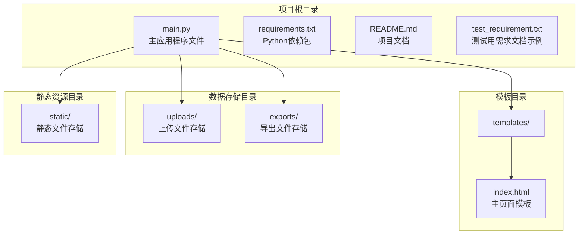
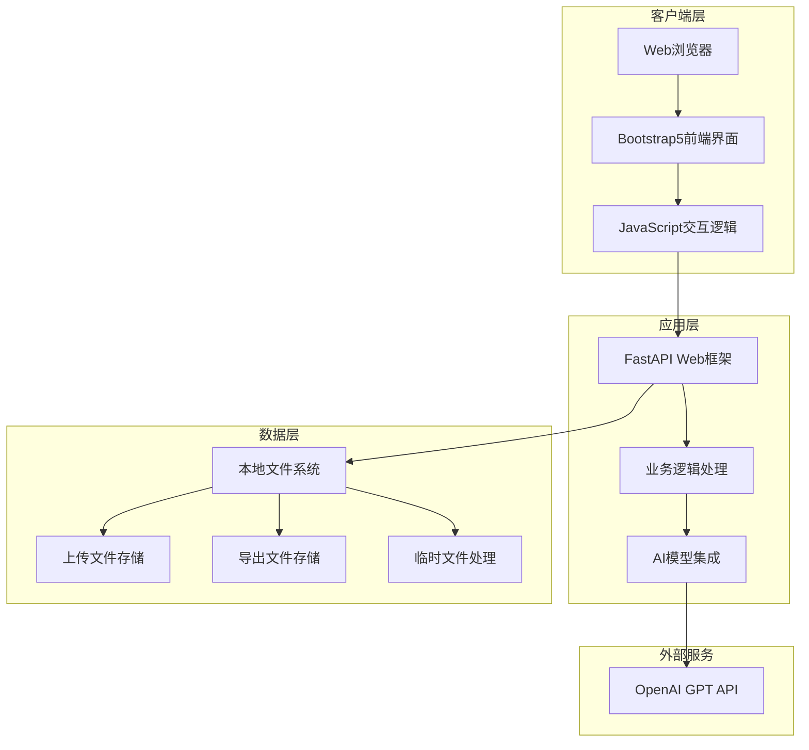
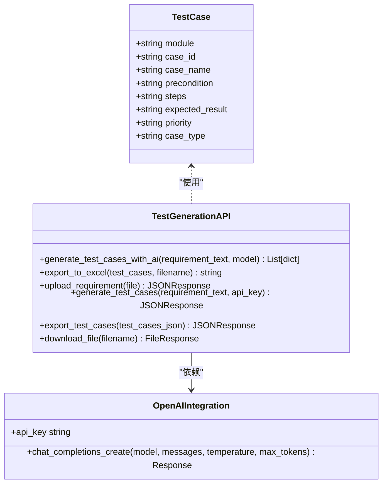
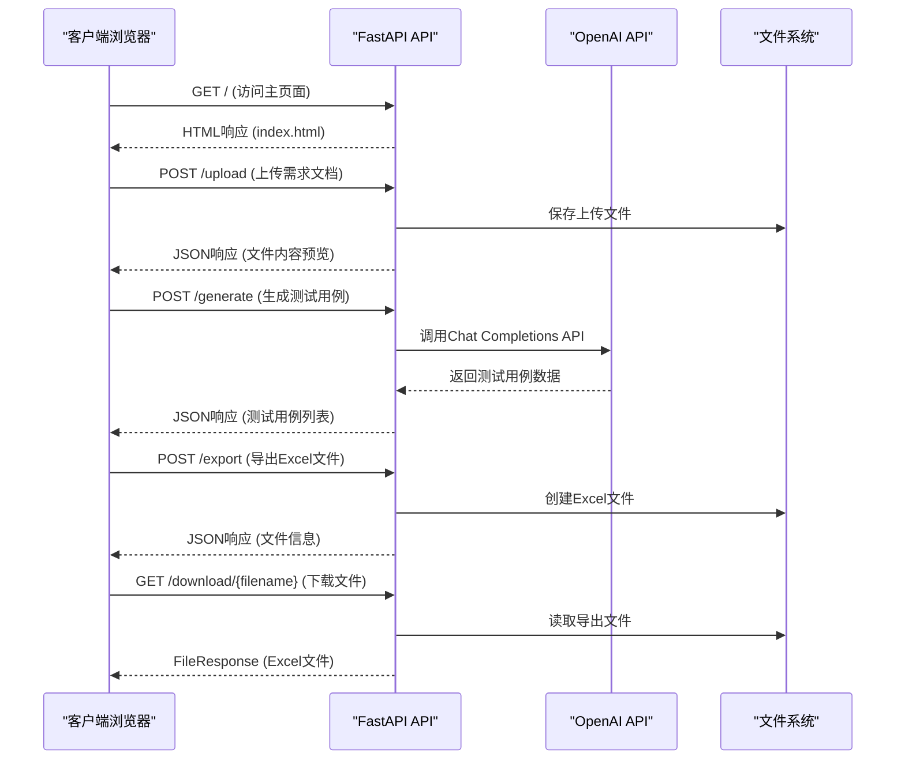
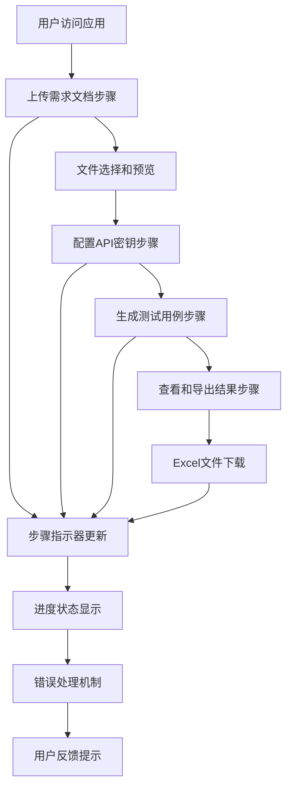
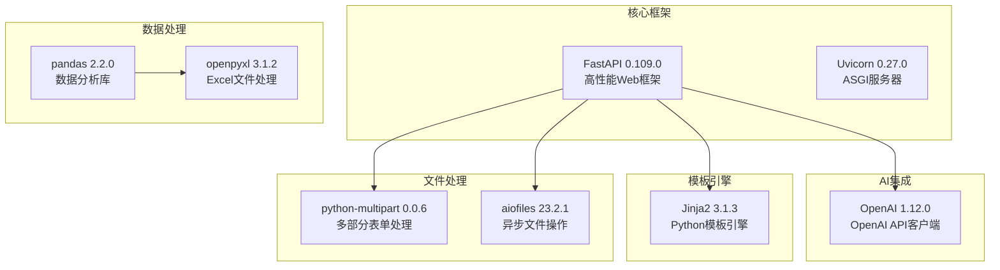
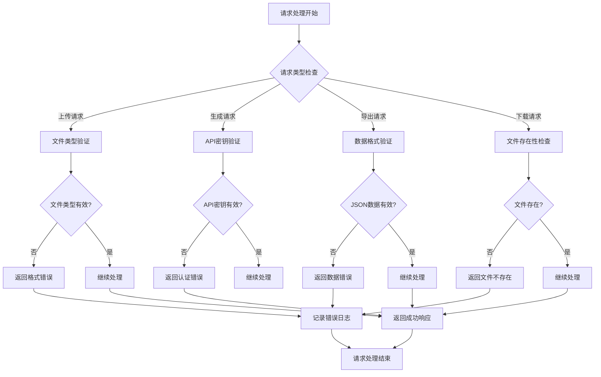

# 部署和运维

<cite>
**本文档引用的文件**
- [README.md](file://README.md)
- [main.py](file://main.py)
- [requirements.txt](file://requirements.txt)
- [test_requirement.txt](file://test_requirement.txt)
- [templates/index.html](file://templates/index.html)
</cite>

## 目录
1. [简介](#简介)
2. [项目结构](#项目结构)
3. [核心组件](#核心组件)
4. [架构概览](#架构概览)
5. [详细组件分析](#详细组件分析)
6. [依赖分析](#依赖分析)
7. [性能考虑](#性能考虑)
8. [故障排除指南](#故障排除指南)
9. [结论](#结论)
10. [附录](#附录)

## 简介

AI测试用例生成工具是一个基于FastAPI构建的Web应用程序，利用OpenAI GPT模型智能生成测试用例。该工具支持多种文档格式上传（txt, doc, docx），能够自动生成结构化的测试用例表格，并支持导出为Excel格式。

本项目采用现代化的技术栈，包括Python + FastAPI作为后端框架，HTML5 + Bootstrap5 + JavaScript作为前端界面，OpenAI GPT系列模型进行AI内容生成，以及pandas + openpyxl进行数据处理和Excel导出。

## 项目结构

该项目采用简洁的分层架构，主要包含以下核心目录和文件：

**图表来源**
- [main.py:15-19](file://main.py#L15-L19)
- [main.py:21-23](file://main.py#L21-L23)

**章节来源**
- [README.md:29-41](file://README.md#L29-L41)
- [main.py:15-19](file://main.py#L15-L19)

## 核心组件

### 应用程序入口点

主应用程序文件定义了完整的FastAPI应用实例，包含了完整的HTTP API端点和业务逻辑实现。

**章节来源**
- [main.py:13](file://main.py#L13)
- [main.py:235-237](file://main.py#L235-L237)

### AI测试用例生成功能

系统的核心功能是基于AI模型生成测试用例，支持复杂的测试场景分析和多维度的测试用例生成。

**章节来源**
- [main.py:41-123](file://main.py#L41-L123)

### 文件处理和导出功能

提供了完整的文件上传、处理和Excel导出功能，支持多种文档格式和数据导出需求。

**章节来源**
- [main.py:155-233](file://main.py#L155-L233)

## 架构概览

该应用程序采用典型的三层架构设计，结合了现代Web开发的最佳实践：

**图表来源**
- [main.py:1-12](file://main.py#L1-L12)
- [main.py:25-26](file://main.py#L25-L26)

## 详细组件分析

### FastAPI应用程序架构

应用程序使用FastAPI框架构建，具有以下关键特性：

**图表来源**
- [main.py:28-40](file://main.py#L28-L40)
- [main.py:41-123](file://main.py#L41-L123)
- [main.py:124-149](file://main.py#L124-L149)

### API端点设计

系统提供了完整的RESTful API端点，支持完整的测试用例生成工作流程：

**图表来源**
- [main.py:151-153](file://main.py#L151-L153)
- [main.py:155-183](file://main.py#L155-L183)
- [main.py:185-201](file://main.py#L185-L201)
- [main.py:203-224](file://main.py#L203-L224)
- [main.py:226-233](file://main.py#L226-L233)

### 前端用户界面架构

前端采用现代化的Bootstrap5框架构建，提供了直观的用户体验：

**图表来源**
- [templates/index.html:78-91](file://templates/index.html#L78-L91)
- [templates/index.html:214-251](file://templates/index.html#L214-L251)
- [templates/index.html:254-298](file://templates/index.html#L254-L298)

**章节来源**
- [templates/index.html:1-383](file://templates/index.html#L1-L383)

## 依赖分析

### Python依赖关系

项目使用了现代化的Python生态系统，所有依赖都经过精心选择以确保最佳性能和稳定性：

**图表来源**
- [requirements.txt:1-8](file://requirements.txt#L1-L8)

### 开发环境配置

项目提供了灵活的开发环境配置选项，支持多种部署方式：

**章节来源**
- [requirements.txt:1-8](file://requirements.txt#L1-L8)
- [README.md:43-47](file://README.md#L43-L47)

## 性能考虑

### 内存和存储优化

系统在设计时充分考虑了性能优化，采用了多项策略来提升运行效率：

1. **文件处理优化**：使用流式处理避免大文件内存溢出
2. **临时文件管理**：合理使用tempfile模块处理临时数据
3. **Excel导出优化**：批量处理数据减少I/O操作
4. **缓存策略**：利用浏览器缓存减少重复请求

### 并发处理能力

应用程序具备良好的并发处理能力，能够有效处理多个用户的并发请求：

- **异步文件操作**：使用aiofiles支持异步文件读写
- **多部分表单处理**：支持大文件上传和并发处理
- **内存管理**：及时清理临时文件和缓存数据

## 故障排除指南

### 常见问题诊断

系统提供了完善的错误处理机制，能够有效识别和处理各种异常情况：

**图表来源**
- [main.py:158-183](file://main.py#L158-L183)
- [main.py:188-201](file://main.py#L188-L201)
- [main.py:206-224](file://main.py#L206-L224)
- [main.py:229-233](file://main.py#L229-L233)

### 错误日志记录

系统实现了多层次的日志记录机制，确保问题能够被及时发现和解决：

**章节来源**
- [main.py:92](file://main.py#L92)
- [main.py:109](file://main.py#L109)

## 结论

AI测试用例生成工具是一个功能完善、架构合理的Web应用程序。它成功地将现代AI技术与传统的测试用例生成流程相结合，为测试工程师提供了高效的工作工具。

该系统的主要优势包括：

1. **技术架构先进**：采用FastAPI + Vue.js的现代化技术栈
2. **功能完整**：覆盖了测试用例生成的完整工作流程
3. **用户体验优秀**：提供直观易用的Web界面
4. **扩展性强**：模块化设计便于功能扩展和维护

## 附录

### 部署准备清单

- Python 3.7+
- 1GB RAM (推荐2GB+)
- 500MB 磁盘空间
- 稳定的网络连接
- OpenAI API密钥

### 生产环境配置建议

1. **服务器规格**：至少2核CPU，4GB内存
2. **存储配置**：SSD存储，预留足够的磁盘空间
3. **网络配置**：开放8000端口，配置防火墙规则
4. **安全配置**：启用HTTPS，配置SSL证书

### 监控和维护

- 定期检查API调用配额
- 监控服务器资源使用情况
- 备份重要数据文件
- 更新依赖包版本