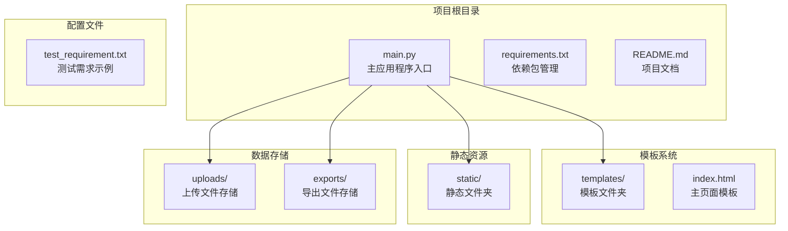
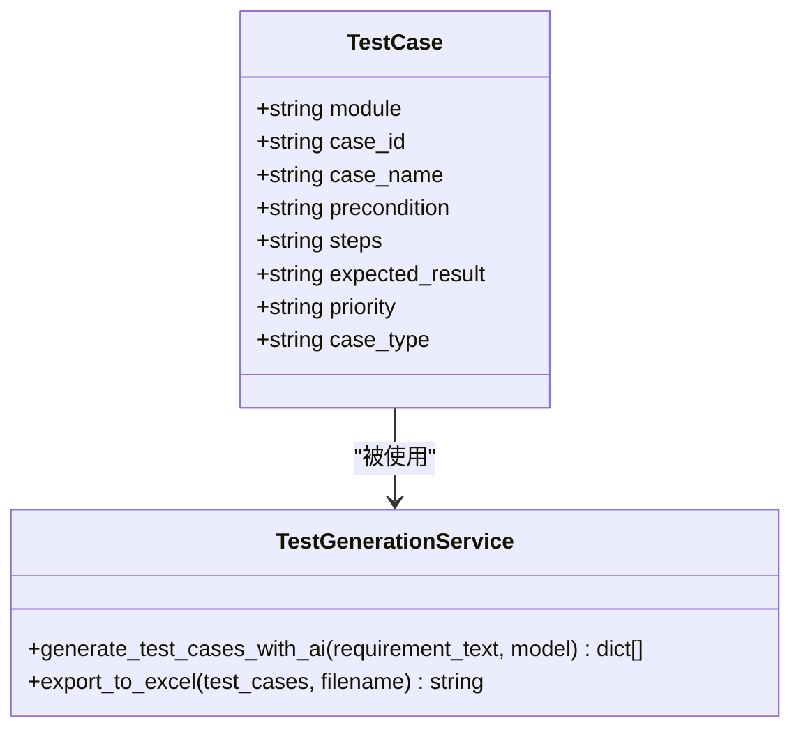
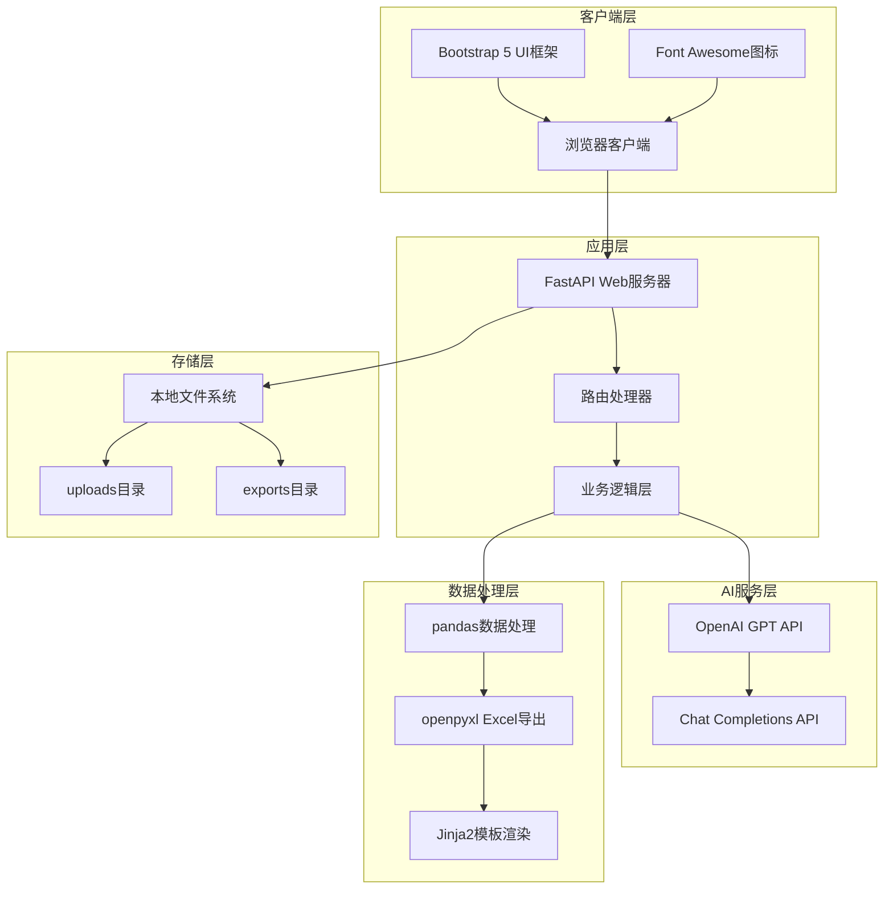
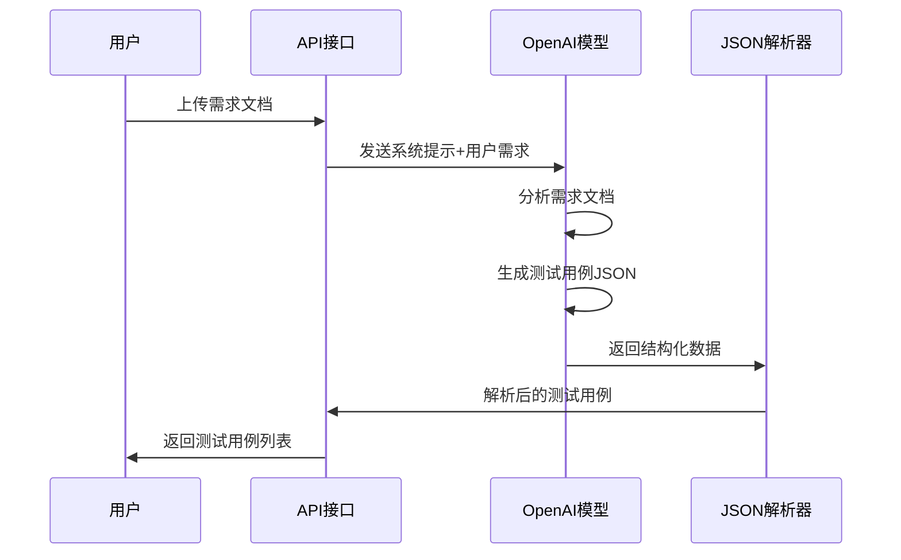
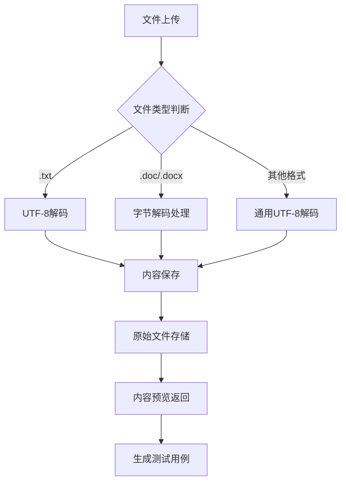
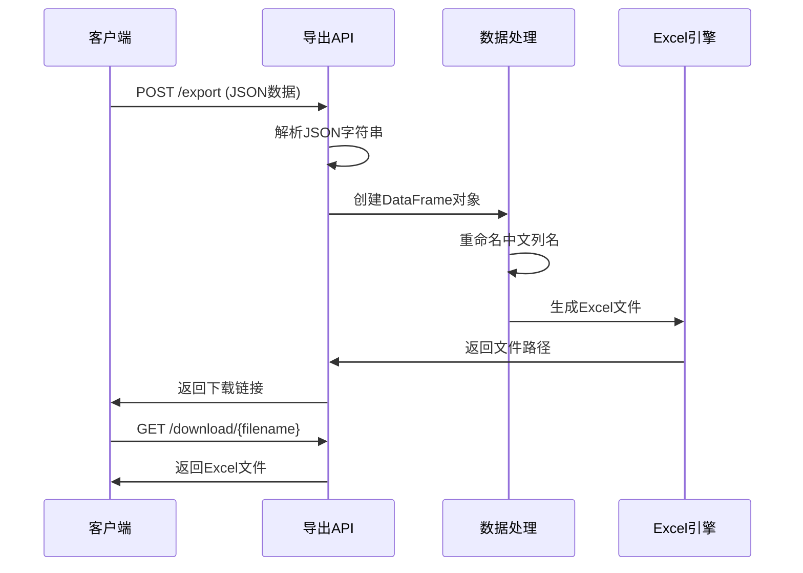
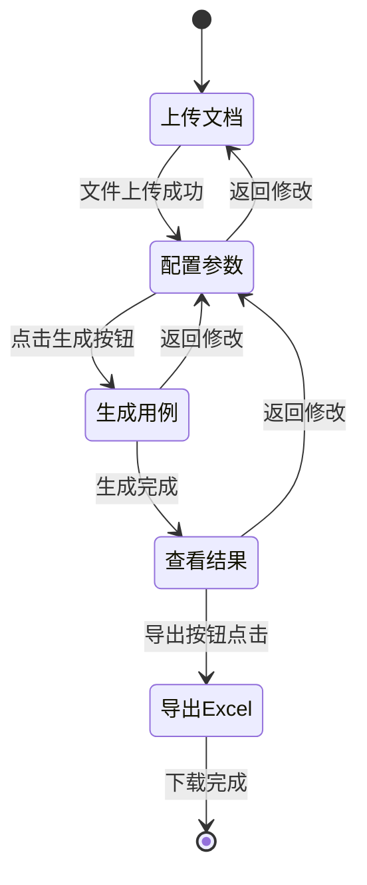
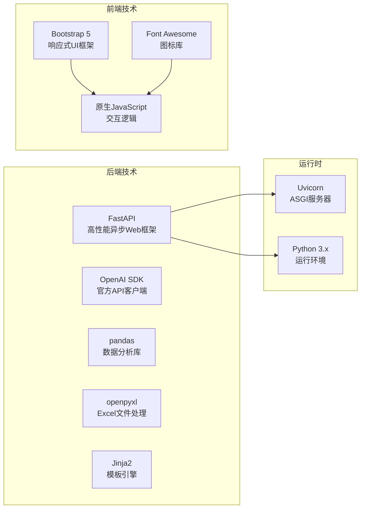
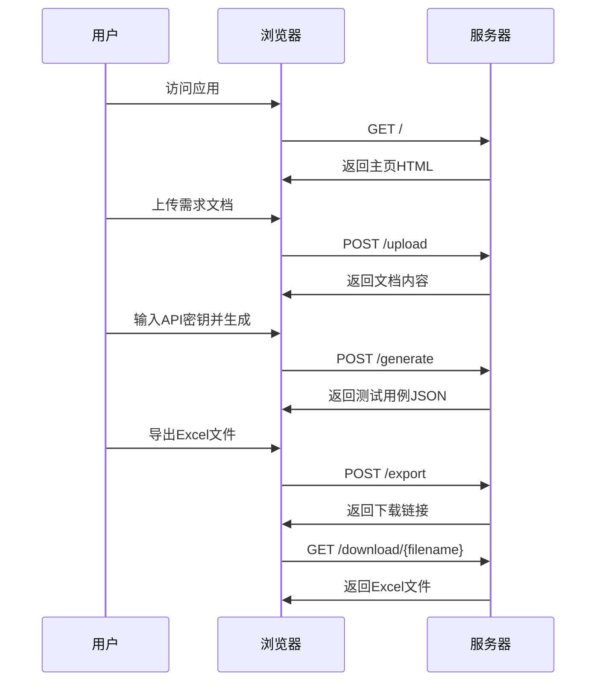

# 项目概述

<cite>
**本文档引用的文件**
- [README.md](file://README.md)
- [main.py](file://main.py)
- [requirements.txt](file://requirements.txt)
- [templates/index.html](file://templates/index.html)
</cite>

## 目录
1. [项目简介](#项目简介)
2. [项目结构](#项目结构)
3. [核心组件](#核心组件)
4. [架构概览](#架构概览)
5. [详细组件分析](#详细组件分析)
6. [技术栈详解](#技术栈详解)
7. [使用流程与用户体验](#使用流程与用户体验)
8. [性能考虑](#性能考虑)
9. [故障排除指南](#故障排除指南)
10. [总结](#总结)

## 项目简介

AI测试用例生成工具是一个基于人工智能的智能测试用例生成平台，旨在帮助测试工程师快速生成专业的测试用例。该项目利用OpenAI GPT模型的强大自然语言处理能力，能够自动分析需求文档并生成结构化的测试用例，显著提升测试工作效率。

### 核心目标
- **智能化测试用例生成**：基于AI模型自动分析需求文档，生成高质量的测试用例
- **多格式文档支持**：支持txt、doc、docx等多种文档格式的上传和处理
- **Excel导出功能**：提供便捷的Excel格式导出，便于团队协作和存档
- **现代化用户体验**：提供直观易用的Web界面，简化操作流程

### 主要特性
- 🤖 基于OpenAI GPT模型智能生成测试用例
- 📁 支持多种文档格式上传（txt, doc, docx）
- 📊 自动生成结构化的测试用例表格
- 📤 支持导出为Excel格式
- 💻 现代化Web界面，操作简单直观

## 项目结构

项目采用简洁而高效的分层架构设计，主要包含以下核心目录：

**图表来源**
- [main.py:15-19](file://main.py#L15-L19)
- [templates/index.html:1](file://templates/index.html#L1-L383)

**章节来源**
- [README.md:29-41](file://README.md#L29-L41)
- [main.py:15-19](file://main.py#L15-L19)

## 核心组件

### 后端服务组件

项目的核心后端服务基于FastAPI框架构建，提供了完整的RESTful API接口：

#### 应用程序初始化
- **FastAPI实例**：创建名为"AI测试用例生成工具"的应用程序
- **静态文件服务**：挂载静态文件目录，支持CSS、JavaScript等资源
- **模板引擎**：配置Jinja2模板系统，用于动态渲染HTML页面

#### 数据模型定义
项目定义了专门的`TestCase`类来封装测试用例的数据结构：

**图表来源**
- [main.py:28-40](file://main.py#L28-L40)
- [main.py:41-123](file://main.py#L41-L123)

#### API端点设计
项目提供了四个核心API端点：

1. **GET /** - 主页面路由，返回HTML模板
2. **POST /upload** - 处理文件上传请求
3. **POST /generate** - 生成测试用例的主要接口
4. **POST /export** - 导出测试用例到Excel
5. **GET /download/{filename}** - 文件下载服务

**章节来源**
- [main.py:13](file://main.py#L13)
- [main.py:151-153](file://main.py#L151-L153)
- [main.py:155-183](file://main.py#L155-L183)
- [main.py:185-201](file://main.py#L185-L201)
- [main.py:203-224](file://main.py#L203-L224)
- [main.py:226-233](file://main.py#L226-L233)

## 架构概览

项目采用前后端分离的现代Web架构设计，实现了清晰的职责分离和良好的可扩展性。

**图表来源**
- [main.py:1-237](file://main.py#L1-L237)
- [requirements.txt:1-8](file://requirements.txt#L1-L8)

### 设计理念

项目遵循以下核心设计原则：

1. **模块化设计**：每个功能模块职责单一，便于维护和扩展
2. **API优先**：采用RESTful API设计，支持未来的移动端和第三方集成
3. **用户体验导向**：提供直观的三步操作流程，降低使用门槛
4. **安全性考虑**：API密钥通过表单传递，避免硬编码在客户端
5. **容错机制**：完善的异常处理和降级策略

## 详细组件分析

### AI测试用例生成引擎

AI引擎是项目的核心创新点，负责将自然语言需求文档转换为结构化的测试用例。

#### 系统提示工程
AI引擎使用精心设计的系统提示，要求AI扮演资深测试工程师角色：

**图表来源**
- [main.py:41-123](file://main.py#L41-L123)

#### 测试用例字段规范
生成的测试用例包含以下标准化字段：

| 字段名称 | 描述 | 示例 |
|---------|------|------|
| 功能模块 | 测试的功能模块名称 | 用户登录 |
| 用例编号 | 唯一的测试用例ID | TC001 |
| 用例名称 | 测试用例的描述性名称 | 正确用户名密码登录 |
| 前置条件 | 执行测试前需要满足的条件 | 用户已注册账号 |
| 测试步骤 | 详细的测试执行步骤 | 1. 打开登录页面 2. 输入正确的用户名 |
| 预期结果 | 期望的测试结果 | 成功跳转到首页 |
| 优先级 | 测试用例的重要程度 | 高/中/低 |
| 用例类型 | 测试类型 | 功能测试/接口测试 |

**章节来源**
- [README.md:64-75](file://README.md#L64-L75)
- [main.py:53-77](file://main.py#L53-L77)

### 文件处理与上传系统

项目实现了灵活的多格式文件处理机制：

**图表来源**
- [main.py:155-183](file://main.py#L155-L183)
- [main.py:163-169](file://main.py#L163-L169)

#### 支持的文件格式
- **纯文本文件** (.txt)：直接UTF-8解码
- **Word文档** (.doc, .docx)：字节流解码处理
- **其他格式**：统一采用UTF-8解码策略

**章节来源**
- [main.py:163-169](file://main.py#L163-L169)

### Excel导出功能

Excel导出功能提供了专业的数据格式化和文件生成能力：

**图表来源**
- [main.py:203-224](file://main.py#L203-L224)
- [main.py:124-149](file://main.py#L124-L149)

#### 导出特性
- **列名国际化**：自动将英文列名转换为中文显示
- **格式保持**：保留原始测试用例的所有字段信息
- **时间戳命名**：使用精确的时间戳确保文件唯一性
- **自动下载**：导出完成后自动触发文件下载

**章节来源**
- [main.py:134-144](file://main.py#L134-L144)
- [main.py:210-212](file://main.py#L210-L212)

### 前端用户界面

前端界面采用现代化的Bootstrap 5框架构建，提供了直观的三步操作流程：

**图表来源**
- [templates/index.html:78-91](file://templates/index.html#L78-L91)

#### 用户体验设计
- **步骤指示器**：清晰显示当前操作阶段
- **实时预览**：上传后立即显示文档内容
- **加载状态**：AI生成过程中的进度反馈
- **响应式设计**：支持桌面和移动设备访问

**章节来源**
- [templates/index.html:78-91](file://templates/index.html#L78-L91)
- [templates/index.html:214-251](file://templates/index.html#L214-L251)

## 技术栈详解

### 核心技术栈

项目采用了经过验证的现代Web开发技术栈，确保了项目的稳定性和可维护性：

**图表来源**
- [requirements.txt:1-8](file://requirements.txt#L1-L8)

### 依赖包分析

#### 必需依赖
- **FastAPI (0.109.0)**：提供高性能的Web API框架
- **Uvicorn (0.27.0)**：ASGI服务器，支持异步请求处理
- **OpenAI (1.12.0)**：官方AI模型API客户端
- **pandas (2.2.0)**：数据处理和分析核心库
- **openpyxl (3.1.2)**：Excel文件读写支持

#### 开发依赖
- **python-multipart (0.0.6)**：处理multipart/form-data请求
- **aiofiles (23.2.1)**：异步文件操作支持
- **Jinja2 (3.1.3)**：模板渲染引擎

**章节来源**
- [requirements.txt:1-8](file://requirements.txt#L1-L8)

### 架构决策说明

#### 为什么选择FastAPI？
1. **性能优势**：基于Starlette和Pydantic，提供卓越的性能表现
2. **自动文档**：内置Swagger和ReDoc文档生成
3. **类型安全**：强大的类型注解支持，减少运行时错误
4. **异步支持**：原生支持异步编程模式

#### 为什么使用OpenAI GPT？
1. **成熟模型**：GPT-3.5-turbo提供可靠的自然语言处理能力
2. **成本效益**：相比其他大模型具有更好的性价比
3. **稳定性**：API接口稳定，易于集成和维护
4. **广泛支持**：社区活跃，文档完善

#### 为什么选择pandas进行数据处理？
1. **专业性**：专为数据分析设计，功能强大
2. **易用性**：简洁的API设计，学习曲线平缓
3. **生态系统**：丰富的数据处理工具和扩展
4. **性能优化**：底层C实现，处理效率高

## 使用流程与用户体验

### 完整使用流程

项目提供了清晰的三步操作流程，确保用户能够轻松上手：

**图表来源**
- [templates/index.html:214-298](file://templates/index.html#L214-L298)
- [main.py:155-233](file://main.py#L155-L233)

### 用户体验设计亮点

#### 1. 渐进式界面设计
- **步骤指示器**：实时显示当前操作阶段
- **渐进式显示**：按步骤逐步展示功能区域
- **视觉反馈**：Active状态突出当前步骤

#### 2. 实时交互反馈
- **加载动画**：AI生成过程中的进度指示
- **错误处理**：友好的错误提示和解决方案
- **状态管理**：清晰的操作状态显示

#### 3. 数据可视化
- **优先级颜色编码**：高/中/低优先级不同颜色标识
- **步骤预览**：测试步骤的格式化显示
- **统计信息**：总用例数量的实时更新

**章节来源**
- [templates/index.html:56-61](file://templates/index.html#L56-L61)
- [templates/index.html:300-323](file://templates/index.html#L300-L323)

### 适用场景

#### 1. 测试工程师日常工作
- **需求分析**：快速理解复杂需求文档
- **用例设计**：自动生成初步测试用例框架
- **回归测试**：为新功能快速补充测试覆盖

#### 2. 团队协作场景
- **知识共享**：标准化测试用例格式
- **质量保证**：统一测试标准和流程
- **新人培训**：提供学习参考模板

#### 3. 项目管理应用
- **测试计划**：制定详细的测试策略
- **风险评估**：识别潜在测试风险点
- **进度跟踪**：监控测试执行进度

## 性能考虑

### 系统性能优化

项目在设计时充分考虑了性能优化，确保在各种使用场景下都能提供良好的用户体验：

#### 1. 异步处理架构
- **非阻塞I/O**：使用异步文件操作避免阻塞
- **并发处理**：支持多个用户的并发请求
- **内存管理**：及时释放临时文件和数据

#### 2. 缓存策略
- **临时文件**：使用临时目录存储中间文件
- **响应缓存**：合理利用浏览器缓存机制
- **API调用优化**：避免重复的AI模型调用

#### 3. 资源管理
- **文件大小限制**：合理控制上传文件大小
- **内存使用**：大数据量时的内存使用优化
- **连接池**：数据库连接的高效管理

### 性能监控指标

| 指标类型 | 目标值 | 监控方法 |
|---------|--------|----------|
| 响应时间 | < 2秒 | API响应时间监控 |
| 并发用户数 | > 100 | 同时在线用户数 |
| 内存使用 | < 500MB | 进程内存监控 |
| CPU使用率 | < 80% | 系统资源监控 |

## 故障排除指南

### 常见问题及解决方案

#### 1. OpenAI API相关问题

**问题**：API密钥无效或过期
**解决方案**：
- 检查API密钥格式是否正确
- 确认账户余额充足
- 验证网络连接正常
- 查看API配额限制

**问题**：AI响应格式不正确
**解决方案**：
- 检查系统提示的完整性
- 验证JSON格式的有效性
- 查看AI模型的可用性状态

#### 2. 文件处理问题

**问题**：文件上传失败
**解决方案**：
- 检查文件格式是否受支持
- 验证文件大小限制
- 确认服务器磁盘空间充足
- 检查文件权限设置

**问题**：Excel导出格式异常
**解决方案**：
- 检查pandas版本兼容性
- 验证openpyxl安装状态
- 确认Excel文件未被占用

#### 3. 前端交互问题

**问题**：页面加载缓慢
**解决方案**：
- 检查CDN资源加载状态
- 验证CSS/JS文件完整性
- 清除浏览器缓存
- 检查网络连接速度

**问题**：按钮点击无响应
**解决方案**：
- 检查JavaScript错误日志
- 验证事件监听器绑定
- 确认AJAX请求状态
- 检查跨域资源共享设置

### 调试技巧

#### 1. 服务器端调试
- 启用详细日志记录
- 使用调试模式启动服务
- 监控API调用频率
- 检查内存泄漏情况

#### 2. 客户端调试
- 使用浏览器开发者工具
- 检查网络请求状态
- 验证JavaScript执行状态
- 监控DOM元素变化

**章节来源**
- [README.md:76-82](file://README.md#L76-L82)
- [main.py:108-122](file://main.py#L108-L122)

## 总结

AI测试用例生成工具是一个设计精良、功能完备的现代化Web应用。项目通过巧妙地结合AI技术与Web开发最佳实践，为测试工程师提供了一个强大而易用的工具。

### 项目优势

1. **技术创新性**：首次将AI模型应用于测试用例生成领域
2. **用户体验优秀**：简洁直观的三步操作流程
3. **技术架构先进**：基于FastAPI的高性能异步架构
4. **扩展性强**：模块化设计便于功能扩展和维护
5. **部署简单**：依赖关系清晰，易于安装和部署

### 技术特色

- **AI驱动的智能分析**：利用GPT模型理解复杂需求文档
- **多格式文档支持**：灵活处理各种类型的文档格式
- **专业数据处理**：使用pandas确保数据质量和一致性
- **现代化前端体验**：Bootstrap 5提供优秀的用户界面
- **完整的API体系**：RESTful设计支持未来扩展

### 发展前景

该项目为测试自动化领域提供了新的思路和解决方案。随着AI技术的不断发展和测试需求的持续增长，该工具具有广阔的发展空间和应用价值。未来可以考虑的功能扩展包括：

- 支持更多AI模型和模型切换
- 增加测试用例的智能分类和推荐
- 提供测试执行状态跟踪
- 集成持续集成和持续测试流程